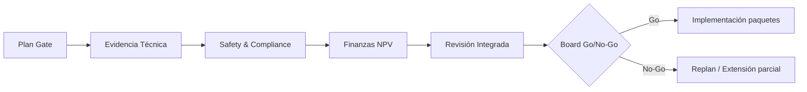

# Procedimiento de Gestión de Vida Útil y Extensiones — P-PROCEDURAL (BWB H₂)

**Ruta sugerida:** `OPTIM-FRAMEWORK/P-PROCEDURAL/processes/Service-Life-Extension-Procedure.md`  
**Objetivo:** ejecutar extensiones LOV 35/40/45 a con evidencia UTCS, V&V y decisión audit-ready.

## 1. Entradas/Salidas
**Entradas:**  
- `constraints/hard_constraints.yaml`, `data/candidates.yaml`, `ampel360-config.yaml`.  
- KPIs O-ORGANIZATIONAL, packs técnicos por segmento (ARC/CRY/ENR/PRO/ELE/INF/CTL).  
- Safety (FHA/PSSA/SSA), MRO plan y costos.

**Salidas:**  
- **Dossier de gate** (M/X1/X2), Acta de decisión, actualización de LOV, backlog MRO/upgrades.

## 2. Flujo (resumen)
1) **Planificación gate (T-6m)**: alcance, hitos, RACI, criterios.  
2) **Evidencia técnica (T-6→T-2m)**: V&V, NDT, SHM trending, LPS/bonding, CRY/HV/H₂.  
3) **Safety & Compliance (T-3→T-1m)**: FHA/PSSA/SSA; normas CS-25/DO-160/ISO H₂.  
4) **Económico (T-2→T-1m)**: NPV/payback y sensibilidad.  
5) **Revisión integrada (T-1m)**: cierre de findings, riesgos residuales.  
6) **Board (T-0)**: Go/No-Go; LOV resultante; publicación Acta.  
7) **Ejecución**: implementación de paquetes y actualización UTCS/DT.

## 3. Diagrama (Mermaid)

## 4. Checklist de Dossier (obligatorio)
- Resumen Ejecutivo (objetivo LOV, riesgos, decisión propuesta).
- KPIs: tabla con umbrales vs medidos (12 meses).
- Técnico por segmento (ARC/CRY/ENR/PRO/ELE/INF/CTL): evidencias, desviaciones y acciones.
- Safety: FHA/PSSA/SSA, hazards y DALs.
- LPS/Lightning: medidas de resistencia, DO-160 §22/23.
- SHM/DT: tendencias y umbrales.
- NPV/Payback: escenarios, sensibilidad.
- Plan MRO/Upgrades: ventanas, capacidad, recursos.
- Acta & UTCS: cabeceras, versiones, repositorio.

## 5. Criterios de aceptación (por gate)
| Criterio | Umbral Gate-M | Umbral Gate-X1 | Umbral Gate-X2 |
|---|---|---|---|
| Safety (hazards) | 100% mitigados | 100% | 100% |
| SHM (24m) | estable | estable | estable |
| LPS bonding | ≤ 2.5 mΩ | ≤ 2.5 mΩ | ≤ 2.5 mΩ |
| Leak-rate H₂ | ≤ umbral | ≤ umbral | ≤ umbral |
| NPV (real) | > 0 | > 0 | > 0 |
| Payback | ≤ 8 a | ≤ 8 a | ≤ 8 a |

## 6. Matriz V&V mínima (extracto)
| Área | Evidencia | Método | Aceptación |
|---|---|---|---|
| ARC (grid/joins) | STR-AN/TST | NL-FEM, pruebas | MoS ≥ 0 |
| CRY (tanques) | THR-TST-CRYO | Ciclos criogénicos | sin daño |
| ENR (HV) | E2-006 | IMD/DP tests | OK |
| PRO (e-drive) | drive-interfaces | Bench+NL-FEA | ratings OK |
| ELE/LPS | LPS-BND/DO-160 | Medición/ensayo | ≤ 2.5 mΩ |
| CTL/AEL | AEL-GVT/FLT | GVT/Flutter | 1.15·VD |

## 7. Gestión de desviaciones
- **Minor**: acción correctiva y fecha; no bloquea si NPV y safety en verde.
- **Major**: bloquea; requiere plan aprobado y re-review ≤ 60 días.

## 8. Registros y UTCS
- Todos los documentos con cabecera UTCS-MI, versión y hash.
- Publicación de Acta y actualización de LOV en repositorio (O/P/T/I/M).

## 9. Plantillas (stubs)
- `O-ORGANIZATIONAL/kpis/cert-readiness-index.yaml`
- `P-PROCEDURAL/gates/Gate-M/dossier.yaml`

## 10. Revisión y mejora continua
- Cadencia de auditoría de proceso: anual.
- Ajustes de umbrales por retorno de experiencia y datos SHM/DT.

---
*Documento generado por AMPEL360 H₂-BWB-Q Framework*  
*Estándar Universal: ARP4754A-00.00-OPTIM-P-VIDAUTIL-0001-v1.0*  
*ID: 7f3c9a2b-Diseno→Operacion*