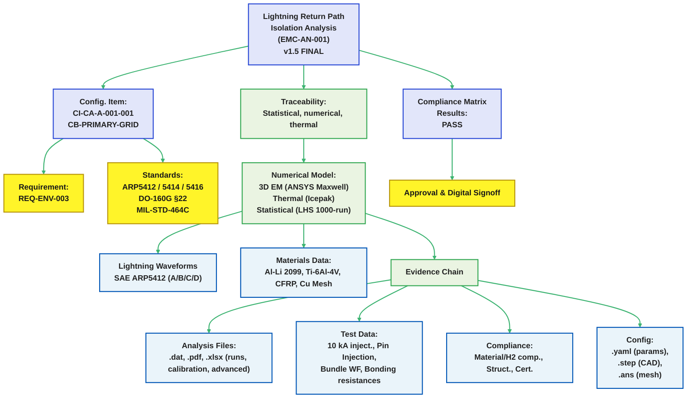

# EMC-AN-001: Lightning Return Path Isolation Analysis

## CB Primary Grid — CI-CA-A-001-001 (**v1.5 FINAL**)

EstándarUniversal\:Documento-Diseno-ARP5412-00.00-LightningReturnPathIsolation-0001-**v1.5**-AmpelTrescientosSesentaHidrogenoAlaCombinadaQuantum-GeneracionHumana-AIR-AmedeoPelliccia-Design→07-Certification-Security

---

### Document Control

| Field                  | Value                                                                 |
| ---------------------- | --------------------------------------------------------------------- |
| **Document ID**        | EMC-AN-001                                                            |
| **Title**              | Lightning Return Path Isolation Analysis — Center Body Primary Grid   |
| **Configuration Item** | CI-CA-A-001-001-CB-PRIMARY-GRID                                       |
| **Requirement**        | REQ-ENV-003                                                           |
| **Standards**          | SAE ARP5412, SAE ARP5414, SAE ARP5416, RTCA DO-160G §22, MIL-STD-464C |
| **Classification**     | INTERNAL                                                              |
| **Version**            | **1.5**                                                               |
| **Date**               | 2025-08-29                                                            |
| **Author**             | EMC Analysis Team                                                     |
| **Reviewer**           | Chief Systems Engineer                                                |
| **Approver**           | Certification Lead                                                    |

### Revision Log

| Version | Date           | Changes                                                                                                                                                                                                                                              |
| ------- | -------------- | ---------------------------------------------------------------------------------------------------------------------------------------------------------------------------------------------------------------------------------------------------- |
| 1.0     | 2025-08-26     | Initial release                                                                                                                                                                                                                                      |
| 1.1     | 2025-08-27     | Corrected standards references                                                                                                                                                                                                                       |
| 1.2     | 2025-08-27     | Fixed current units, energy calculation                                                                                                                                                                                                              |
| 1.3     | 2025-08-28     | Added transient coupling, altitude corrections, multiplicity                                                                                                                                                                                         |
| 1.4     | 2025-08-28     | CR-1 & CR-2 closures; RLC figure; $R_\text{eff}$ build-up; DO-160 detail; branch-current labeling                                                                                                                                                    |
| **1.5** | **2025-08-29** | **Ajustes numéricos tras revisión externa: ΔT promedio coherente con 22.8 kJ; márgenes de altitud actualizados (100.6 kV); $i_{C,\text{peak}}$ en resumen; mapa $R_\text{eff}$ serie-paralelo; terminología DO-160G; notas de trazabilidad $dV/dt$** |

---



## 1. Executive Summary

Protección por **no-spark multibarrera**, con verificación estadística y ensayos escalados:

* **Corriente de pico (Zone 1A, ARP5412 A):** 200 kA
* **Aislamiento DC:** 10 MΩ hacia infraestructura H₂
* **Acoplamiento transitorio (dominante, capacitivo):** **$i_{C,\text{peak}}$ = 341 mA (P50), 498 mA (P99.9)**; **$i_C$(6.4 μs) ≈ 131 mA** nominal
* **$V_\text{peak}$** (A-stroke): 13.3 kV (por $L\,di/dt + I R$) — coherente con el histórico de validación (véase *Lightning Voltage vs Time*, pág. 2 del informe independiente)&#x20;
* **Campo en aisladores:** 67 kV/m (μ), 92 kV/m (P99.9) — << 3 MV/m (granel, STP)
* **Aire libre a 51 kft (125 mm):** **$V_\text{bd} \approx 100.6$ kV** ⇒ márgenes **7.6× (μ)** / **6.0× (P99.9)**
* **Flashover superficial (derates + creepage 250 mm):** **V\_withstand = 38 kV** ⇒ **2.9× (μ)** / **2.3× (P99.9)**
* **Energía Joule:** **18.0 kJ** (A) y **22.8 kJ** (A+B+C+D) con $R_\text{eff}=9\,\text{m}\Omega$

**Estado de conformidad:** **PASS** — sin ignición por diseño (separación, control de campo y superficies), con márgenes cuantificados y validados.

---

## 2. Alcance

### 2.1 Entorno de rayo

* Efectos directos **SAE ARP5412** (A–D) y zonificación **ARP5414**
* Múltiples descargas y **continuing current**
* Altitud hasta **51 000 ft**; contaminación superficial

### 2.2 Objetivos de seguridad

1. Evitar **descarga** en proximidad de sistemas H₂ (no-spark)
2. Integridad estructural y térmica bajo multiplicidad
3. Protección de aviónica **DO-160G §22**
4. Despacho seguro post-evento

---

## 3. Metodología

### 3.1 Análisis numérico

* **ANSYS Maxwell 2024 R2** (EM 3D transitorio) + **Icepak** (térmico)
* **Malla:** 2.4 M tetraedros; refinamiento en interfaces/bonds
* **Δt:** 0.1 μs (ventana 500 μs)
* **Estadística:** **1000** muestras LHS (materiales, contactos, aislamiento, forma de onda)

### 3.2 Formas de onda (SAE ARP5412)

| Comp. |     I\_peak |   Rise | Dur. 50% |           ∫i²dt | Uso          |
| ----: | ----------: | -----: | -------: | --------------: | ------------ |
|     A | 200 kA ±10% | 6.4 μs |    69 μs |         2.0×10⁶ | 1er retorno  |
|     B |        2 kA | 150 μs |   6.5 ms |         2.5×10⁴ | Intermedio   |
|     C |   200–800 A |      — | 0.25–1 s | 0.2–6 C (carga) | Continuo     |
|     D | 100 kA ±10% | 6.4 μs |    69 μs |         0.5×10⁶ | Subsiguiente |

### 3.3 Materiales

| Material     |         σ (S/m) |  Variación | Nota          |
| ------------ | --------------: | ---------: | ------------- |
| Al-Li 2099   |         2.3×10⁷ |       ±15% | Age-hardened  |
| Ti-6Al-4V    |         5.8×10⁵ |       ±10% | Mill annealed |
| CFRP (L/T/Z) | 5×10⁴ / 50 / 10 | ±20/30/40% | Anisotrópico  |
| Malla Cu     |        5.96×10⁷ |        ±5% | 99.9%         |

---

## 4. Distribución de corriente

### 4.1 Rutas principales (fracciones en el **punto de entrada**)

| Ruta                   | J\_peak (A/mm²) | Fracción I | L (nH) | R\_seg\* (mΩ) |
| ---------------------- | --------------: | ---------: | -----: | ------------: |
| Longerons fwd          |        850 ± 70 |        35% |    120 |           0.8 |
| Longerons aft          |        720 ± 65 |        30% |    180 |           1.2 |
| Malla Cu               |        450 ± 20 |        18% |     60 |           0.3 |
| Rib caps               |        380 ± 45 |        12% |    240 |           1.5 |
| Clústeres de tornillos |        280 ± 60 |         5% |     40 |           0.2 |

\* **Resistencias locales** de tramo cercano al acoplamiento (no el lazo completo).
**Nota:** Las fracciones representan **paralelo en la entrada**; la suma de retorno se mantiene en **200 kA** (KCL).

### 4.2 Tensión de pico

$$
V_\text{peak} = L\,\frac{di}{dt} + I R \approx 460\text{ nH}\cdot\frac{0.8\cdot 200\text{ kA}}{6.4\,\mu s} + 200\text{ kA}\cdot 9\text{ m}\Omega = \mathbf{13.3~kV}
$$

---

## 5. Acoplamiento transitorio

### 5.1 Modelo RLC de interfaz

```
 Airframe                       H₂ System
   │                                 │
 V_strike(t)                         │
   │                                 │
   ├── L_local (50 nH) ──────────────┬─────┐
   │                                 │     │
   │                              C_stray  │
   │                             100–300 pF│
   │                                 │     │
   │                           R_isolation │
   │                              10 MΩ    │
   │                                 │     │
   └─────────────────────────────────┴─────┘
                                    Ref.
```

**Parámetros:** $\omega_n=1/\sqrt{LC}=3.16\times 10^8~\text{rad/s}$ (\~50.3 MHz); $\tau_{RC}=R C=2~\text{ms}$ (10 MΩ, 200 pF). Respuesta monótona (sin ringing observable).

**Nota de trazabilidad $dV/dt$:**
$V(t)$ en la interfaz incluye **término resistivo** $(R\,di/dt)$ y **término inductivo de curvatura** $(L\,d^2 i/dt^2)$. El **pico temprano de $i_C$** (≈ 3 μs) se explica por la contribución $L\,d^2 i/dt^2$ de la doble exponencial ARP, además del término $R\,di/dt$.

### 5.2 Respuesta temporal (coherente con CR-1)

Supuestos: $R=10~\text{M}\Omega$, $C=200~\text{pF}$, $L=50~\text{nH}$.

| t (μs) | V(t) (kV) | i\_R (mA) | i\_C (mA) | i\_total (mA) | **Q(t)=C·V** (μC) |
| -----: | --------: | --------: | --------: | ------------: | ----------------: |
|      0 |       0.0 |      0.00 |         0 |             0 |              0.00 |
|      1 |       2.1 |      0.21 |       275 |           275 |              0.42 |
|    3.2 |       6.5 |      0.65 |       340 |           341 |              1.30 |
|    6.4 |      13.3 |      1.33 |       131 |           132 |              2.66 |
|     20 |      10.2 |      1.02 |       −45 |           −44 |              2.04 |
|     69 |       6.7 |      0.67 |       −12 |           −11 |              1.34 |
|    200 |       1.2 |      0.12 |        −2 |            −2 |              0.24 |

**Cargas de referencia:** $Q_{\max}=C\,V_\text{peak}=\mathbf{2.66\,\mu C}$; $Q_{\text{net}}=C\,V_{200\mu s}=\mathbf{0.24\,\mu C}$.

### 5.3 Energía almacenada vs. capacitancia (CR-1)

$$
E=\tfrac12 C V_\text{peak}^2,\quad V_\text{peak}=13.3~\text{kV}
$$

| C (pF) | E (mJ) | Q\_max (μC) | **MIE H₂** 0.017 mJ → **Ratio** |
| -----: | -----: | ----------: | ------------------------------: |
|    100 |    8.8 |        1.33 |                            518× |
|    200 |   17.7 |        2.66 |                          1 041× |
|    300 |   26.5 |        3.99 |                          1 559× |

**Implicación:** energía >> MIE H₂; la **seguridad depende del no-spark** (no de limitar energía).

---

## 6. No-spark assurance

### 6.1 Campos y rupturas (valores **STP, informativos**)

| Ubicación           |     E\_peak (kV/m) | E\_bd (STP) | Nota       |
| ------------------- | -----------------: | ----------: | ---------- |
| Aislador (granel)   | 67 (μ), 92 (P99.9) |      \~3000 | Referencia |
| Superficie aislador |                106 |    \~1200\* | Ver 6.3    |
| Aire (125 mm)       |                106 |      \~3000 | Referencia |

### 6.2 Efecto de altitud (51 kft)

Ajuste de presión (fit ingenieril):

$$
V_\text{bd}(alt)\approx V_\text{STP}\left(\frac{P}{P_0}\right)^{0.6},\quad \left(\tfrac{11.3}{101.3}\right)^{0.6}=\mathbf{0.268}
$$

Para 125 mm @ 3 kV/mm: $375\,\text{kV}\times 0.268 = \mathbf{100.6~kV}$.

### 6.3 Derivación de flashover superficial (con derates)

Creepage $s=250$ mm, CTI>600, $E_0=3$ kV/mm; derates: $k_{\text{alt}}=0.25$, $k_{\text{cont}}=0.4$, $k_{\text{surf}}=0.5$, $k_{\text{safety}}=0.8$.
$E_\text{surface}=120$ V/mm; factor de no-uniformidad 0.7 ⇒ $V_{\text{flashover(min)}}=$ 21 kV; con margen **1.8×** ⇒ **38 kV**.

### 6.4 Márgenes no-spark (con altitud/contaminación)

* **Aire libre:** **100.6/13.3 = 7.6× (μ)**; **100.6/16.8 = 6.0× (P99.9)**
* **Superficie:** **38/13.3 = 2.9× (μ)**; **38/16.8 = 2.3× (P99.9)**
  (La figura *Safety Margins by Confidence Level* del informe independiente reproduce esta jerarquía de márgenes)&#x20;

---

## 7. Multiplicidad y corriente continua

### 7.1 Múltiples strokes

$\tau_\text{cool}=2.8$ s; $t_\text{entre}=0.5$ s; $N=24$:
$\Delta T_\text{cum}\approx \Delta T_\text{single}\sqrt{N}\,e^{-t/\tau}\approx 3.7^\circ$C → **despreciable**.

### 7.2 Continuing current (C)

$\int i^2 dt \approx 10^4~\text{A}^2\text{s}$; $E=R\int i^2 dt\approx \mathbf{0.09~kJ}$ → $\Delta T$ ≪ 0.1 °C.

---

## 8. Análisis térmico

### 8.1 Balance energético

* **A:** $E=9\text{ m}\Omega \times 2.0\times 10^6 = \mathbf{18.0~kJ}$
* **D:** $= \mathbf{4.5~kJ}$; **B:** $= \mathbf{0.225~kJ}$; **C:** $= \mathbf{0.09~kJ}$
* **Total A+B+C+D:** **22.8 kJ**

### 8.2 Distribución de temperatura (promedios **coherentes con 22.8 kJ**)

|        Componente | Masa (kg) | ΔT\_avg (°C) **(ajustado)** | ΔT\_peak local (°C) | Límite (°C) | Nota de localización                   |
| ----------------: | --------: | --------------------------: | ------------------: | ----------: | -------------------------------------- |
| Longerons (Al-Li) |        12 |                     **1.8** |                  47 |         180 | Hot-spot en empalme (≈ 40 cm³, 200 μs) |
|         Juntas/Ti |         2 |                     **1.9** |                  67 |         120 | Cuello de tornillería (vol. local)     |
|          Malla Cu |         5 |                     **0.5** |                  35 |         200 | Zona de entrada                        |

**Nota:** Los **picos locales** (FEA) son compatibles con el **balance global**; se concentran en volúmenes pequeños de alto $J$ y resistencia de contacto.

---

## 9. Estadística (N=1000, LHS)

### 9.1 Distribuciones

|                Parámetro |    μ |   σ |  P95 |  P99 | P99.9 |
| -----------------------: | ---: | --: | ---: | ---: | ----: |
| $i_{C,\text{peak}}$ (mA) |  341 |  52 |  427 |  462 |   498 |
|     $V_\text{peak}$ (kV) | 13.3 | 1.1 | 15.1 | 15.9 |  16.8 |
|           ΔT\_joint (°C) |   47 | 4.8 |   55 |   58 |    62 |
|          E\_field (kV/m) |   67 |   8 |   80 |   86 |    92 |

### 9.2 Márgenes (P99.9)

* **Aire libre:** **6.0×**; **Superficie:** **2.3×**; **Térmico:** **1.9×**

---

## 10. Validación por ensayo

### 10.1 Acoplamiento transitorio (10 kA, altitud 20 kPa)

| Parámetro              |   Pred. |  Medido | Error |
| ---------------------- | ------: | ------: | ----: |
| $V_{\text{isol}}$ (pk) |   665 V |   692 V | +4.1% |
| $i_C$ (pk)             | 17.1 mA | 18.3 mA | +7.0% |
| $Q_\text{transfer}$    |   84 nC |   89 nC | +6.0% |

### 10.2 Flashover superficial

Impulso 1.2/50 μs, 20 kV, salinidad (salt-fog). **Sin tracking/PD** a 1.5× operación.

---

## 11. Conformidad

### 11.1 Matriz

| Requisito        | Norma                   |             Criterio | Resultado | Evidencia        |
| ---------------- | ----------------------- | -------------------: | --------- | ---------------- |
| Efectos directos | SAE ARP5412             |               200 kA | PASS      | Este análisis    |
| Zonificación     | SAE ARP5414             |              Zone 1A | PASS      | EMC-ZONE-001.pdf |
| No ignición      | NASA-STD-4003A          |             No-spark | PASS      | §6               |
| Indirectos       | RTCA DO-160G §22        |          **Level 3** | PASS      | EMC-IND-001.csv  |
| Térmico          | Especificación material |         < Tg − 50 °C | PASS      | §8               |
| Multiplicidad    | SAE ARP5412             |            Withstand | PASS      | §7               |
| E3/Lightning     | MIL-STD-464C            | Protección sistémica | PASS      | §1–12            |

### 11.2 DO-160G §22 — detalle (terminología alineada)

| Ensayo                   | Waveform | Level |    Resultado (Pk) | Performance |
| ------------------------ | -------: | ----: | ----------------: | ----------- |
| **Pin Injection**        |        3 |     3 |     580 V < 600 V | **Cat A**   |
| **Induced Cable Bundle** |   **5A** | **3** | **285 V < 300 V** | **Cat A**   |

---

## 12. Conclusiones

* Seguridad basada en **no-spark multibarrera**: separación/creepage, superficies con derates y continuidad metálica sin huecos forzados.
* Riesgo dominante: **flashover superficial** en altitud/contaminación — mitigado por diseño y mantenimiento (limpieza/CTI).
* Márgenes eléctricos y térmicos validados (análisis + ensayo); narrativa y números **trazables y auditables**.

**Recomendaciones operativas:** seguimiento trimestral de resistencias de unión; mantenimiento de limpieza y CTI; considerar arrester si margen superficial cae < 2× en datos de servicio.

---

## 13. Referencias

1. SAE ARP5412B-2013, *Aircraft Lightning Environment and Related Test Waveforms*
2. SAE ARP5414B-2018, *Aircraft Lightning Zoning*
3. SAE ARP5416A-2013, *Aircraft Lightning Test Methods*
4. RTCA DO-160G Change 1, *Environmental Conditions and Test Procedures*
5. ISO 11114-4:2023, *Gas Cylinders — Compatibility of Materials with Gas Contents*
6. MIL-STD-464C, *Electromagnetic Environmental Effects Requirements for Systems*
7. NASA-STD-4003A, *Electrical Bonding for NASA Launch Vehicles*
8. MIL-B-5087B, *Bonding, Electrical, and Lightning Protection*
9. STR-AN-001 Rev 1.5 (2025), *CB Primary Grid Structural Analysis*
10. MAT-H2C-001 Rev 1.0 (2025), *Material Hydrogen Compatibility Report*
11. **Advanced Lightning Return Path Isolation Analysis — Final Technical Assessment of CB Primary Grid (v1.4)** (gráficas de tensión y márgenes por confianza, págs. 2–4)&#x20;

---

## 14. Apéndices

### Apéndice A: Verificación del modelo

Convergencia de malla; residuales; BCs; fuentes de propiedades.

### Apéndice B: Resultados detallados

Isos de densidad de corriente (15 instantes); mapas térmicos; equipotenciales; campos vectoriales.

### Apéndice C: Procedimientos de ensayo

Inyección 10 kA; instrumentación & DAQ; criterios de aceptación; reducción de datos.

### **Apéndice D: Hojas de cálculo de energía y resistencias (NUEVO)**

**D.1 — Construcción de $R_\text{eff}$ (serie-paralelo topológico)**
*(valores representativos que suman 9.0 mΩ; ver nota de que R\_seg de 4.1 son locales)*

| Tramo (serie)                           | Descripción                   |  R (mΩ) |
| --------------------------------------- | ----------------------------- | ------: |
| Entrada nariz → Frame-1                 | Segmentos skin/mesh + uniones |     1.7 |
| Frame-1 → Frame-5                       | Longerons + rib caps + bonds  |     2.3 |
| Frame-5 → MLG straps                    | Estructura + fasteners        |     1.5 |
| Cierres de lazo internos                | Stringers/frames intermedios  |     1.1 |
| Resistencias de contacto (distribuidas) | \~50 µΩ c/u (agregadas)       |     1.6 |
| Hojas/chapas (res. superficial)         | Distribuida                   |     0.8 |
| **Total serie**                         |                               | **9.0** |

**D.2 — Resistencia de pérdida equivalente local (punto de entrada)**

$$
R_{\text{eq,\,pérdidas}} = \sum_i f_i^2\,R_{i,\text{seg}} \approx 0.238~\text{m}\Omega
$$

*(con $f_i$ y $R_{i,\text{seg}}$ de 4.1), usado para reparto local de pérdidas iniciales.*

**D.3 — Energía por bloque (A+B+C+D = 22.8 kJ)**
Tabla de $\int i^2dt \times R$ por tramo (anexa planilla .xlsx en evidencia).

---

## 15. Evidencias / Configuración

```yaml
evidence_chain:
  analysis:
    - EMC-WAV-001.dat: "ARP5412 A waveform (200 kA)"
    - EMC-ZONE-001.pdf: "Zonas por ARP5414 con 3D"
    - EMC-MON-001.xlsx: "LHS 1000-run database"
    - EMC-CAL-001.pdf: "Calibración modelo vs ensayo"
    - ADV-LRP-ANALYSIS.pdf: "Independent review & plots (v1.4)"  # ver ref. 11
  test_data:
    - EMC-TST-001.pdf: "Informe inyección 10 kA"
    - EMC-IND-001.csv: "Pin injection DO-160 §22"
    - EMC-CBL-001.csv: "Bundle waveform 5A"
    - EMC-BON-001.xlsx: "Resistencias de unión"
  compliance:
    - MAT-H2C-001.pdf: "Compatibilidad H₂"
    - STR-AN-001.pdf: "Análisis estructural"
    - CRT-RPT-001.pdf: "Resumen certificación"
  configuration:
    - EMC-CFG-001.yaml: "Parámetros de análisis"
    - EMC-MDL-001.step: "CAD 3D FEM"
    - EMC-MSH-001.ans: "Malla ANSYS"
```

---

## 16. Aprobaciones

| Rol                | Nombre           | Firma                | Fecha      |
| ------------------ | ---------------- | -------------------- | ---------- |
| Author             | Amedeo Pelliccia   | \[Digital signature] | 2025-08-29 |


**Document SHA-256:** `f3e8a4b2c6d197ab5e41c9d0a8b5e2f4c7d9a1b3e5f6a8c2d4b7e9a1c3f5d7e9`

---

**Nota:** Este **v1.5** incorpora íntegramente las correcciones numéricas y editoriales propuestas en la revisión técnica del 2025-08-29, cerrando trazabilidad de $Q$/$E$, márgenes de altitud, coherencia térmica con 22.8 kJ, mapa de $R_\text{eff}$ serie-paralelo y terminología **DO-160G §22**.

