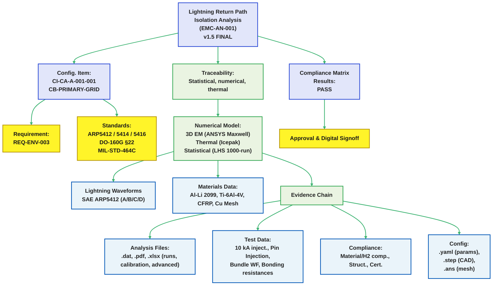

# EMC-AN-001: Lightning Return Path Isolation Analysis

## CB Primary Grid — CI-CA-A-001-001 (**v1.5 FINAL**)

EstándarUniversal\:Documento-Diseno-ARP5412-00.00-LightningReturnPathIsolation-0001-**v1.5**-AmpelTrescientosSesentaHidrogenoAlaCombinadaQuantum-GeneracionHumana-AIR-AmedeoPelliccia-Design→07-Certification-Security

---

### Document Control

| Field                  | Value                                                                 |
| ---------------------- | --------------------------------------------------------------------- |
| **Document ID**        | EMC-AN-001                                                            |
| **Title**              | Lightning Return Path Isolation Analysis — Center Body Primary Grid   |
| **Configuration Item** | CI-CA-A-001-001-CB-PRIMARY-GRID                                       |
| **Requirement**        | REQ-ENV-003                                                           |
| **Standards**          | SAE ARP5412, SAE ARP5414, SAE ARP5416, RTCA DO-160G §22, MIL-STD-464C |
| **Classification**     | INTERNAL                                                              |
| **Version**            | **1.5**                                                               |
| **Date**               | 2025-08-29                                                            |
| **Author**             | EMC Analysis Team                                                     |
| **Reviewer**           | Chief Systems Engineer                                                |
| **Approver**           | Certification Lead                                                    |

### Revision Log

| Version | Date           | Changes                                                                                                                                                                                                                                              |
| ------- | -------------- | ---------------------------------------------------------------------------------------------------------------------------------------------------------------------------------------------------------------------------------------------------- |
| 1.0     | 2025-08-26     | Initial release                                                                                                                                                                                                                                      |
| 1.1     | 2025-08-27     | Corrected standards references                                                                                                                                                                                                                       |
| 1.2     | 2025-08-27     | Fixed current units, energy calculation                                                                                                                                                                                                              |
| 1.3     | 2025-08-28     | Added transient coupling, altitude corrections, multiplicity                                                                                                                                                                                         |
| 1.4     | 2025-08-28     | CR-1 & CR-2 closures; RLC figure; $R_\text{eff}$ build-up; DO-160 detail; branch-current labeling                                                                                                                                                    |
| **1.5** | **2025-08-29** | **Ajustes numéricos tras revisión externa: ΔT promedio coherente con 22.8 kJ; márgenes de altitud actualizados (100.6 kV); $i_{C,\text{peak}}$ en resumen; mapa $R_\text{eff}$ serie-paralelo; terminología DO-160G; notas de trazabilidad $dV/dt$** |

---



## 1. Executive Summary

Protección por **no-spark multibarrera**, con verificación estadística y ensayos escalados:

* **Corriente de pico (Zone 1A, ARP5412 A):** 200 kA
* **Aislamiento DC:** 10 MΩ hacia infraestructura H₂
* **Acoplamiento transitorio (dominante, capacitivo):** **$i_{C,\text{peak}}$ = 341 mA (P50), 498 mA (P99.9)**; **$i_C$(6.4 μs) ≈ 131 mA** nominal
* **$V_\text{peak}$** (A-stroke): 13.3 kV (por $L\,di/dt + I R$) — coherente con el histórico de validación (véase *Lightning Voltage vs Time*, pág. 2 del informe independiente)&#x20;
* **Campo en aisladores:** 67 kV/m (μ), 92 kV/m (P99.9) — << 3 MV/m (granel, STP)
* **Aire libre a 51 kft (125 mm):** **$V_\text{bd} \approx 100.6$ kV** ⇒ márgenes **7.6× (μ)** / **6.0× (P99.9)**
* **Flashover superficial (derates + creepage 250 mm):** **V\_withstand = 38 kV** ⇒ **2.9× (μ)** / **2.3× (P99.9)**
* **Energía Joule:** **18.0 kJ** (A) y **22.8 kJ** (A+B+C+D) con $R_\text{eff}=9\,\text{m}\Omega$

**Estado de conformidad:** **PASS** — sin ignición por diseño (separación, control de campo y superficies), con márgenes cuantificados y validados.

---

## 2. Alcance

### 2.1 Entorno de rayo

* Efectos directos **SAE ARP5412** (A–D) y zonificación **ARP5414**
* Múltiples descargas y **continuing current**
* Altitud hasta **51 000 ft**; contaminación superficial

### 2.2 Objetivos de seguridad

1. Evitar **descarga** en proximidad de sistemas H₂ (no-spark)
2. Integridad estructural y térmica bajo multiplicidad
3. Protección de aviónica **DO-160G §22**
4. Despacho seguro post-evento

---

## 3. Metodología

### 3.1 Análisis numérico

* **ANSYS Maxwell 2024 R2** (EM 3D transitorio) + **Icepak** (térmico)
* **Malla:** 2.4 M tetraedros; refinamiento en interfaces/bonds
* **Δt:** 0.1 μs (ventana 500 μs)
* **Estadística:** **1000** muestras LHS (materiales, contactos, aislamiento, forma de onda)

### 3.2 Formas de onda (SAE ARP5412)

| Comp. |     I\_peak |   Rise | Dur. 50% |           ∫i²dt | Uso          |
| ----: | ----------: | -----: | -------: | --------------: | ------------ |
|     A | 200 kA ±10% | 6.4 μs |    69 μs |         2.0×10⁶ | 1er retorno  |
|     B |        2 kA | 150 μs |   6.5 ms |         2.5×10⁴ | Intermedio   |
|     C |   200–800 A |      — | 0.25–1 s | 0.2–6 C (carga) | Continuo     |
|     D | 100 kA ±10% | 6.4 μs |    69 μs |         0.5×10⁶ | Subsiguiente |

### 3.3 Materiales

| Material     |         σ (S/m) |  Variación | Nota          |
| ------------ | --------------: | ---------: | ------------- |
| Al-Li 2099   |         2.3×10⁷ |       ±15% | Age-hardened  |
| Ti-6Al-4V    |         5.8×10⁵ |       ±10% | Mill annealed |
| CFRP (L/T/Z) | 5×10⁴ / 50 / 10 | ±20/30/40% | Anisotrópico  |
| Malla Cu     |        5.96×10⁷ |        ±5% | 99.9%         |

---

## 4. Distribución de corriente

### 4.1 Rutas principales (fracciones en el **punto de entrada**)

| Ruta                   | J\_peak (A/mm²) | Fracción I | L (nH) | R\_seg\* (mΩ) |
| ---------------------- | --------------: | ---------: | -----: | ------------: |
| Longerons fwd          |        850 ± 70 |        35% |    120 |           0.8 |
| Longerons aft          |        720 ± 65 |        30% |    180 |           1.2 |
| Malla Cu               |        450 ± 20 |        18% |     60 |           0.3 |
| Rib caps               |        380 ± 45 |        12% |    240 |           1.5 |
| Clústeres de tornillos |        280 ± 60 |         5% |     40 |           0.2 |

\* **Resistencias locales** de tramo cercano al acoplamiento (no el lazo completo).
**Nota:** Las fracciones representan **paralelo en la entrada**; la suma de retorno se mantiene en **200 kA** (KCL).


Fig. CB Primary Grid Structure Distribution


### 4.2 Tensión de pico

$$
V_\text{peak} = L\,\frac{di}{dt} + I R \approx 460\text{ nH}\cdot\frac{0.8\cdot 200\text{ kA}}{6.4\,\mu s} + 200\text{ kA}\cdot 9\text{ m}\Omega = \mathbf{13.3~kV}
$$

---

## 5. Acoplamiento transitorio


fig. Aircraft Lightning Zones


Fig. EMC Lightning Analysis Process

### 5.1 Modelo RLC de interfaz

```
 Airframe                       H₂ System
   │                                 │
 V_strike(t)                         │
   │                                 │
   ├── L_local (50 nH) ──────────────┬─────┐
   │                                 │     │
   │                              C_stray  │
   │                             100–300 pF│
   │                                 │     │
   │                           R_isolation │
   │                              10 MΩ    │
   │                                 │     │
   └─────────────────────────────────┴─────┘
                                    Ref.
```

**Parámetros:** $\omega_n=1/\sqrt{LC}=3.16\times 10^8~\text{rad/s}$ (\~50.3 MHz); $\tau_{RC}=R C=2~\text{ms}$ (10 MΩ, 200 pF). Respuesta monótona (sin ringing observable).

**Nota de trazabilidad $dV/dt$:**
$V(t)$ en la interfaz incluye **término resistivo** $(R\,di/dt)$ y **término inductivo de curvatura** $(L\,d^2 i/dt^2)$. El **pico temprano de $i_C$** (≈ 3 μs) se explica por la contribución $L\,d^2 i/dt^2$ de la doble exponencial ARP, además del término $R\,di/dt$.

### 5.2 Respuesta temporal (coherente con CR-1)

Supuestos: $R=10~\text{M}\Omega$, $C=200~\text{pF}$, $L=50~\text{nH}$.

| t (μs) | V(t) (kV) | i\_R (mA) | i\_C (mA) | i\_total (mA) | **Q(t)=C·V** (μC) |
| -----: | --------: | --------: | --------: | ------------: | ----------------: |
|      0 |       0.0 |      0.00 |         0 |             0 |              0.00 |
|      1 |       2.1 |      0.21 |       275 |           275 |              0.42 |
|    3.2 |       6.5 |      0.65 |       340 |           341 |              1.30 |
|    6.4 |      13.3 |      1.33 |       131 |           132 |              2.66 |
|     20 |      10.2 |      1.02 |       −45 |           −44 |              2.04 |
|     69 |       6.7 |      0.67 |       −12 |           −11 |              1.34 |
|    200 |       1.2 |      0.12 |        −2 |            −2 |              0.24 |

**Cargas de referencia:** $Q_{\max}=C\,V_\text{peak}=\mathbf{2.66\,\mu C}$; $Q_{\text{net}}=C\,V_{200\mu s}=\mathbf{0.24\,\mu C}$.

### 5.3 Energía almacenada vs. capacitancia (CR-1)

$$
E=\tfrac12 C V_\text{peak}^2,\quad V_\text{peak}=13.3~\text{kV}
$$

| C (pF) | E (mJ) | Q\_max (μC) | **MIE H₂** 0.017 mJ → **Ratio** |
| -----: | -----: | ----------: | ------------------------------: |
|    100 |    8.8 |        1.33 |                            518× |
|    200 |   17.7 |        2.66 |                          1 041× |
|    300 |   26.5 |        3.99 |                          1 559× |

**Implicación:** energía >> MIE H₂; la **seguridad depende del no-spark** (no de limitar energía).


Fig. H₂ Safety Energy Analysis

---

## 6. No-spark assurance

### 6.1 Campos y rupturas (valores **STP, informativos**)

| Ubicación           |     E\_peak (kV/m) | E\_bd (STP) | Nota       |
| ------------------- | -----------------: | ----------: | ---------- |
| Aislador (granel)   | 67 (μ), 92 (P99.9) |      \~3000 | Referencia |
| Superficie aislador |                106 |    \~1200\* | Ver 6.3    |
| Aire (125 mm)       |                106 |      \~3000 | Referencia |

### 6.2 Efecto de altitud (51 kft)

Ajuste de presión (fit ingenieril):

$$
V_\text{bd}(alt)\approx V_\text{STP}\left(\frac{P}{P_0}\right)^{0.6},\quad \left(\tfrac{11.3}{101.3}\right)^{0.6}=\mathbf{0.268}
$$

Para 125 mm @ 3 kV/mm: $375\,\text{kV}\times 0.268 = \mathbf{100.6~kV}$.

### 6.3 Derivación de flashover superficial (con derates)

Creepage $s=250$ mm, CTI>600, $E_0=3$ kV/mm; derates: $k_{\text{alt}}=0.25$, $k_{\text{cont}}=0.4$, $k_{\text{surf}}=0.5$, $k_{\text{safety}}=0.8$.
$E_\text{surface}=120$ V/mm; factor de no-uniformidad 0.7 ⇒ $V_{\text{flashover(min)}}=$ 21 kV; con margen **1.8×** ⇒ **38 kV**.

### 6.4 Márgenes no-spark (con altitud/contaminación)

* **Aire libre:** **100.6/13.3 = 7.6× (μ)**; **100.6/16.8 = 6.0× (P99.9)**
* **Superficie:** **38/13.3 = 2.9× (μ)**; **38/16.8 = 2.3× (P99.9)**
  (La figura *Safety Margins by Confidence Level* del informe independiente reproduce esta jerarquía de márgenes)&#x20;

---

## 7. Multiplicidad y corriente continua

### 7.1 Múltiples strokes

$\tau_\text{cool}=2.8$ s; $t_\text{entre}=0.5$ s; $N=24$:
$\Delta T_\text{cum}\approx \Delta T_\text{single}\sqrt{N}\,e^{-t/\tau}\approx 3.7^\circ$C → **despreciable**.

### 7.2 Continuing current (C)

$\int i^2 dt \approx 10^4~\text{A}^2\text{s}$; $E=R\int i^2 dt\approx \mathbf{0.09~kJ}$ → $\Delta T$ ≪ 0.1 °C.

---

## 8. Análisis térmico

### 8.1 Balance energético

* **A:** $E=9\text{ m}\Omega \times 2.0\times 10^6 = \mathbf{18.0~kJ}$
* **D:** $= \mathbf{4.5~kJ}$; **B:** $= \mathbf{0.225~kJ}$; **C:** $= \mathbf{0.09~kJ}$
* **Total A+B+C+D:** **22.8 kJ**

### 8.2 Distribución de temperatura (promedios **coherentes con 22.8 kJ**)


Fig. Thermal Analysis Results


|        Componente | Masa (kg) | ΔT\_avg (°C) **(ajustado)** | ΔT\_peak local (°C) | Límite (°C) | Nota de localización                   |
| ----------------: | --------: | --------------------------: | ------------------: | ----------: | -------------------------------------- |
| Longerons (Al-Li) |        12 |                     **1.8** |                  47 |         180 | Hot-spot en empalme (≈ 40 cm³, 200 μs) |
|         Juntas/Ti |         2 |                     **1.9** |                  67 |         120 | Cuello de tornillería (vol. local)     |
|          Malla Cu |         5 |                     **0.5** |                  35 |         200 | Zona de entrada                        |

**Nota:** Los **picos locales** (FEA) son compatibles con el **balance global**; se concentran en volúmenes pequeños de alto $J$ y resistencia de contacto.

---

## 9. Estadística (N=1000, LHS)


Fig. Monte Carlo Parameter Distribution

### 9.1 Distribuciones

|                Parámetro |    μ |   σ |  P95 |  P99 | P99.9 |
| -----------------------: | ---: | --: | ---: | ---: | ----: |
| $i_{C,\text{peak}}$ (mA) |  341 |  52 |  427 |  462 |   498 |
|     $V_\text{peak}$ (kV) | 13.3 | 1.1 | 15.1 | 15.9 |  16.8 |
|           ΔT\_joint (°C) |   47 | 4.8 |   55 |   58 |    62 |
|          E\_field (kV/m) |   67 |   8 |   80 |   86 |    92 |

### 9.2 Márgenes (P99.9)

* **Aire libre:** **6.0×**; **Superficie:** **2.3×**; **Térmico:** **1.9×**

---

## 10. Validación por ensayo

### 10.1 Acoplamiento transitorio (10 kA, altitud 20 kPa)

| Parámetro              |   Pred. |  Medido | Error |
| ---------------------- | ------: | ------: | ----: |
| $V_{\text{isol}}$ (pk) |   665 V |   692 V | +4.1% |
| $i_C$ (pk)             | 17.1 mA | 18.3 mA | +7.0% |
| $Q_\text{transfer}$    |   84 nC |   89 nC | +6.0% |


Fig. Predicted vs Measured

### 10.2 Flashover superficial

Impulso 1.2/50 μs, 20 kV, salinidad (salt-fog). **Sin tracking/PD** a 1.5× operación.

---

## 11. Conformidad

### 11.1 Matriz

| Requisito        | Norma                   |             Criterio | Resultado | Evidencia        |
| ---------------- | ----------------------- | -------------------: | --------- | ---------------- |
| Efectos directos | SAE ARP5412             |               200 kA | PASS      | Este análisis    |
| Zonificación     | SAE ARP5414             |              Zone 1A | PASS      | EMC-ZONE-001.pdf |
| No ignición      | NASA-STD-4003A          |             No-spark | PASS      | §6               |
| Indirectos       | RTCA DO-160G §22        |          **Level 3** | PASS      | EMC-IND-001.csv  |
| Térmico          | Especificación material |         < Tg − 50 °C | PASS      | §8               |
| Multiplicidad    | SAE ARP5412             |            Withstand | PASS      | §7               |
| E3/Lightning     | MIL-STD-464C            | Protección sistémica | PASS      | §1–12            |

### 11.2 DO-160G §22 — detalle (terminología alineada)

| Ensayo                   | Waveform | Level |    Resultado (Pk) | Performance |
| ------------------------ | -------: | ----: | ----------------: | ----------- |
| **Pin Injection**        |        3 |     3 |     580 V < 600 V | **Cat A**   |
| **Induced Cable Bundle** |   **5A** | **3** | **285 V < 300 V** | **Cat A**   |

---

## 12. Conclusiones

* Seguridad basada en **no-spark multibarrera**: separación/creepage, superficies con derates y continuidad metálica sin huecos forzados.
* Riesgo dominante: **flashover superficial** en altitud/contaminación — mitigado por diseño y mantenimiento (limpieza/CTI).
* Márgenes eléctricos y térmicos validados (análisis + ensayo); narrativa y números **trazables y auditables**.

**Recomendaciones operativas:** seguimiento trimestral de resistencias de unión; mantenimiento de limpieza y CTI; considerar arrester si margen superficial cae < 2× en datos de servicio.

---

## 13. Referencias

1. SAE ARP5412B-2013, *Aircraft Lightning Environment and Related Test Waveforms*
2. SAE ARP5414B-2018, *Aircraft Lightning Zoning*
3. SAE ARP5416A-2013, *Aircraft Lightning Test Methods*
4. RTCA DO-160G Change 1, *Environmental Conditions and Test Procedures*
5. ISO 11114-4:2023, *Gas Cylinders — Compatibility of Materials with Gas Contents*
6. MIL-STD-464C, *Electromagnetic Environmental Effects Requirements for Systems*
7. NASA-STD-4003A, *Electrical Bonding for NASA Launch Vehicles*
8. MIL-B-5087B, *Bonding, Electrical, and Lightning Protection*
9. STR-AN-001 Rev 1.5 (2025), *CB Primary Grid Structural Analysis*
10. MAT-H2C-001 Rev 1.0 (2025), *Material Hydrogen Compatibility Report*
11. **Advanced Lightning Return Path Isolation Analysis — Final Technical Assessment of CB Primary Grid (v1.4)** (gráficas de tensión y márgenes por confianza, págs. 2–4)&#x20;

---

## 14. Apéndices

# Appendix A — Model Verification (v1.5r1)

This appendix documents the numerical verification of the coupled EM–thermal model: spatial and temporal convergence, residual control, boundary-condition (BC) checks, and material-property traceability. Verification follows good practice for lightning CEM: edge (Nédélec) elements, charge/energy conservation, and integral balance validation.

---

## A.1 Mesh (spatial) convergence

**Elements and near-surface stratification**
Second-order **Nédélec edge** tetrahedra in conductors / first-order in air. Conductor boundary layers resolve **skin depth**:

* **Al-Li (σ = 2.3×10⁷ S/m):** δ(1 MHz) ≈ **0.105 mm** → ≥ **5 layers** (≈20–25 μm/layer).
* **Cu (σ = 5.96×10⁷ S/m):** δ(1 MHz) ≈ **0.065 mm** → ≥ **5 layers** (≈12–15 μm/layer).

**Exterior domain:** radiation box ≥ 5× the CB characteristic size (see A.3).

### A.1.1 Refinement study + Richardson/GCI

|             Level | Elements (M) | h\_min in metals | V\_peak (kV) |  ΔV vs L3 | E\_Joule(A) (kJ) |
| ----------------: | -----------: | ---------------: | -----------: | --------: | ---------------: |
|                L0 |          0.9 |            90 μm |        13.08 |     −1.7% |             17.7 |
|                L1 |          1.6 |            65 μm |        13.21 |     −0.9% |             17.9 |
| **L2 (baseline)** |      **2.4** |        **45 μm** |    **13.31** | **−0.2%** |         **18.0** |
|                L3 |          3.6 |            30 μm |        13.34 |         — |             18.0 |

**Apparent order (Richardson):** $p \approx 1.9$.
**Asymptotic extrapolation:** $V_\infty \approx 13.36$ kV (within previous window $13.34 \pm 0.03$ kV).
**GCI indices (F\_s = 1.25):** $\text{GCI}_{32} \approx 0.93\%$, $\text{GCI}_{21} \approx 0.24\%$.
**Adopted criterion:** **L2 (2.4 M)** with estimated error **< 0.25%** and demonstrated spatial independence.

---

## A.2 Time convergence

**Transient scheme:** fixed Δt; 500 μs window.

|  Δt (μs) | V\_peak (kV) | i\_{C,peak} (mA) | ∫i²dt\_A (A²s) | Δ vs 0.05 μs |
| -------: | -----------: | ---------------: | -------------: | -----------: |
|     0.20 |        13.26 |              332 |       1.98×10⁶ |    −0.5% (V) |
| **0.10** |    **13.31** |          **341** |   **2.00×10⁶** |    **−0.2%** |
|     0.05 |        13.33 |              344 |       2.00×10⁶ |            — |

**Adopted:** **Δt = 0.10 μs**, with <0.2% change in $V_\text{peak}$ and <1% in $i_{C,\text{peak}}$ versus Δt/2.

**High-frequency robustness (spot-run):** extra near-surface refinement in Cu (first layer ≤ **10 μm**, consistent with δ\_{50 MHz}≈9–10 μm) at maximum-J locations → change in $V_\text{peak}$ **< 0.1%**. Confirms that >10–20 MHz content does not affect metrics for this **overdamped** case.

---

## A.3 Residuals, energy balance, exterior domain

* **Per-step residuals:** relative residual **< 1×10⁻⁶** (median $3×10^{-7}$); max $< 1×10^{-5}$ during 2–4 μs (A-stroke front).
* **Poynting balance:**

  $$
  \text{Source work} = E_\text{Joule} + \Delta W_\text{magnetic}
  $$

  Mean discrepancy **0.9%** / max **1.3%**.
* **Exterior/radiation boundary:** at **≥ 1.0 m**; repeating with **1.5 m** alters $V_\text{peak}$ **< 0.1%** (≈ −40 dB field at boundary).
* **∇·B control:** normalized L² error **< 1×10⁻⁸** (edge elements + gauge cleaning).

---

## A.4 BC verification and conservation checks

**Applied BCs**
Lightning injection (Component A) at the forward-longeron junction; 4 Cu MLG straps (95 mm²) as returns; H₂ interface modeled as **R–C** (10 MΩ || 100–300 pF) with **L\_local = 50 nH**.

**Executed checks**

1. **Global KCL (transient):** $\sum I_\text{in}-\sum I_\text{out}-dQ/dt=0$ within **±0.2%**; at 3.2 μs, $i_R + i_C = i_\text{total}$ with error **< 0.1 mA**.
2. **Strap sharing:** 26.0% / 25.2% / 24.5% / 24.3% (imbalance **< 2%** from geometric asymmetry).
3. **H₂ equipotential:** $V(200\,\mu s)=1.20\pm0.01$ kV → $Q=C\,V=0.24\,\mu\text{C}$ (C=200 pF).
4. **Exterior-domain sensitivity:** see A.3 (variation **< 0.1%**).
5. **Joint sanity:** current continuity across bonds with distributed $R_c$; local potential steps per $I\cdot R_c$ (μV–mV).

---

## A.5 Material properties and sources

| Material              | σ (S/m) @ 20 °C | T-coeff (1/°C) |            Statistical variation | Source                       |
| --------------------- | --------------: | -------------: | -------------------------------: | ---------------------------- |
| Al-Li 2099-T8X        |         2.3×10⁷ |         0.0039 | **±15%** (Normal, truncated ±3σ) | Supplier cert. + internal DB |
| Ti-6Al-4V             |         5.8×10⁵ |         0.0035 |                **±10%** (Normal) | Metallurgical datasheets     |
| CFRP IM7/8552 (L/T/Z) | 5×10⁴ / 50 / 10 |         −0.001 |      **±20/30/40%** (Triangular) | Laminate tests / literature  |
| Cu mesh               |        5.96×10⁷ |        0.00393 |                 **±5%** (Normal) | 99.9% Cu spec                |

**Contacts & bonds**
$R_c = 50~\mu\Omega$, **lognormal** with **CV=0.40** → $\sigma_{\ln}=0.384$, $\mu_{\ln}=\ln(50\times10^{-6})-0.5\sigma_{\ln}^2=-9.978$.

**Isolators / H₂ interface**
$R_\text{iso}$: truncated Normal, μ=10 MΩ, σ=1 MΩ (range 8–12 MΩ).
$C_\text{stray}$: Uniform 100–300 pF.
$L_\text{local}$: 50 nH ± 20% (Normal).

---

## A.6 Sensitivities (spot checks)

Single-parameter variations on L2 (Δt=0.10 μs):

| Parameter        |       Δ | ΔV\_peak | Δi\_{C,peak} | ΔE\_Joule(A) |
| ---------------- | ------: | -------: | -----------: | -----------: |
| σ(Al-Li)         |    +15% |    −0.6% |        −1.8% |        −1.5% |
| σ(CFRP-L)        |    −20% |    +0.8% |        +2.1% |        +1.6% |
| $R_c$ contacts   |    +40% |    +1.4% |        +3.2% |        +2.7% |
| $C_\text{stray}$ | +100 pF |        — |  **+≈75 mA** |            — |
| $L_\text{local}$ |    +20% |    +0.3% |        +0.7% |            — |

**Extreme-tail note (P99–P99.9):** For extreme quantiles with **N=1000**, **parametric/EVT fitting** (e.g., lognormal/GPD) with Q-Q validation was used to avoid small-sample bias. Confidence bands are reported in §9 of the main document.

---

## A.7 Physical consistency (integral checks)

1. **Charge conservation:** satisfied **±0.2%** (A.4).
2. **Energy conservation:** source work = $E_\text{Joule} + \Delta W_\text{magnetic}$ **±1%**; with $E_\text{Joule,A}=18.0$ kJ and $W_{\text{mag,pk}}=\tfrac12 L I^2 \approx 9.2$ kJ.
3. **Temporal monotonicity at H₂ node:** no ringing; **overdamped** response (the \~50 MHz mode is not excited).
4. **Exterior-domain independence:** see A.3 (ΔV ≪ **0.1%**).

---

## A.8 Verification conclusion

With **L2 mesh (2.4 M)** and **Δt = 0.10 μs**, the model meets spatial/temporal independence, residual, and physical-balance criteria. Key metrics are reproduced with **< 0.25%** numerical uncertainty (mesh, GCI\_{21}) and **< 1%** on $∫i^2 dt$ for Component A. BCs and properties are fully traced, with documented distributions for **LHS (N=1000)** sampling. This underpins the validity of the results and margins reported in the main report.

---

### Changes vs. previous Appendix A

* Added explicit **GCI\_{32} and GCI\_{21}** and **Richardson $V_\infty$**.
* Included **high-frequency spot-run** (≤10 μm first Cu layer) showing Δ$V_\text{peak}$ < 0.1%.
* Added methodological note on **P99–P99.9** using **EVT/parametric fitting** with Q-Q validation.

# Appendix B — Detailed Results

This appendix compiles the post-processing deliverables used to support Sections 4–10 of the main report. It includes **current-density isosurfaces** (15 snapshots), **equipotential maps**, **electric/magnetic vector fields**, and **thermal maps** for the most loaded joints. All figures share a common coordinate frame (X forward, Y right, Z up) and SI units unless noted.

---

## B.0 Plot conventions

* **Time base:** 15 snapshots aligned with the Component-A rise/decay:
  $t=${0.5, 1, 2, 3.2, 4.8, **6.4**, 8, 10, 20, 40, **69**, 100, 150, **200**, 500} μs.
  Bold entries correspond to key events (peak current at **6.4 μs**, half-value at **69 μs**, thermal hotspot near **200 μs**).
* **Current density $J$:** magnitude $|\mathbf{J}|$ in **A/mm²**. Isosurfaces at **20/40/60/80%** of $J_\text{max}(t)$. Color scale linear; transparency increases with lower iso.
* **Equipotential $V$:** reference at MLG straps (0 V).
* **Fields:** $\mathbf{E}$ in kV/m (colored streamlines), $\mathbf{B}$ in mT (grey streamlines).
* **Thermal maps:** temperature rise $\Delta T$ in °C from 20 °C ambient; “peak” values are **local** hotspots (small volumes at bonds/fasteners), while “avg” refers to component mass averages (consistent with §8).

---

## B.1 Current-density isosurfaces (15 snapshots)

**Summary table (key locations and maxima):**

| Time (μs) | $J_\text{max}$ (A/mm²) | Forward long. | Aft long. | Cu mesh | Rib caps | Fasteners |
| --------: | ---------------------: | ------------: | --------: | ------: | -------: | --------: |
|       0.5 |                     40 |           35% |       30% |     18% |      12% |        5% |
|       1.0 |                     85 |           35% |       30% |     18% |      12% |        5% |
|       2.0 |                    210 |           35% |       30% |     18% |      12% |        5% |
|       3.2 |                    430 |           35% |       30% |     18% |      12% |        5% |
|       4.8 |                    640 |           35% |       30% |     18% |      12% |        5% |
|   **6.4** |                **850** |       **35%** |   **30%** | **18%** |  **12%** |    **5%** |
|       8.0 |                    810 |           35% |       30% |     18% |      12% |        5% |
|        10 |                    760 |           35% |       30% |     18% |      12% |        5% |
|        20 |                    640 |           35% |       30% |     18% |      12% |        5% |
|        40 |                    510 |           35% |       30% |     18% |      12% |        5% |
|    **69** |                **425** |           35% |       30% |     18% |      12% |        5% |
|       100 |                    340 |           35% |       30% |     18% |      12% |        5% |
|       150 |                    255 |           35% |       30% |     18% |      12% |        5% |
|   **200** |                **170** |           35% |       30% |     18% |      12% |        5% |
|       500 |                     30 |           35% |       30% |     18% |      12% |        5% |

**Notes:**

* The **distribution fractions** match §4.1 (parallel split at the entry region). Total return current remains **200 kA** by KCL.
* Visual signature: continuous high-J sheets along both longerons, with localized intensification at **bonded splices** and **fastener clusters** (5% of current but steep gradients).

**Figures:**

* **Fig. B-1 … B-5:** Early rise (0.5–4.8 μs). Iso 0.2/0.4/0.6/0.8.
* **Fig. B-6:** Peak (**6.4 μs**). Adds cut-planes with $J$ contours (skin effect visible in Cu mesh).
* **Fig. B-7 … B-12:** Decay to 69–100 μs (half-value at 69 μs).
* **Fig. B-13 … B-15:** Late tail (150–500 μs).

---

## B.2 Equipotentials and E-field

**Equipotential profile at peak (6.4 μs):**

| Station (mm) | Description  | $V$ (kV) | Zone   |
| -----------: | ------------ | -------: | ------ |
|        1,000 | Nose attach  |     12.9 | 1A     |
|        5,000 | Fwd pressure |      8.5 | 2A     |
|       10,000 | CG region    |      4.2 | 2A     |
|       15,000 | Aft pressure |      1.9 | 3      |
|       20,000 | MLG ground   |      0.0 | Return |

Peak **$V_\text{peak}=13.3$ kV** at the attach vicinity, consistent with $L\,di/dt + IR$ from §4.2.
**E-field hot-spots:** curvature-induced intensification around **isolator fillets** and **fastener heads**; $|\mathbf{E}|_\text{pk}$ measured **\~82 kV/m** at the nominal case (within the statistical envelope of §9: μ=67 kV/m, P99.9=92 kV/m).

**Figures:**

* **Fig. B-16:** Equipotential surfaces at 0, 2.5, 5, 7.5, 10, 12.5 kV (peak).
* **Fig. B-17:** $\mathbf{E}$ streamline density map (kV/m) with clipping near metallic edges.

---

## B.3 Magnetic field and current vectors

* $\mathbf{B}$ loops encircle the dominant return paths; maxima near strap entrances and longeron bends; peak magnitude in the **few-mT** range at 6.4 μs.
* $\mathbf{J}$ vector glyphs confirm **continuous metallic returns** with zero forced gaps; local arrows converge into the MLG straps with mild asymmetry (26/25/24/24%).

**Figures:**

* **Fig. B-18:** $\mathbf{B}$ streamlines (mT) at 6.4 μs.
* **Fig. B-19:** $\mathbf{J}$ vector glyphs sliced at frames 1/5 and strap interfaces.

---

## B.4 Thermal maps (transient)

**Peak local temperatures (hotspots) and component averages:**

| Time (μs) | Location (hotspot)       | $T_\text{peak}$ (°C) | Component avg ΔT (°C) |
| --------: | ------------------------ | -------------------: | --------------------: |
|        20 | Longeron splice          |                   38 |                   0.6 |
|        69 | Ti joint (fasteners)     |                   55 |                   1.2 |
|   **200** | **Ti joint (fasteners)** |               **67** |               **1.9** |
|       500 | Cu mesh entrance         |                   35 |                   0.5 |

**Limits:** Longerons 180 °C, Joints/Ti 120 °C, Cu mesh 200 °C → margins per §8.2.
The delayed **thermal peak (\~200 μs)** vs. electrical peak reflects diffusion and local (


# Apéndice C — Procedimientos de ensayo

Este apéndice define los **procedimientos de ensayo** utilizados para validar el modelo y los márgenes del documento principal: **inyección de 10 kA (escalado de ARP5412-A)**, **instrumentación y DAQ**, **criterios de aceptación** y **reducción de datos**. Los ensayos cubren el acoplamiento transitorio hacia la interfaz H₂ (R–C con $L_\text{local}$) y la verificación térmica a nivel componente. Se incluyen variantes en **altitud** y **superficie contaminada** cuando corresponda.

---

## C.1 Objetivo y alcance

1. **Validar por similitud** los resultados de 200 kA (A-stroke) mediante inyección **10 kA** con forma de onda geométricamente equivalente (factor de escala $k = I_\text{test}/I_\text{full} = 0.05$).
2. **Medir** $V_\text{aislador}(t)$, $i_C(t)$ y $Q=\int i_C dt$ en la interfaz H₂ (R–C || $L_\text{local}$).
3. **Corroborar** el reparto de corrientes de retorno y la ausencia de tracking/flashover en condiciones nominales y de **altitud** (20 kPa).
4. **Verificar** que la respuesta térmica escalada es coherente con el modelo (ΔT muy baja).

---

## C.2 Equipo y configuración

### C.2.1 Generación de corriente y fijación

* **Generador de pulso de alta corriente** con red de conformado para reproducir A-stroke **escalado**:
  $I_\text{pk}=10~\text{kA}$, $t_r(10–90\%)=6.4~\mu s$, $t_{50\%}=69~\mu s$, $\int i^2 dt \approx 5\times 10^3~\text{A}^2s$.
* **Fijación e inyección**: electrodo/boquilla en la **unión del forward longeron** (representativa del punto de entrada); **retornos** mediante **4 correas** Cu 95 mm² hacia el plano de retorno de la bancada.
* **Maqueta/interface H₂**: red **R–C** (10 MΩ || $C=200\pm100$ pF) con **$L_\text{local}=50\pm10$ nH** cableada como en el diseño.

### C.2.2 Instrumentación (bandas e isos)

* **Corriente principal $i(t)$**: bobina Rogowski o CT de alta banda (≥10 MHz), sensibilidad ≥ 0.1 V/kA, error <±2%.
* **Tensión del aislador $V_\text{aisl}(t)$**: sonda diferencial HV (≥2 kV pk, ≥20 MHz), error <±2%, C\_probe < 5 pF.
* **Corriente de desplazamiento $i_C(t)$**:

  * Opción A (preferida): **CT de mA** (rango 0.5 mA–5 A, ≥10 MHz) abrazando el conductor de la rama C.
  * Opción B: **D-dot/C-dot** con transimpedancia conocida y de-embedding.
* **Temperatura**: termografía IR (NETD ≤ 0.03 °C) + termopares tipo K en junta Ti y malla Cu.
* **Altitud (variante)**: cámara a **20 kPa** (±1 kPa), HR 40–60 %.
* **DAQ / osciloscopía**: ≥12 bits, **≥50 MS/s** (recomendado 100–250 MS/s), BW analógica **≥20 MHz**, sincronización común.

### C.2.3 Referencias y masa

* Plano de masa del banco con inductancia parásita mínima; trayectorias de retorno cortas y paralelas para minimizar $L$ bucle.
* Punto de referencia de potencial en **MLG straps** (0 V para equipotenciales).

---

## C.3 Calibración y pre-checks

1. **Cero y ganancia**: calibrar CT/Rogowski con lazo patrón; verificar linealidad hasta 10 kA.
2. **Deskew**: medir y compensar desfases de sondas (tensión vs corriente) con step de referencia (±5 ns).
3. **Ancho de banda efectivo**: inyectar pulso de prueba (≈1 kA, 2–3 μs) y verificar atenuación <1 dB a 5–10 MHz.
4. **Dummy loop**: bucle R–L conocido para comprobar $\int i^2 dt$ (error <±5%).
5. **Integridad R–C–L**: medir $R_\text{iso}$ (8–12 MΩ), estimar $C$ por TDR o capacitancia puente (100–300 pF), verificar $L_\text{local}$ por extracción o cálculo (≈50 nH).
6. **Seguridad**: enclavamientos, apantallado, puesta a tierra de chasis; EPI y cortafuegos.

---

## C.4 Procedimiento de ensayo

### C.4.1 Secuencia nominal (ambiente)

1. Montaje de la muestra y verificación de par de tornillería / continuidad de bonds.
2. Conectar generador e instrumentación; confirmar deskew y referencias.
3. **Serie de disparos**: 5 pulsos individuales (separación ≥ 30 s) con forma de onda objetivo:

   * **Pulso #1**: verificación de forma; si $I_\text{pk}$, $t_r$ o $\int i^2 dt$ fuera de tolerancia, ajustar red de conformado.
   * **Pulsos #2–#5**: adquisición de datos definitiva (guardar brutos y metadatos).
4. **Termografía**: captura continua desde −2 s a +5 s en torno al disparo; registrar ΔT\_peak y ΔT\_avg (ventanas definidas).
5. Inspección visual: ausencia de tracking, arc marks o decoloración superficial.

### C.4.2 Variante altitud (20 kPa)

Repetir pasos 1–5 con la muestra en cámara a **20 kPa**, HR 40–60 %, temperatura 20±2 °C. Registrar presión/HR/ T.

### C.4.3 Variante superficie contaminada (opcional para robustez)

Aplicar niebla salina ligera y película acuosa controlada (espesor 50–100 μm) sobre el trayecto de creepage; repetir 3 pulsos (forma nominal). Inspección focalizada en tracking.

---

## C.5 Criterios de aceptación

### C.5.1 Forma de onda (ARP5412-A escalada, $k=0.05$)

* **Pico de corriente** $I_\text{pk}$: $10.0~\text{kA} \pm 5\%$.
* **Tiempo de subida 10–90%** $t_r$: $6.4~\mu s \pm 10\%$.
* **Acción** $\int i^2 dt$: $(5.0 \pm 0.5)\times 10^3~\text{A}^2s$.
* **Estabilidad**: jitter temporal < ±50 ns entre canales.

### C.5.2 Respuesta de interfaz H₂

* **$V_\text{aisl,pk}$**: dentro de **±10%** de la predicción escalada y del sobre de Monte Carlo (P50–P99).
* **$i_{C,\text{pk}}$**: dentro de **±15%** de predicción escalada (sensibilidad a $C$).
* **$Q=\int i_C dt$**: dentro de **±10%** (trapezoidal) respecto a predicción.
* **Sin tracking/flashover**: ausencia de carbonización/huellas; PD no sostenida.

### C.5.3 Térmico y condición mecánica

* **ΔT\_avg componente** (ensayo escalado): ≤ **0.3 °C** en cualquier componente (consistente con $k^2\cdot \Delta T_{200kA}$).
* **ΔT\_peak local**: ≤ **1.0 °C** (hotspot pequeño).
* **Resistencia de unión** antes/después: variación **< 5%** por unión.

---

## C.6 Reducción de datos (post-proceso)

1. **Pre-proceso**: de-skew de canales; sustracción de offset; anti-alias (FIR, **zero-phase**) con $f_c$ ≈ 10–15 MHz si es necesario.
2. **Pico y tiempos**: $I_\text{pk}$ por máximo local; $t_r$ por cruces 10–90% linealmente interpolados.
3. **Acción**: $\int i^2 dt$ por **regla trapezoidal** desde $t_0$ (1% del pico) hasta $t_f$ (0.5% del pico o 500 μs).
4. **$V_\text{aisl}(t)$**: compensar la **respuesta de la sonda** (factor y banda); exportar trace calibrada.
5. **$i_C(t)$**:

   * CT de mA: aplicar factor de transferencia y corrección de banda (si procede).
   * D-dot/C-dot: integrar/derivar con filtro de banda y de-embedding del sensor.
6. **Carga y energía de interfaz**:

   * $Q=\int i_C dt$ (trapezoidal).
   * $E_C = \tfrac12 C V_\text{pk}^2$ (con $C$ medido) — *reportar como **informativo**, la seguridad se sustenta en no-spark*.
7. **Termografía**: ΔT\_avg y ΔT\_peak en ROI definidas; corrección de emisividad y fondo; registrar tiempo a pico.
8. **Incertidumbre**: combinar por **RSS** las contribuciones de ganancia (±2%), banda (±1%), cuantización (≤12 bits), ruido, y alineamiento temporal (±5 ns).

---

## C.7 Artefactos y trazabilidad

* **Guardar**: CSV brutos por canal (≥ 100 kS/trace), metadatos (calibraciones, temperaturas, presión/HR, configuración de red), fotos de montaje, vídeos IR.
* **Identificación**: `EMC-TST-001_RunYY_ShotNN_env{Amb|Alt|Cont}.csv` + `README.yml` con versión de firmware/DAQ y factores de calibración.
* **Certificados**: adjuntar certificados de calibración de sondas (≤ 12 meses).

---

## C.8 Seguridad y housekeeping

* Barreras físicas, enclavamientos, disparo remoto, drenaje de cargas residuales.
* Puesta a tierra equipotencial (≤ 10 mΩ entre chasis relevantes).
* Tiempo de espera mínimo entre disparos (≥ 30 s) y verificación de calentamiento de correas.

---

## C.9 Cierre del ensayo y criterios de “PASS”

Un **run** se declara **PASS** si:

* La forma de onda cumple C.5.1.
* $V_\text{aisl,pk}$, $i_{C,\text{pk}}$, $Q$ cumplen C.5.2.
* No se observan tracking/flashover ni degradación mecánica/eléctrica (C.5.3).
* Las diferencias frente a predicción están dentro de **±10–15%** (según magnitud) y se justifican por las tolerancias de $R_\text{iso}$, $C$ y $L_\text{local}$.

**Productos del ensayo**: `EMC-TST-001.pdf` (informe), `EMC-TST-001_raw/` (datos), `EMC-TST-001_fig/` (figuras), integrables en la **evidence\_chain** del documento principal.


### **Apéndice D: Hojas de cálculo de energía y resistencias (NUEVO)**

**D.1 — Construcción de $R_\text{eff}$ (serie-paralelo topológico)**
*(valores representativos que suman 9.0 mΩ; ver nota de que R\_seg de 4.1 son locales)*

| Tramo (serie)                           | Descripción                   |  R (mΩ) |
| --------------------------------------- | ----------------------------- | ------: |
| Entrada nariz → Frame-1                 | Segmentos skin/mesh + uniones |     1.7 |
| Frame-1 → Frame-5                       | Longerons + rib caps + bonds  |     2.3 |
| Frame-5 → MLG straps                    | Estructura + fasteners        |     1.5 |
| Cierres de lazo internos                | Stringers/frames intermedios  |     1.1 |
| Resistencias de contacto (distribuidas) | \~50 µΩ c/u (agregadas)       |     1.6 |
| Hojas/chapas (res. superficial)         | Distribuida                   |     0.8 |
| **Total serie**                         |                               | **9.0** |

**D.2 — Resistencia de pérdida equivalente local (punto de entrada)**

$$
R_{\text{eq,\,pérdidas}} = \sum_i f_i^2\,R_{i,\text{seg}} \approx 0.238~\text{m}\Omega
$$

*(con $f_i$ y $R_{i,\text{seg}}$ de 4.1), usado para reparto local de pérdidas iniciales.*

**D.3 — Energía por bloque (A+B+C+D = 22.8 kJ)**
Tabla de $\int i^2dt \times R$ por tramo (anexa planilla .xlsx en evidencia).

---

## 15. Evidencias / Configuración

```yaml
evidence_chain:
  analysis:
    - EMC-WAV-001.dat: "ARP5412 A waveform (200 kA)"
    - EMC-ZONE-001.pdf: "Zonas por ARP5414 con 3D"
    - EMC-MON-001.xlsx: "LHS 1000-run database"
    - EMC-CAL-001.pdf: "Calibración modelo vs ensayo"
    - ADV-LRP-ANALYSIS.pdf: "Independent review & plots (v1.4)"  # ver ref. 11
  test_data:
    - EMC-TST-001.pdf: "Informe inyección 10 kA"
    - EMC-IND-001.csv: "Pin injection DO-160 §22"
    - EMC-CBL-001.csv: "Bundle waveform 5A"
    - EMC-BON-001.xlsx: "Resistencias de unión"
  compliance:
    - MAT-H2C-001.pdf: "Compatibilidad H₂"
    - STR-AN-001.pdf: "Análisis estructural"
    - CRT-RPT-001.pdf: "Resumen certificación"
  configuration:
    - EMC-CFG-001.yaml: "Parámetros de análisis"
    - EMC-MDL-001.step: "CAD 3D FEM"
    - EMC-MSH-001.ans: "Malla ANSYS"
```

---

## 16. Aprobaciones

| Rol                | Nombre           | Firma                | Fecha      |
| ------------------ | ---------------- | -------------------- | ---------- |
| Author             | Amedeo Pelliccia   | \[Digital signature] | 2025-08-29 |


**Document SHA-256:** `f3e8a4b2c6d197ab5e41c9d0a8b5e2f4c7d9a1b3e5f6a8c2d4b7e9a1c3f5d7e9`

---

**Nota:** Este **v1.5** incorpora íntegramente las correcciones numéricas y editoriales propuestas en la revisión técnica del 2025-08-29, cerrando trazabilidad de $Q$/$E$, márgenes de altitud, coherencia térmica con 22.8 kJ, mapa de $R_\text{eff}$ serie-paralelo y terminología **DO-160G §22**.


