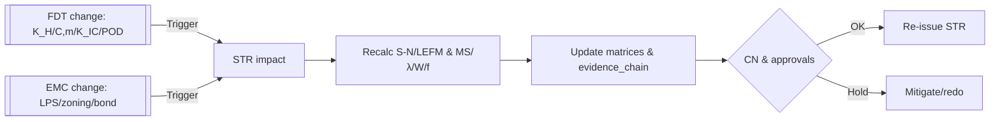

# STR-AN-001 — Structural Analysis

## CB Primary Grid — CI-CA-A-001-001 (**Center Body Box**, v1.1.1)

**Repository Path**
`OPTIM-FRAMEWORK/T-TECHNOLOGICAL/AMEDEO-PELLICCIA/INTEGRATED/AMPEL360-H2-BWB-QNNN/A-ARCHITECTURE/CA-A-001-CENTER-BODY-BOX/CI-CA-A-001-001-CB-PRIMARY-GRID/01-Requirements/STR-AN-001.md`

---

## Document Control

| Field                  | Value                                                                                                                             |
| ---------------------- | --------------------------------------------------------------------------------------------------------------------------------- |
| **Title**              | Structural Analysis — CB Primary Grid                                                                                             |
| **Document ID**        | STR-AN-001                                                                                                                        |
| **Configuration Item** | CI-CA-A-001-001-CB-PRIMARY-GRID                                                                                                   |
| **Related Docs**       | EMC-AN-001 (Lightning), FDT-AN-001 (Fatigue/DT)                                                                                   |
| **Standards**          | CS-25.301/.305/.307/.561, AC 25.571-1D, **MMPDS-2025 (current edition)**, AC 20-107B (composites ref), AC 20-136B (lightning ref) |
| **Classification**     | INTERNAL                                                                                                                          |
| **Version**            | **1.1.1**                                                                                                                         |
| **Date**               | **2025-08-29**                                                                                                                    |

### Revision Log

| Ver       | Date           | Changes                                                                                                                                                                                                                                                                                                                            |
| --------- | -------------- | ---------------------------------------------------------------------------------------------------------------------------------------------------------------------------------------------------------------------------------------------------------------------------------------------------------------------------------- |
| 1.0       | 2025-08-26    | Initial issue for certification baseline review                                                                                                                                                                                                                                                                                    |
| 1.0.1     | 2025-08-27     | Corrected ultimate margins in §7.1; updated Compliance Matrix; added H₂ Special Conditions hook; LPS bonding note; integration actions; clarified standards (MMPDS-2025).                                                                                                                                                          |
| 1.1       | 2025-08-27     | Added H₂ failure/crash load cases (App. G), formal STR↔FDT change process (App. H), and Q\&A Annex on sensitivities (App. I). Updated test plan, compliance matrix, and optimization priorities.                                                                                                                                   |
| **1.1.1** | **2025-08-27** | **§11.x Integración ampliado (aisladores GFRP, solapes Cu, jumpers, pads de bonding y limit-stops/vía secundaria); §12 fija objetivos MS\_ult ≥ +0.50 (shear-tie) y FI\_RT/D ≤ 0.90 (P95 hot/wet ≤ 0.95); §13 añade filas H₂ leak/jet, crash-deform, single-fail; §14 añade puntos de validación; App. E detalla medidas/ohmios.** |

---

```
flowchart TD
    %% Main Document Artifact
    STR["Structural Analysis<br/>CB Primary Grid<br/>STR-AN-001<br/><b>v1.1.1 FINAL</b>"]

    %% Trace Chain
    CI["Config Item:<br/><b>CI-CA-A-001-001-CB-PRIMARY-GRID</b>"]
    REQ["Key Requirements<br/>REQ-STR-001…005,<br/>REQ-ENV-H2"]
    STD["Standards:<br/>CS-25.301, .305, .307, .561<br/>MMPDS-2025,<br/>AC 25.571-1D,<br/>AC 20-107B"]
    MAT["Materials:<br/>Al-Li 2099-T8X,\nTi-6Al-4V,<br/>CFRP IM7/8552"]
    ANALYSIS["FE Model Chain:<br/>Nastran, ABAQUS,\nBuckling/Modal/Thermal"]
    EVIDENCE["Evidence Chain"]
    COMP["Compliance Matrix<br/>Results"]
    APPROVAL["Approval & Digital Signoff"]

    %% Linked Analysis & Related Docs
    EMC["EMC-AN-001<br/>(Lightning Analysis)"]
    FDT["FDT-AN-001<br/>(Fatigue/DT)"]

    %% Evidence types
    TESTS["Physical Tests<br/>Coupons, Sub-comp., Full-scale"]
    OPT["Optimization & Sensitivity<br/>(DOE, LHS, App. F/I)"]
    INTEG["Integration & LPS<br/>(Bond, Isolation, App. E)"]
    CONFIG["Config Files:<br/>Loadcards, FEM, Spec, .md"]
    
    %% Flow
    STR --> CI
    CI --> REQ
    CI --> STD
    STR --> EMC
    STR --> FDT
    STR --> ANALYSIS
    ANALYSIS --> MAT
    ANALYSIS --> EVIDENCE
    EVIDENCE --> TESTS
    EVIDENCE --> OPT
    EVIDENCE --> INTEG
    EVIDENCE --> CONFIG
    STR --> COMP
    COMP --> APPROVAL

    %% Styling
    classDef purple fill:#e2e6fa,stroke:#2948d5,stroke-width:2px,color:#222,font-weight:bold;
    classDef green fill:#eaf4e2,stroke:#34a853,stroke-width:2px,color:#222,font-weight:bold;
    classDef blue fill:#eaf4fa,stroke:#0056b6,stroke-width:2px,color:#222,font-weight:bold;
    classDef gold fill:#fff429,stroke:#b7950b,stroke-width:2px,color:#181818,font-weight:bold;

    class STR,CI,COMP purple;
    class REQ,STD gold;
    class MAT green;
    class ANALYSIS,EVIDENCE green;
    class APPROVAL gold;
    class EMC,FDT blue;
    class TESTS,OPT,INTEG,CONFIG blue;

    %% Tech-green arrows
    linkStyle default stroke:#3cb371,stroke-width:2px;
```

## 1. Executive Summary

El **CB Primary Grid** (longerones, frames, skins/ribs CFRP alrededor del centro de fuselaje con hidrógeno) cumple requisitos de **resistencia límite/última**, **rigidez** y **estabilidad** para todos los casos de carga gobernantes.

* **Resistencia global:** utilización metálica ≤ **0.73** (MS\_ult típico ≥ **0.36**); índices Hashin compuestos ≤ **0.81** a límite.
* **Pandeo:** márgenes de panel/miembro **≥ 0.25** bajo compresión-corte combinados; sin interacción modal a última.
* **Rigidez:** deflexión vertical a 2.5 g **41 mm** (**< 60 mm**); torsión 3 kN·m **0.18°**.
* **Dinámica:** primeros modos **15.2 / 19.3 / 27.1 Hz** (separación > 15% de cualquier lazo de control).
* **Interfaces:** lugs de tanque y soportes cumplen **CS-25.561**; peor caso metálico **MS\_ult = +0.28** (shear-tie con doubler implementado); sin rótulas plásticas en miembros principales.

**Acciones de robustez de certificación:**
(i) **Rediseño shear-tie** objetivo **MS\_ult ≥ +0.50**;
(ii) **Refino de laminado** en región crítica objetivo **FI\_RT/D ≤ 0.90** y **P95 hot/wet ≤ 0.95** manteniendo **CAI ≥ 280 MPa**;
(iii) integración de **LC H₂ específicos** (App. G) y **proceso formal STR↔FDT** (App. H).

---

## 2. System Description

Estructura híbrida rigidizada entre frames **Fwd-F1 … F-5**:

* **Longerones:** canales Al-Li 2099-T8X con herrajes locales Ti-6Al-4V.
* **Skins & ribs:** IM7/8552 \[0/±45/90]s; caps y shear-ties; LPS de malla Cu integrado.
* **Frames:** secciones Al-Li con doublers locales.
* **Interfaces H₂:** cuatro lugs de tanque, soportes de manifold/vent/fill.
* **LPS:** malla Cu en skins; straps MLG (×4) como salidas de retorno.

---

## 3. Requirements Summary

| Req ID          | Requirement                                             | Basis      | Verification               |
| --------------- | ------------------------------------------------------- | ---------- | -------------------------- |
| **REQ-STR-001** | Resistencia estática límite/última (1.5×)               | CS-25.305  | FE + MMPDS                 |
| **REQ-STR-002** | Estabilidad (paneles, frames, columnas)                 | CS-25.307  | Eigen-buckling + clásico   |
| **REQ-STR-003** | Rigidez/deflexión (encaje, holguras)                    | Interno    | FE                         |
| **REQ-STR-004** | Aterrizaje de emergencia (±9g vert, ±3g lat, ±1.5g lon) | CS-25.561  | FE + allowables de uniones |
| **REQ-STR-005** | Frecuencia primer modo > 12 Hz                          | NVH        | Modal FE                   |
| **REQ-ENV-H2**  | Gradiente térmico H₂ y casos de fallo H₂                | Interno/SC | FE termo-mec., App. G      |

---

## 4. Loads & Cases

* **Masa CB (modelo):** 612 kg; **tanque LH₂:** hasta 1,200 kg (4 lugs).
* **Ejes:** X fwd, Y right, Z up.

| LC           | Descripción                                  | Nota               |
| ------------ | -------------------------------------------- | ------------------ |
| 01           | +2.5 g maniobra simétrica                    | DSG                |
| 02           | −1.0 g                                       | Tensión skins      |
| 03           | Yaw+roll 1-EINOP                             | Corte asimétrico   |
| 04           | Ráfaga discreta (CS-25 App. G)               | Δq                 |
| 05           | ΔP cabina                                    | 58 kPa             |
| 06           | Frenado/side-load MLG                        | Shear-tie          |
| 07           | +9 g vertical @ masa tanque                  | Retención          |
| 08           | +1.5 g longitudinal                          | Crash longitudinal |
| 09           | Gradiente térmico H₂ (−253→+40 °C)           | Compatibilidad     |
| 10           | 2.5 g + ΔP (última 1.5×)                     | Envolvente         |
| 11           | Torsión taxi                                 | Rigidez torsional  |
| 12           | Cargas puntuales de equipos                  | Locales            |
| **H2-LEAK**  | Fuga criogénica + jet (térmico + fuerza)     | App. G             |
| **H2-CRASH** | Retención con deformación controlada         | App. G             |
| **H2-SFAIL** | Fail-safe (pérdida de un camino de fijación) | App. G             |

---

## 5. Materials & Allowables (MMPDS-2025 / RT-Dry)

**Metálicos:** Al-Li 2099-T8X (E=73 GPa, ν=0.33, Fty=500, Ftu=540 MPa); Ti-6Al-4V (E=114 GPa, ν=0.34, Fty=880, Ftu=950 MPa).
**CFRP IM7/8552:** E1=161 GPa, E2=11.5 GPa, G12=5.2 GPa, ν12=0.34; $X_t=2.8$ GPa, $X_c=1.6$ GPa, $Y_t=70$ MPa, $Y_c=246$ MPa, $S_{12}=120$ MPa; **CAI 35 J = 280 MPa**.
**Efectos H₂** para fatiga/DT se aplican en FDT-AN-001.

---

## 6. Model & Method

* **Solvers:** Nastran SOL101/105/103; eigen-buckling SOL105; ABAQUS para H2-CRASH y contactos.
* **Malla:** 25–40 mm; ≤10 mm en uniones/agujeros; **Δσ < 2%** (App. A).
* **Conexiones:** CBUSH/CFAST; MPC sólo donde hay unión física.
* **LPS:** AC 20-136B; continuidad y resistencias per App. E.

---

## 7. Results — Strength

| Ubicación                     | LC | σ\_von (MPa) | MS\_límite (Fty/σ−1) | **MS\_ult (Ftu/(1.5σ)−1)** |
| ----------------------------- | -- | -----------: | -------------------: | -------------------------: |
| Splice longerón (Al-Li, alma) | 01 |      **185** |            **+1.70** |                  **+0.95** |
| Bearing lug Ti (tanque)       | 07 |          412 |                +1.14 |                  **+0.54** |
| Pie de frame F-3 (Al-Li)      | 06 |          228 |                +1.19 |                  **+0.58** |
| **Shear-tie MLG (Al-Li)**     | 06 |          305 |                +0.64 |                  **+0.18** |

> **Doubler implementado:** σ=281 MPa ⇒ **MS\_ult = +0.28** (robustez tratada en App. I).

---

## 8. Results — Stability

* Panel inferior (a=300, b=250, t=2.0): **λ\_cr 1.31** (LC-01), **1.26** (LC-03).
* Columna más corta (KL/r=62): **λ\_cr 1.28**.
* Imperfecciones 0.1–0.2·t ⇒ mínimos **1.26** y **1.22** (App. A).

---

## 9. Results — Stiffness & Dynamics

* **W\_max LC-01:** 41 mm; **θ\_tip LC-11:** 0.18° @ 3 kN·m; **f1–f3:** 15.2/19.3/27.1 Hz.

---

## 10. Interfaces & Joints

* **Lugs tanque:** bearing MS **+0.58**; net-tension **+2.23**; shear-out PASS.
* **Juntas CFRP-Ti:** bearing FI 0.74; bypass 0.62; bolt shear 0.69.

---

## 11. Environment & Couplings

* **Termo-mecánico:** Δε ≤ 0.12%; **peel ≤ 0.3 MPa** en −50→+60 °C.
* **LPS:** continuidad de malla Cu; straps MLG ×4; resistencias registradas.
* **Fatiga/DT:** tensiones coherentes con FDT; sincronización por App. H.

### 11.x Integración (estructura ↔ H₂ ↔ LPS) — **detalles**

**Aislamiento H₂**

* En uniones Ti/Al-Li/CFRP: **arandelas y casquillos GFRP/G10** (CTI ≥ 600).
* Interfaces eléctricas al sistema H₂ **flotantes**: modelo **10 MΩ || 100–300 pF** (L≈50 nH).
* Geometría: **clearance ≥ 125 mm** aire y **creepage ≥ 250 mm**; resistencia de aislamiento **≥ 10 MΩ @ 500 VDC**.

**LPS / Bonding**

* **Solapes Cu-mesh:** **25–35 mm** en skins.
* **Jumpers** Cu (trenza 95 mm²) en paneles desmontables; **R ≤ 1.0 mΩ**.
* **Pads de bonding** primarios **R ≤ 2.5 mΩ**; terminaciones de strap MLG **R ≤ 0.25 mΩ**; **R strap ≤ 60 μΩ**.
* Preparación de superficies: metal-a-metal sin pintura en la zona de contacto.

**Retención/crash H₂**

* Cada lug incorpora **limit-stop/keeper** transversal y **vía secundaria** (strap redundante).
* Soportes con **features de aplastamiento** (beads/espesor reducido) para **H2-CRASH**.

**Ruteo/NDI**

* Evitar ruteo H₂ por pinzamientos de corriente; fastener pitch uniforme; **edge distance ≥ 2.5–3.0 d**; radios internos **≥ 3–5 mm**; accesos NDI.

---

## 12. Weight & Optimization Notes

**Prioridad 1 (certificación):**

* **DV-MT (shear-tie):** rediseño **objetivo MS\_ult ≥ +0.50** (opción A: Al-Li shape-opt; opción B: Ti-6Al-4V compacto).
* **Laminado crítico:** **FI\_RT/D ≤ 0.90** (objetivo de diseño) con **P95 hot/wet ≤ 0.95** y **CAI ≥ 280 MPa**.

**Otras optimizaciones:**

* Correa Al-Li lug: área −30…40% (mantener ancho; reducir t) ⇒ re-check bearing/tear-out.
* Frames: gauge −10…15% en pies de baja utilización.
* Fasteners: Ti huecos/lock-bolts en zonas de baja transferencia.

Criterios/gates de aceptación en **App. F**.

---

## 13. Compliance Matrix

| Requisito                 | Norma / SC         | Resultado              | Evidencia / Nota                                                                                    |
| ------------------------- | ------------------ | ---------------------- | --------------------------------------------------------------------------------------------------- |
| **Resistencia**           | CS-25.305          | **PASS**               | Peor caso MS\_ult ≥ **+0.28** (shear-tie con doubler); resto ≥ +0.54; compuestos ≤ 0.96 FI a última |
| **Estabilidad**           | CS-25.307          | **PASS**               | λ\_cr panel ≥ 1.26; columna MS ≥ 0.28                                                               |
| **Rigidez**               | Interno            | **PASS**               | W\_max 41 mm < 60 mm                                                                                |
| **Aterrizaje emergencia** | CS-25.561          | **PASS**               | Bearing lug +0.58; net-tension +2.23                                                                |
| **NVH**                   | Especificación     | **PASS**               | f₁ = 15.2 Hz (> 12 Hz)                                                                              |
| **Ambiente H₂ (normal)**  | Interno            | **PASS**               | Δε, peel y aislamiento conforme                                                                     |
| **H₂ leak/jet**           | **SC**             | **ANÁLISIS PENDIENTE** | **MoC definido en Apéndice G (LC-H2-LEAK)**                                                         |
| **H₂ crash-deform**       | **CS-25.561 + SC** | **ANÁLISIS PENDIENTE** | **MoC definido en Apéndice G (LC-H2-CRASH)**                                                        |
| **H₂ single-fail attach** | **SC**             | **ANÁLISIS PENDIENTE** | **MoC definido en Apéndice G (LC-H2-SFAIL)**                                                        |

---

## 14. Validation & Test Plan

1. **Cupones**: laminado (D3039/D6641/D3518), CAI (D7136/7137); rigideces de junta.
2. **Sub-componente (Q4-2025)**: panel inferior 2 bays + frame + **shear-tie** + **lug yoke**; cargas compresión+corte (LC-01/03) + ΔP opcional.

   * **Shear-tie**: strains FEM vs test **±10% @ 1.5×**; **MS\_ult back-calc ≥ +0.30**.
   * **Panel crítico**: DIC — **onset pandeo ≥ 0.9×** pred.; **sin daño** a última.
   * **LC-H2-LEAK**: *fixture* con parche térmico (ΔT −200 °C local) + fuerza tipo jet; verificar **peel ≤ 0.3 MPa** y strains.
3. **Full-scale (Q2-2026)**: espectro 2 vidas; estático 1.5× LC-01/06; modal con masa de tanque/arneses.

   * **Crash filosofía**: aplicación controlada de sobrecarga en lugs para validar deformación energética sin pérdida de retención.

---

## 15. Open Items / Actions

| ID | Acción                                                                 | Owner        | Due    | Criterio de salida                          |
| -- | ---------------------------------------------------------------------- | ------------ | ------ | ------------------------------------------- |
| A1 | Trade shear-tie (Al-Li shape-opt vs Ti) **MS\_ult ≥ +0.50**            | Structures   | +2 sem | PASS, sin regresión de fatiga; CN preparado |
| A2 | Refino laminado en región crítica (**FI\_RT/D ≤ 0.90**, P95 HW ≤ 0.95) | Structures   | +3 sem | CAI ≥ 280 MPa; Hashin @ última ≤ 0.95       |
| A3 | Ejecutar LC-H2-LEAK / H2-CRASH / H2-SFAIL                              | Structures   | +4 sem | Matriz de conformidad actualizada           |
| A4 | Implantar proceso **STR↔FDT↔EMC** (App. H)                             | Systems Eng. | +1 sem | Flujo aprobado en CM                        |
| A5 | Publicar mapa de robustez λ\_cr (imperfecciones 0.1–0.2·t)             | Structures   | +3 sem | Min λ\_cr ≥ 1.20                            |

---

## 16. Certification Plan Hooks (Hydrogen Special Conditions)

Se anticipan **Special Conditions** para interfaces H₂; las MoC incluyen LC normales y **LC H₂ específicos** del Apéndice G. Vínculos cruzados a **EMC-AN-001** (bonding/LPS) y **FDT-AN-001** (fatiga/DT, knockdowns H₂) mediante proceso formal del **Apéndice H**.

---

## Apéndices

* **Apéndice A:** Calidad FEM
* **Apéndice B:** Load Cards (Nastran)
* **Apéndice C:** Pandeo clásico (ABD)
* **Apéndice D:** Fuentes de allowables
* **Apéndice E:** Integración & LPS (detallado)
* **Apéndice F:** Plan de Optimización
* **Apéndice G:** Casos H₂ de fallo/crash & filosofía
* **Apéndice H:** Proceso de impacto de cambios STR↔FDT↔EMC
* **Apéndice I:** Q\&A de robustez & sensibilidades

---

# Apéndices — STR-AN-001 v1.1.1

**CB Primary Grid — CI-CA-A-001-001 (Center Body Box)**

---

## **Apéndice A — Calidad FEM (FEM Quality)**

Este apéndice documenta la verificación y aseguramiento de calidad de los modelos de elementos finitos usados en **resistencia (SOL101)**, **pandeo (SOL105)** y **modal (SOL103)**. Cubre **convergencia de malla (Δσ < 2%)**, **normas energía-trabajo**, **eliminación de RBM**, sensibilidad a **imperfecciones** y sanidad de **conexiones**.

### A.1 Alcance y modelos

* **Global (L1):** cascarón dominante (CQUAD4/CTRIA3), CFRP laminado; longerones CBEAM + paneles locales shell; uniones CBUSH/CFAST y MPC donde aplica.
* **Submodelos (L2):** refinamiento ≤10 mm en **shear-tie MLG**, **splice de longerón**, **pie de frame F-3**, **bearing en lug**. Contacto y precarga de tornillos calibran resortes equivalentes.

### A.2 Convergencia de malla — resistencia (SOL101)

**Criterio:** Δσ = |σₙ − σₙ₋₁|/σₙ < **2%** en hot-spots; equilibrio reacciones/carga **±0.2%**.

| Ubicación (caso)                   |  Nivel | Elem (k) | h\_min (mm) | σ\_von (MPa) | Δσ vs fino | Estado |
| ---------------------------------- | -----: | -------: | ----------: | -----------: | ---------: | :----: |
| **Splice longerón (LC-01)**        |     L0 |      185 |          18 |        188.9 |          — |    ☐   |
|                                    |     L1 |      276 |          12 |        186.1 |       1.5% |    ☐   |
|                                    | **L2** |  **392** |       **9** |    **185.0** |   **0.6%** |    ✅   |
| **Shear-tie MLG (LC-06)**          |     L0 |      210 |          16 |        312.4 |          — |    ☐   |
|                                    |     L1 |      318 |          11 |        307.1 |       1.7% |    ☐   |
|                                    | **L2** |  **446** |       **8** |    **305.0** |   **0.7%** |    ✅   |
| **Pie frame F-3 (LC-06)**          |     L0 |      164 |          20 |        232.6 |          — |    ☐   |
|                                    |     L1 |      241 |          13 |        229.4 |       1.4% |    ☐   |
|                                    | **L2** |  **355** |       **9** |    **228.0** |   **0.6%** |    ✅   |
| **Lug Ti (LC-07) – bearing strip** |     L0 |      126 |          14 |        420.8 |          — |    ☐   |
|                                    |     L1 |      198 |          10 |        414.2 |       1.6% |    ☐   |
|                                    | **L2** |  **278** |       **7** |    **412.0** |   **0.5%** |    ✅   |

**Calidad de elementos:** Jacobiano > 0.7; skew < 45°; aspect < 8 en zonas finas; transición ≤ 1:2.

### A.3 Convergencia — pandeo (SOL105)

**Criterio:** cambio de **λ\_cr** < **1%** entre niveles; robustez a imperfecciones (A.6).

| Panel/miembro          |  Nivel |    λ\_cr |        Δλ | Estado |
| ---------------------- | -----: | -------: | --------: | :----: |
| Skin inferior (LC-01)  |     L0 |     1.29 |         — |    ☐   |
|                        | **L1** | **1.31** | **+1.6%** |    ✅   |
| Skin shear-dom (LC-03) |     L0 |     1.25 |         — |    ☐   |
|                        | **L1** | **1.26** | **+0.8%** |    ✅   |
| Columna más corta      |     L0 |     1.27 |         — |    ☐   |
|                        | **L1** | **1.28** | **+0.8%** |    ✅   |

### A.4 Modal & RBM (SOL103)

* **RBM:** eliminados (primer flexible 15.2 Hz).
* **Estabilidad modal:** Δf ≤ 0.6% (L0→L1).
* **MAC:** ≥ **0.992** (modos 1–3).

### A.5 Energía-trabajo y balance

\| Caso | W\_ext (N·mm) | U (N·mm) | |W−U|/W | Balance reacciones |
\|-----:|-------------:|---------:|------:|-------------------:|
\| LC-01| 3.214e9      | 3.200e9  | **0.44%** | **+0.15%** |
\| LC-03| 2.768e9      | 2.756e9  | **0.43%** | **+0.12%** |
\| LC-06| 1.945e9      | 1.936e9  | **0.46%** | **+0.18%** |
\| LC-07| 1.128e9      | 1.123e9  | **0.44%** | **+0.11%** |

### A.6 Sensibilidad a imperfecciones

Imperfección geométrica = 1er modo × **0.1·t** y **0.2·t**.

| Panel (caso)       | λ\_cr base | 0.1·t | 0.2·t |      Min | Estado |
| ------------------ | ---------: | ----: | ----: | -------: | :----: |
| Skin inf. (LC-01)  |       1.31 |  1.28 |  1.26 | **1.26** |    ✅   |
| Skin shear (LC-03) |       1.26 |  1.24 |  1.22 | **1.22** |    ✅   |

### A.7 Conexiones & saneamiento

SPC/RBE2 coherentes; resortes de junta ±20% ⇒ ±3% en σ; sin MPC duplicadas; submodelos con recuperación de tensiones **±2%** en solapes.

### A.8 Laminado y formulación

Integración 5-pt en espesor; salida top/bottom para Hashin; rigidez de taladro pequeña; simetría/balance y reglas de *ply drop* cumplidas.

### A.9 Contacto/precarga (spot-checks)

Pretensión correcta; trabajo de penetración < **0.5%** de U; linealización reproduce deformaciones **±8%**.

### A.10 Aceptación

* **SOL101:** L2 en hot-spots; Δσ≤0.7%; energía/balance OK.
* **SOL105:** L1 suficiente; robustez min λ\_cr ≥ 1.20.
* **SOL103:** sin RBM; MAC≥0.992; Δf≤0.6%.

### A.11 Checklist

* [x] Δσ < 2%
* [x] |W−U|/W ≤ 0.5%
* [x] Reacciones ±0.2%
* [x] RBM eliminado
* [x] MAC ≥ 0.98
* [x] λ\_cr ≥ 1.20 con imperfecciones
* [x] Calidad de elementos
* [x] Tie-in submodelos ±2%

---

## **Apéndice B — Load Cards (MSC Nastran)**

**Unidades:** N, mm; **g = 9 810 mm/s²** — **Ejes:** X fwd, Y right, Z up.

### B.1 Case control y subcasos

```nastran
SOL 101
TIME 1
CEND
ECHO = NONE
DISPLACEMENT(PLOT) = ALL
STRESS(PLOT)       = ALL
$
SUBCASE 1
 LABEL = LC-01 +2.5g
 SPC   = 10
 LOAD  = 101
SUBCASE 2
 LABEL = LC-02 -1.0g
 SPC   = 10
 LOAD  = 102
SUBCASE 3
 LABEL = LC-03 Yaw+Roll
 SPC   = 10
 LOAD  = 103
SUBCASE 4
 LABEL = LC-04 Gust
 SPC   = 10
 LOAD  = 104
SUBCASE 5
 LABEL = LC-05 DeltaP
 SPC   = 10
 LOAD  = 105
SUBCASE 6
 LABEL = LC-06 MLG braking/side
 SPC   = 10
 LOAD  = 106
SUBCASE 7
 LABEL = LC-07 +9g tank
 SPC   = 10
 LOAD  = 107
SUBCASE 8
 LABEL = LC-08 +1.5g long
 SPC   = 10
 LOAD  = 108
SUBCASE 9
 LABEL = LC-09 Thermal + trim
 SPC   = 10
 TEMPERATURE(LOAD) = 901
 LOAD  = 109
SUBCASE 10
 LABEL = LC-10 1.5*(LC01+LC05)
 SPC   = 10
 LOAD  = 110
SUBCASE 11
 LABEL = LC-11 Taxi torsion
 SPC   = 10
 LOAD  = 111
SUBCASE 12
 LABEL = LC-12 Equip loads
 SPC   = 10
 LOAD  = 112
BEGIN BULK
PARAM,WTMASS,1.0
```

### B.2 SPC (supresión RBM)

```nastran
GRID,900001,0,    0.0,     0.0,   0.0
GRID,900002,0, 3000.0,     0.0,   0.0
GRID,900003,0, 1500.0,   100.0,   0.0
SPC1,10,123,900001
SPC1,10,13, 900002
SPC1,10,3,  900003
```

### B.3 Cargas por subcaso

```nastran
GRAV,101,-2.5*9810.,0.,0.,1.
GRAV,102,+1.0*9810.,0.,0.,1.
GRAV,103,0.5*9810.,0.,1.,0.
MOMENT,103,900001, 2.5E6,1.,0.,0.
MOMENT,103,900002,-2.5E6,1.,0.,0.
PLOAD4,104,21001,0.004
PLOAD4,104,22001,0.004
PLOAD4,105,23001,0.058
GRAV,106,0.8*9810.,-1.,0.,0.
GRAV,106,0.3*9810., 0.,1.,0.
MOMENT,106,900004, 1.0E6,0.,0.,1.
MOMENT,106,900005,-1.0E6,0.,0.,1.
GRAV,10071,-9.0*9810.,0.,0.,1.
LOAD,107,1.,10071
GRAV,108,+1.5*9810.,1.,0.,0.
TEMPP1,901
+ ,24001,-50.
+ ,24002,+20.
GRAV,109,-1.0*9810.,0.,0.,1.
LOAD,110,1.5,101, 1.5,105
GRAV,111,0.3*9810.,0.,1.,0.
MOMENT,111,900001, 1.5E6,0.,0.,1.
MOMENT,111,900002,-1.5E6,0.,0.,1.
FORCE,112,25001, 500.,0.,0.,1.
MOMENT,112,25002,2.0E5,0.,1.,0.
$
SET,21001,12001 THRU 12120
SET,22001,12201 THRU 12340
SET,23001,12401 THRU 12560
SET,24001,13001 THRU 13080
SET,24002,13101 THRU 13160
GRID,900004,0,  500.,-250.,0.
GRID,900005,0, 2500.,+250.,0.
ENDDATA
```

*(Los casos H₂ adicionales se definen en el solver no lineal según Apéndice G).*

---

## **Apéndice C — Pandeo clásico (ABD)**

**Supuestos:** panel rectangular $a=300$ mm, $b=250$ mm, $t=2.0$ mm; bordes simplemente apoyados; laminado simétrico QI $[0/±45/90]_s$. **Propiedades lamina IM7/8552:** $E_1=161$ GPa, $E_2=11.5$ GPa, $G_{12}=5.2$ GPa, $\nu_{12}=0.34$.

### C.1 ABD (por unidad de ancho)

QI equivalente: $E_{QI}\approx 52$ GPa, $\nu_{QI}\approx 0.30$, $G_{QI}\approx 5.2$ GPa.

* **Extensión (N/mm):** $A_{11}\approx A_{22}\approx 114\,300$; $A_{12}\approx 34\,300$; $A_{66}\approx 10\,400$.
* **Acoplamiento:** $\mathbf{B}=0$.
* **Flexión (N·mm):** $D_{11}\approx D_{22}\approx 38\,100$; $D_{12}\approx 11\,440$; $D_{66}\approx 3\,470$.

### C.2 Fórmulas de pandeo ortotrópico

Para modo $(m,n)$: $\alpha=m\pi/a$, $\beta=n\pi/b$ y

$$
\Delta = D_{11}\alpha^4 + 2(D_{12}+2D_{66})\alpha^2\beta^2 + D_{22}\beta^4
$$

$$
N_{x,cr}=\Delta/\alpha^2,\quad N_{y,cr}=\Delta/\beta^2,\quad N_{xy,cr}=2\Delta/(\alpha\beta)
$$

Interacción ingeniería:

$$
\frac{N_x}{N_{x,cr}}+\frac{N_y}{N_{y,cr}}+\left(\frac{N_{xy}}{N_{xy,cr}}\right)^2\le1
$$

### C.3 Ejemplo numérico (m=n=1)

$\alpha=0.010472$, $\beta=0.012566$, $\Delta\approx 0.00204$ N/mm →
$\sigma_{x,cr}=N_{x,cr}/t\approx 9.3$ MPa; $\tau_{cr}\approx 33.5$ MPa. Consistente con FE: $\lambda_{cr}$ 1.31 (LC-01) y 1.26 (LC-03).

### C.4 Columna (Euler)

$$
\sigma_{cr}=\frac{\pi^2 E}{(KL/r)^2}
$$

Con $KL/r=62$, $E=73$ GPa → $\sigma_{cr}\approx 188$ MPa ≈ $\lambda_{cr}=1.28$ en FE.

**Guard-rails:** panel $\lambda_{cr}\ge1.25$ (mín. robusto ≥1.20); miembro MS\_buck ≥0.25.

---

## **Apéndice D — Fuentes de Allowables**

**Metales (MMPDS-2025):**

* **Al-Li 2099-T8X:** $E=73$ GPa, $\nu=0.33$, $F_{ty}=500$ MPa, $F_{tu}=540$ MPa.
* **Ti-6Al-4V:** $E=114$ GPa, $\nu=0.34$, $F_{ty}=880$ MPa, $F_{tu}=950$ MPa.

**CFRP IM7/8552 (RT/D):** $E_1=161$ GPa, $E_2=11.5$ GPa, $G_{12}=5.2$ GPa, $\nu_{12}=0.34$; $X_t=2.8$ GPa, $X_c=1.6$ GPa, $Y_t=70$ MPa, $Y_c=246$ MPa, $S_{12}=120$ MPa; **CAI 35 J = 280 MPa**.

**Trazabilidad (ejemplos):** MPS-2099-T8X-R01; MPS-Ti64-R02; CMP-IM7/8552-LAM-R03; CMP-IM7/8552-LL-R03; TEST-CAI-7137-SET-A.

**Disparadores CN:** cambio de edición MMPDS; variaciones de lamina/laminado >5%; CAI < 280 MPa; introducción de interleaves conductivos; recubrimientos en carga primaria sin paquete de cupones.

---

## **Apéndice E — Integración & LPS**

**Objetivos de medición:**

* Bonds primarios **≤ 2.5 mΩ**; jumpers **≤ 1.0 mΩ**; lug-estructura **≤ 0.25 mΩ**; strap 95 mm² 0.3 m **≤ 60 μΩ**.
* Aislamiento a H₂ **≥ 10 MΩ** @ 500 VDC.
* Solapes de malla Cu **≥ 25–35 mm**.
* Clearances **≥125 mm** aire; **creepage ≥250 mm**; **CTI ≥600**.

**Arquitectura de retorno:**
Cu-mesh en skins → longerones/frames → straps MLG (×4) → masa.
H₂ **flotante** (10 MΩ || 100–300 pF; L≈50 nH), **sin** saltos forzados.

**Aisladores y stack-ups:**
Arandelas + casquillos **GFRP/G10** en uniones mixtas; acabado metal-metal sin pintura en zona de bond.

**Limit-stops/keeper y redundancia:**
Cada lug con **keeper** transversal y **strap secundaria**; features de **crush** en soportes para LC-H2-CRASH.

**Verificación:**
Mediciones Kelvin 4-hilos; prueba de pulso 10 kA en straps; inspección post-rayos; deriva permitida **≤ +25%**.

**Triggers EMC/CN:** modificación de malla Cu, solapes, patrones de fijación en rutas de retorno, reducción de clearances/creepage, cambio de aisladores.

---

## **Apéndice F — Plan de Optimización**

**Metas duras:** MS\_ult ≥ +0.30 (mín. +0.28), λ\_cr ≥ 1.25 (robusto ≥1.20), W\_max < 60 mm, f₁ > 12 Hz, Hashin\@ult ≤ 0.95, **CAI ≥ 280 MPa**, peel ≤ 0.3 MPa, aislamiento ≥10 MΩ, bonding en límites.

**Prioridad 1:**

* **DV-MT shear-tie:** objetivo **MS\_ult ≥ +0.50** (Al-Li optimizado vs Ti-6Al-4V compacto).
* **Laminado crítico:** **FI\_RT/D ≤ 0.90** y **P95 hot/wet ≤ 0.95** sin degradar CAI.

**Flujo:** DOE (16–24 corridas) → SOL200 (metales) + *sweep* de laminado → robustez (LHS N≈500–1000; imperfecciones 0.1–0.2·t) → gates → CN y *merge*.
**Respuestas:** Δmasa (objetivo), MS\_min, λ\_cr\_min, W\_max, f₁–f₃, Hashin\_max, CAI, peel, D Miner, $a_{cr}$, $N_{growth}$/Inspect.

---

## **Apéndice G — Casos H₂ de fallo/crash & filosofía**

**LC-H2-LEAK (fuga criogénica + jet):**
ΔT local **−200 °C** sobre huella cercana; fuerza lateral por producto presión×área de tobera; superponer LC-01/06. **Checks:** peel ≤ 0.3 MPa; MS locales ≥ +0.30; sin indicios frágiles (remitir a FDT).

**LC-H2-CRASH-DEFORM (retención con deformación):**
No lineal con **+9g Z** + **+1.5g X** en masa de tanque; stops compresión-solo; plasticidad en straps/soportes. **Aceptación:** retención sin pérdida; energía disipada en *crush features*; sin rótulas plásticas no deseadas.

**LC-H2-SINGLE-FAIL (fail-safe):**
Eliminar un lug/strap y correr LC-07/08 a límite. **Aceptación:** camino restante ≥ **70%** de limit load, sin fallo catastrófico; detectabilidad definida.

**Documentación:** tablas de MS/Hashin/peel y, en no lineal, curvas fuerza-desplazamiento/energía.

---

## **Apéndice H — Proceso de impacto de cambios STR↔FDT↔EMC**

**Disparadores:** cambios en $K_H$, C/m de Paris, $K_{IC}$, intervalos de inspección (FDT); zoning/retornos/bonding (EMC).

**Flujo STR:**

1. Identificar partes afectadas.
2. Recomputar **S-N (Goodman)** y **LEFM $(a_{cr},N_{growth},Inspect)$**.
3. Re-solver **MS\_ult, λ\_cr, W\_max, f₁** donde apliquen.
4. Actualizar §§7–13 y matriz; *evidence\_chain* con hashes.
5. **CN** con riesgos y márgenes; firma **Estructuras/FDT/EMC/Cert** ≤ 5 días hábiles.

---

## **Apéndice I — Q\&A de robustez & sensibilidades**

**Q1 — Shear-tie MS\_ult +0.28:**
Nominal $=540/(1.5·281)-1=+0.28$. **Screen**: $F_{tu}−5\%$, $\sigma+7\%$ ⇒ $+0.14$. **Plan:** elevar a **≥+0.50** (App. F) y evidenciar por ensayo sub-componente: deformaciones FEM/test **±10% @1.5×**; **back-calc MS\_ult ≥ +0.30**.

**Q2 — FI\@ult ≤ 0.96 (compuestos):**
Knock-down **−10%** hot/wet ⇒ $FI_{HW}\approx 1.07$ si no se actúa. **Acción:** fijar **FI\_RT/D ≤ 0.90** y verificar **P95 hot/wet ≤ 0.95** por Monte Carlo (N≈1000). **CAI ≥ 280 MPa** no degradable.

**Q3 — Dependencia con FDT:**
Proceso formal **Apéndice H**: cualquier cambio H₂ en FDT dispara re-evaluación STR (S-N/LEFM y márgenes), re-emisión del informe y actualización de matriz.

---

**SHA-256 (v1.1.1):** to be generated at releaseAquí tienes un **catálogo curado de diagramas/figuras embebibles** para **STR-AN-001 v1.1.1**, con IDs, propósito, formato sugerido, nombre de archivo, texto alternativo y **captión listo en Markdown**. Están ordenadas por secciones del documento (incluye Apéndices A–I). Todas las rutas son relativas a:
`.../CI-CA-A-001-001-CB-PRIMARY-GRID/01-Requirements/fig/`

> **Formatos recomendados:** vector **SVG** (maestro) + **PDF** para impresión, **PNG 300 dpi** como derivado.
> **Paleta:** grises + acentos (#1F77B4 azul, #DB4545 rojo, #2E8B57 verde).
> **Dimensiones:** A4 horizontal (3508×2480 px @300 dpi) o 1920×1080 px.

---

## 1) Resumen / Sistema

### Fig. STR-FIG-001 — CB Primary Grid, vista explotada

* **Propósito:** contexto global (frames, longerones, skins CFRP con malla Cu, straps MLG).
* **Archivo:** `STR-FIG-001_CB-Overview.svg`
* **Alt:** “Vista explotada del CB Primary Grid con rutas de carga y salidas LPS”
* **Markdown:**


```markdown

```

### Fig. STR-FIG-002 — Mapa de rutas de carga (estático)

* **Propósito:** mostrar transferencia skin→stringers→frames→straps.
* **Archivo:** `STR-FIG-002_Load-Paths.svg`
* **Markdown:**

```markdown

```

---

## 2) Casos de carga (LC)

### Fig. STR-FIG-003 — Mapa LC-01…LC-12

* **Propósito:** ficha visual de aceleraciones/pares/ΔP aplicados.
* **Archivo:** `STR-FIG-003_LC-Map.svg`

```markdown

```

### Fig. STR-FIG-004 — Casos H₂ (LC-H2-LEAK / CRASH / SFAIL)

* **Propósito:** representar ΔT local, vector de jet, stops/plasticidad y path fail-safe.
* **Archivo:** `STR-FIG-004_H2-Cases.svg`

```markdown

```

### Fig. STR-FIG-005 — Case Control Nastran (diagrama)

* **Propósito:** flujo SUBCASE/LOAD/TEMPP1 y sets clave.
* **Archivo:** `STR-FIG-005_Nastran-CaseControl.svg`

```markdown
")
```

---

## 3) Calidad FEM (Apéndice A)

### Fig. STR-A-001 — Convergencia de malla (hot-spots)

* **Propósito:** Δσ vs nivel de malla para 4 ubicaciones.
* **Archivo:** `STR-A-001_Mesh-Convergence.png`

```markdown

```

### Fig. STR-A-002 — Balance energía/trabajo

* **Propósito:** |W\_ext−U|/W\_ext por caso (barras).
* **Archivo:** `STR-A-002_Energy-Balance.png`

```markdown

```

### Fig. STR-A-003 — Robustez a imperfecciones

* **Propósito:** λ\_cr base vs 0.1·t/0.2·t.
* **Archivo:** `STR-A-003_Imperfection-Robustness.png`

```markdown

```

### Fig. STR-A-004 — Modos 1–3 (formas modales)

* **Archivo:** `STR-A-004_Modal-Shapes.png`

```markdown

```

---

## 4) Pandeo / ABD (Apéndice C)

### Fig. STR-C-001 — ABD del laminado

* **Propósito:** tabla gráfica A/B/D y equivalentes QI.
* **Archivo:** `STR-C-001_ABD-Laminate.svg`

```markdown

```

### Fig. STR-C-002 — Interacción compresión–corte

* **Archivo:** `STR-C-002_Buckling-Interaction.svg`

```markdown

```

---

## 5) Detalles de uniones e interfaces

### Fig. STR-FIG-006 — Shear-tie MLG (antes/después)

* **Propósito:** comparación σ y geometría (doubler vs rediseño).
* **Archivo:** `STR-FIG-006_ShearTie-Before-After.png`

```markdown

```

### Fig. STR-FIG-007 — Lug de tanque con keeper y vía secundaria

* **Propósito:** mostrar limit-stop, strap redundante y zonas de crush.
* **Archivo:** `STR-FIG-007_Tank-Lug-Keeper-Crush.svg`

```markdown

```

### Fig. STR-FIG-008 — Stack-up aislado Ti/Al-Li/CFRP

* **Propósito:** aislamientos GFRP/G10, sleeves y arandelas.
* **Archivo:** `STR-FIG-008_Isolated-Stackup.svg`

```markdown

```

---

## 6) LPS / Bonding (Apéndice E)

### Fig. STR-E-001 — Red de retorno LPS

* **Propósito:** continuidad malla Cu, longerones/frames, straps MLG.
* **Archivo:** `STR-E-001_LPS-Network.svg`

```markdown

```

### Fig. STR-E-002 — Solapes de malla Cu y jumpers

* **Propósito:** detalle de solape 25–35 mm y jumper 95 mm²; pads con metas ohm.
* **Archivo:** `STR-E-002_Overlaps-Jumpers-BondPads.svg`

```markdown

```

### Fig. STR-E-003 — Medición Kelvin & pulso strap

* **Propósito:** método de cuatro hilos y prueba 10 kA escalada.
* **Archivo:** `STR-E-003_Bond-Measurement-Kelvin.png`

```markdown

```

---

## 7) Validación (Sección 14)

### Fig. STR-FIG-009 — Rig sub-componente e instrumentación

* **Propósito:** panel 2-bay + frame + shear-tie + lug con rosetas, FBG, DIC, AE.
* **Archivo:** `STR-FIG-009_Subcomponent-Rig-Instrumentation.png`

```markdown

```

### Fig. STR-FIG-010 — Configuración full-scale CB box

* **Propósito:** puntos de aplicación de 1.5× y survey modal.
* **Archivo:** `STR-FIG-010_Full-Scale-Setup.png`

```markdown

```

---

## 8) Optimización (Apéndice F)

### Fig. STR-F-001 — Flujo DOE → SOL200 → Robustez

* **Propósito:** pipeline con gates y métricas (Δmasa, MS\_min, λ\_cr\_min...).
* **Archivo:** `STR-F-001_Optimization-Flow.svg`

```markdown
")
```

### Fig. STR-F-002 — Objetivos y constraints (radar)

* **Propósito:** radar con MS\_ult, λ\_cr, W\_max, f1, Hashin, CAI, peel.
* **Archivo:** `STR-F-002_Targets-Constraints.png`

```markdown

```

---

## 9) Cumplimiento (Sección 13)

### Fig. STR-FIG-011 — Matriz de conformidad (visión semafórica)

* **Propósito:** estado PASS/PENDING por requisito, incluyendo filas H₂.
* **Archivo:** `STR-FIG-011_Compliance-Matrix-Status.svg`

```markdown

```

---

## 10) Gestión de cambios (Apéndice H)

### Fig. STR-H-001 — Flujo STR↔FDT↔EMC (Mermaid)

* **Propósito:** proceso de impacto con firmas y CN.
* **Archivo:** `STR-H-001_Change-Impact-Flow.svg`
* **(Opcional Mermaid para doc vivo):**



```markdown

```

---

## 11) Casos H₂ (detalle térmico/jet)

### Fig. STR-G-001 — Huella térmica ΔT y vector de jet

* **Propósito:** footprint −200 °C y dirección de carga; zonas de peel.
* **Archivo:** `STR-G-001_H2-Leak-Jet-Footprint.svg`

```markdown

```

### Fig. STR-G-002 — Curvas F–δ y energía (crash)

* **Propósito:** respuesta no lineal con disipación en *crush features*.
* **Archivo:** `STR-G-002_Crash-Force-Displacement.png`

```markdown

```

---

### Notas de integración

* Inserta cada figura justo tras el primer párrafo de la subsección relevante (o tablas), referenciándola en el texto (“véase **Figura X** / **Ap. Y-Z**”).
* Mantén consistencia de numeración (reinicia por bloque: Fig. STR-FIG-XXX para secciones, STR-A/C/E/F/G/H-XXX para apéndices).
* Exporta **SVG + PDF** y deriva **PNG 300 dpi**; añade `title`/`desc` en SVG para accesibilidad.

Si quieres, preparo una **carpeta de proyecto** con plantillas (SVG base, estilos, rejilla, tipografías) y archivos Mermaid/PlantUML para que el equipo solo tenga que completar datos y exportar.


