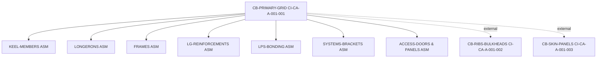

# PSB-001 — Product Structure Breakdown
## CI-CA-A-001-001 — CB-PRIMARY-GRID

EstándarUniversal:Documento-Diseno-ARP4754A-00.00-ProductStructureBreakdown-0001-v1.0-AmpelTrescientosSesentaHidrogenoAlaCombinadaQuantum-GeneracionHumana-AIR-AmedeoPelliccia-8f2ad9c1-02-Design→07-Certification-Security

---

### 1. Scope
Primary load-bearing grid of the center body: keel members, longerons, frames, LG reinforcements, LPS bonding straps, system brackets, and access features. External items (ribs, skin panels) are referenced to their own CIs.

### 2. Structure (Mermaid)

### 3. Bill of Structure (BoS) — navigation

| Node ID | Name                        | Level | CI Ref              | Make/Buy | Phase Docs                                                                             |
| ------- | --------------------------- | ----: | ------------------- | -------- | -------------------------------------------------------------------------------------- |
| PG      | CB-PRIMARY-GRID             |     0 | CI-CA-A-001-001     | Make     | See folders `01…11`                                                                    |
| KEEL    | Keel Members Assy           |     1 | (this CI)           | Make     | [`02-Design/`](../02-Design/)                                                          |
| LON     | Longerons Assy              |     1 | (this CI)           | Make     | [`02-Design/`](../02-Design/)                                                          |
| FRM     | Frames Assy                 |     1 | (this CI)           | Make     | [`02-Design/`](../02-Design/)                                                          |
| LGR     | Landing Gear Reinforcements |     1 | (this CI)           | Make     | [`02-Design/`](../02-Design/)                                                          |
| LPS     | LPS Bonding Network         |     1 | (this CI)           | Buy/Make | [`05-Verification-Validation/`](../05-Verification-Validation/)                        |
| BRK     | Systems Brackets Kit        |     1 | (this CI)           | Make     | [`02-Design/`](../02-Design/)                                                          |
| ACC     | Access Doors & Panels       |     1 | (this CI)           | Make     | [`03-Building-Prototyping/`](../03-Building-Prototyping/)                              |
| RIBS    | CB Ribs/Bulkheads           |   1\* | **CI-CA-A-001-002** | Make     | [`../../CI-CA-A-001-002-CB-RIBS-BULKHEADS/`](../../CI-CA-A-001-002-CB-RIBS-BULKHEADS/) |
| SKIN    | CB Skin Panels              |   1\* | **CI-CA-A-001-003** | Make     | [`../../CI-CA-A-001-003-CB-SKIN-PANELS/`](../../CI-CA-A-001-003-CB-SKIN-PANELS/)       |

\*External to this CI; maintained in its own CI tree.

### 4. Interfaces (excerpt)

* IF-A-STRUCT-JOINTS (PG↔RIBS/SKIN)
* IF-A-LPS-BONDING (PG↔LPS)
* IF-C2-H2-MOUNTS (PG↔Cryogenic mounts)
* IF-P-PROP-INTEGRATION (PG↔Propulsion attach)

### 5. Traceability links

* Requirements: [`../01-Requirements/requirements.yaml`](../01-Requirements/requirements.yaml)
* V&V Matrix: [`../01-Requirements/verification-matrix.csv`](../01-Requirements/verification-matrix.csv)

### 6. Change control

* Log: [`../01-Requirements/change-log.yaml`](../01-Requirements/change-log.yaml)
* Ledger plan (on PR): `T-TECHNOLOGICAL/LEDGER/cli/ledger-plan.json`
