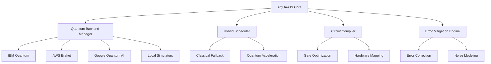

# AQUA-OS — Quantum Operating System
**Advanced Quantum-Enabled Architectural Operating System for AMPEL360-H₂-BWB-Q**

## Overview

AQUA-OS provides the foundational quantum computing infrastructure for the AMPEL360 framework, enabling quantum-enhanced optimization, simulation, and machine learning workflows for aerospace applications.

## Core Components

### Quantum Backend Management
- **Quantum Provider Abstraction**: Support for IBM Quantum, AWS Braket, Google Quantum AI
- **Circuit Optimization**: Automatic gate sequence optimization for target hardware
- **Error Mitigation**: Quantum error correction and noise reduction algorithms
- **Resource Scheduling**: Optimal quantum resource allocation and job queuing

### Hybrid Computing Framework
- **Classical-Quantum Interface**: Seamless integration between classical and quantum processors
- **Adaptive Execution**: Dynamic switching between classical and quantum algorithms based on problem size
- **Performance Monitoring**: Real-time quantum performance metrics and benchmarking
- **Cost Optimization**: Minimize quantum cloud costs through intelligent scheduling

### Applications
- **QAOA Enhancement**: Advanced quantum approximate optimization for aircraft configuration
- **Quantum ML**: Quantum machine learning for design pattern recognition
- **Optimization Suites**: Quantum-enhanced structural and aerodynamic optimization
- **Simulation Acceleration**: Quantum speedup for complex physics simulations

## Architecture



## Installation & Setup

```bash
# Install AQUA-OS dependencies
pip install qiskit[all] cirq google-cirq amazon-braket-sdk

# Initialize quantum backends
python aqua_os/setup.py --configure-backends

# Test quantum connectivity
python aqua_os/quantum_test.py --validate-all
```

## Integration with AMPEL360

AQUA-OS integrates directly with:
- **QAOA Optimizer**: Enhanced quantum optimization for BWB configuration
- **Digital Twin**: Quantum-accelerated simulation synchronization  
- **CAD-AI Convert**: Quantum-enhanced constraint solving
- **Risk Management**: Quantum Monte Carlo simulations

---
*Generated by AMPEL360 H₂-BWB-Q Framework*