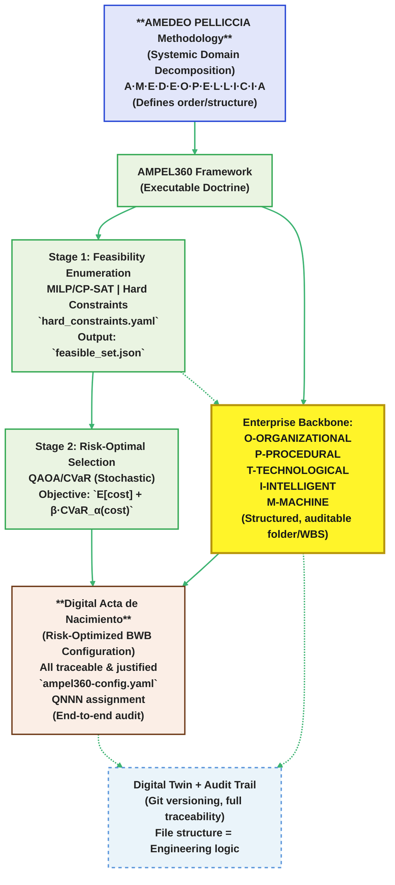
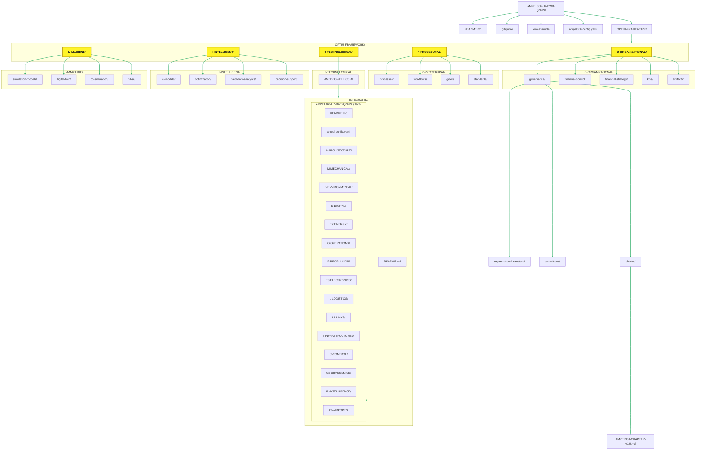
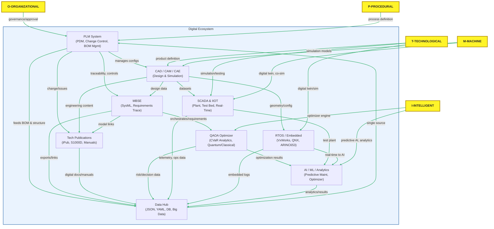

# AMPEL360-H2-BWB-Q
Optimized BWB Aircraft Configuration Model. Born in Hydrogen and Quantum Simulation

**Enterprise Framework for Quantum-Inspired Aircraft Configuration Optimization**

## Quick Start

```bash
# 1. Install dependencies
pip install -r requirements.txt

# 2. Run the complete setup and optimization
python3 setup_ampel360.py

# 3. Check configuration status
python3 ampel360_utils.py --status --validate

# 4. Run QAOA optimization manually (optional)
python3 OPTIM-FRAMEWORK/I-.INTELLIGENT/scripts/qaoa_over_F.py --optimize
```

## Framework Overview

AMPEL360 H₂-BWB-Q is a comprehensive enterprise framework for aircraft configuration optimization, integrating organizational governance, procedural standards, technological implementation, and machine learning capabilities.



### Core Technical Components

- **Configuration Management**: `ampel360_config.json` - Main framework configuration
- **Hard Constraints**: `constraints/hard_constraints.yaml` - TRL gates, compatibility rules
- **Donor Database**: `OPTIM-FRAMEWORK/I-.INTELLIGENT/data/candidates.yaml` - AMPEL aircraft subsystem donors
- **Optimization Engine**: `OPTIM-FRAMEWORK/I-.INTELLIGENT/scripts/qaoa_over_F.py` - QAOA-based CVaR optimization
- **Utilities**: `ampel360_utils.py` - Configuration management utilities
- **Setup Script**: `setup_ampel360.py` - Complete framework setup and demonstration

### Enterprise Framework Structure

- **OPTIM-FRAMEWORK/O-ORGANIZATIONAL/** - Governance, financial control, and management
- **OPTIM-FRAMEWORK/P-PROCEDURAL/** - Processes, workflows, gates, and standards
- **OPTIM-FRAMEWORK/T-TECHNOLOGICAL/** - Detailed architectural component breakdown
- **OPTIM-FRAMEWORK/M-MACHINE/** - Machine learning, simulation, and digital twin capabilities

## Architecture Overview

The framework implements a **feasible-first pipeline** (MILP/CP-SAT + QAOA) for BWB aircraft configuration optimization with hydrogen propulsion and quantum-inspired risk management.

### Current Configuration (P2 Phase)

```yaml
{
  "utcs_mi": {
    "version": "5.0",
    "doc_id": "UTCS-MI/CS25-H2/AMPEL360-QNNN/2025-08-26/v1.0",
    "status": "P2-Approved-Pending-QNNN"
  },
  "architecture": {
    "fuselage": 24,         # BWB primary structure
    "wing": 24,             # BWB wing (34 for advanced morphing)
    "primary_structure": 24, # BWB structural framework
    "flight_controls": 24,   # BWB-compatible control systems
    "propulsion": 37,        # H₂ turbofan engines
    "energy": 38,           # H₂ BWB rear-mounted storage
    "avionics": 1,          # TUW mature systems
    "landing_gear": 1,      # TUW systems (geometry-dependent)
    "cabin": 1,             # TUW systems (BWB-adapted)
    "tail": "N/A-BWB"       # Not applicable for BWB
  },
  "capacity": {
    "QNNN": 150,            # Optimized passenger capacity
    "binning_range_pax": [150, 220],
    "objective": "E[cost] + beta * CVaR_alpha(cost)"
  },
  "risk": {
    "cvar_alpha": 0.8,      # Focus on tail risk (80th percentile)
    "beta": 0.25            # Risk weight in objective function
  }
}
```

### Enterprise Framework Integration

The technical implementation is integrated within a comprehensive enterprise framework:

#### Organizational Framework (O-ORGANIZATIONAL)
- **Governance**: Program charter, stakeholder management, decision authority
- **Financial Management**: Budget allocation, cost control, ROI analysis
- **Performance Management**: KPIs, metrics tracking, success criteria

#### Procedural Framework (P-PROCEDURAL)  
- **Process Management**: Design reviews, change control, risk management
- **Phase Gates**: P1 (Conservative), P2 (Introduce BWB), P3 (Full Optimal)
- **Standards**: Coding standards, documentation, quality assurance

#### Technological Framework (T-TECHNOLOGICAL)
- **Architecture (A)**: Structural systems, aerodynamic components
- **Mechanical (M)**: Landing gear, hydraulics, actuation systems
- **Environmental (E)**: Life support, pressurization, ice protection
- **Digital (D)**: Computing, software, quantum systems, cybersecurity
- **Energy (E2)**: Power generation, distribution, hydrogen storage
- **Operations (O)**: Cockpit, cabin, cargo, emergency systems
- **Propulsion (P)**: Engines, fuel systems, nacelles, controls
- **Electronics (E3)**: Communication, navigation, antennas
- **Logistics (L)**: Maintenance, ground support, supply chain

#### Machine Framework (M-MACHINE)
- **Simulation Models**: Aerodynamics, structures, propulsion, cryogenics
- **Digital Twin**: Real-time integration, predictive analytics
- **Co-simulation**: Multi-physics integration, quantum-classical hybrid
- **HIL/SIL**: Hardware/software-in-the-loop testing capabilities
# Acta de Nacimiento Digital — **AMPEL360 H₂‑BWB QNNN**
**UTCS‑MI v5.0 — Documento de Decisión de Arquitectura**  
ID: UTCS‑MI/CS25‑H2/AMPEL360‑QNNN/2025-08-26/v1.0

---

## 1. Objeto
Formalizar la **decisión de arquitectura** del programa *AMPEL360 H₂‑BWB QNNN*, resultado del pipeline **feasible‑first** (MILP/CP‑SAT + QAOA sobre 𝔽) con objetivo **ecosistema** (E[coste] + β·CVaR_α).

## 2. Ámbito y contexto
- Fase de madurez: **P2 — Introduce BWB**.  
- Dataset base: **43 AMPELs** (métricas normalizadas, TRL por subsistema, geometría).  
- Corredores H₂ iniciales (ejemplo): **LHR–FRA–DXB–SIN**.
- Criterios de certificación: **CS‑25/FAR‑25** con apéndices H₂ (alineación preliminar).

## 3. Decisión de arquitectura (selección de donantes)
- **Fuselaje**: **24 — BWB**
- **Ala**: **24 — BWB** *(opcional 34 si TRL≥6 para superficies avanzadas)*
- **Estructura primaria**: **24 — BWB**
- **Sistemas de control**: **24 — BWB** (alivio de cargas + control CG por quema H₂)
- **Propulsión**: **37 — H₂ turbofan**
- **Energía / Tanques**: **38 — H₂ BWB rear‑mounted**
- **Aviónica**: **01 — TUW** (siempre que pase integración IO/buses)
- **Tren de aterrizaje**: **01 — TUW** (si encaja en bays BWB; si no, set BWB‑dedicado)
- **Cabina**: **01 — TUW** (maquetas y puertas/evac adaptadas a BWB)
- **Empenaje**: **No aplica (BWB)** — superficies integradas

> **Justificación:** volumen criogénico y L/D del BWB (24), con **módulos TUW maduros** donde la geometría lo permite, y cadena Propulsión–Energía **H₂‑H₂** (37–38) para mantener compatibilidad y riesgo controlado.

## 4. Parámetro de capacidad (QNNN)
El número **QNNN** se fija como
\[
\mathrm{QNNN} = \arg\min_N \; \mathbb{E}_s[H_s(N)] + \beta\,\mathrm{CVaR}_\alpha(H_s(N))
\]
donde **H_s** es el coste ecosistema (RD + MFG_INV + CERT_TIME·CAPITAL + INFRA + TRAIN + MAINT·FLEET·LIFE + FUEL·BLOCK_HRS·PRICE) por escenario *s*.
- **Rango de diseño inicial**: 150–220 pax (binning por módulos de cabina BWB y puertas).
- **Estado**: **TBD** → se cerrará tras ejecutar `feasible_pool.py` y el selector sobre 𝔽.

## 5. Restricciones duras aplicadas
- **TRL gates** por subsistema (P2): ala≥6, fuselaje≥6, estr. primaria≥7, propulsión≥6, energía≥6, control≥7, aviónica≥8, tren≥8, cabina≥7.
- **Compatibilidad estructural** (allowed_pairs): *(wing,fuselage) ∈ {(24,24),(34,24),(24,34)}; *(energy,fuselage) ∈ {(38,24),(38,34)}.*
- **Conflictos** (forbidden_pairs): ej. (wing=1, fuselage=24), (wing=5, energy=38).
- **Física/operación** (normalizado): Peso≤0.65; TWR≥0.55; Ruido≤0.65; Evac≤90 s.
- **Política H₂**: *energy_type(propulsión) = energy_type(energía) = 'Hydrogen'*.
- **Cap de diversidad**: ≤4 subsistemas del mismo donante.

## 6. Integración y geometría (criterios mínimos)
- Volumen criogénico **≥ demanda de ruta** y **margen CG** con secuencia de consumo.
- **Gear TUW** solo si **keel_depth** y **gear_bay_span** del BWB lo admiten; si no, gear BWB dedicado.
- **Evacuación 90 s** con puertas y pasillos BWB; si no se cumple, rediseño de layout/cabina.

## 7. Roadmap TRL y certificación (resumen)
- **P2 (este documento)**: BWB estructural + H₂ turbofan + tanques traseros + módulos TUW factibles.  
- **P3**: BLI/DP selectiva, morphing (34) si TRL≥6 y se mantiene cumplimiento OEI/runway y evac.

## 8. Riesgos principales y mitigación
- **Integración tanques‑estructura** → validación de cargas y crashworthiness (ensayos sub‑escala).  
- **Evac BWB** → simulación dinámica y mockups; redistribución de puertas si es preciso.  
- **Suministro H₂** → corredores priorizados, contratos de abastecimiento, buffer de licuefacción.

## 9. Trazabilidad y artefactos
- **Constraints**: `constraints/hard_constraints.yaml`  
- **Donantes**: `data/candidates.yaml`  
- **Feasible set**: `feasible_set.json` (post‑enumeración)  
- **Selector**: `scripts/qaoa_over_F.py` (stub CVaR; sustituible por QAOA one‑hot)

## 10. Aprobación
- **Estado**: *Aprobado para desarrollo detallado (P2)*, a reserva de cierre de **QNNN** tras la corrida completa.

---

**Firmas electrónicas**  
- Chief Architect (DT): AMEDEO PELLICCIA Fecha: 2025-08-26  
- Chief Systems Engineer: _____________________  Fecha: 2025-08-26  
- Certification Lead: _________________________  Fecha: 2025-08-26

## Work Breakdown Structure 


### **directory**


# AMPEL360-H2-BWB-QNNN — Árbol completo (CAs y **todos** los CIs)
> Nota: **cada CI contiene las 11 fases UTCS** (`01-Requirements` … `11-Sustainment-Recycle`) con `phase.md` y `phase-data.yaml`.

```AMPEL360-H2-BWB-QNNN/
├─ README.md
├─ .gitignore
├─ .env.example
├─ requirements.txt
├─ ampel360-config.yaml
├─ constraints/
│  └─ hard_constraints.yaml
├─ data/
│  └─ candidates.yaml
├─ scripts/
│  ├─ qaoa_over_F.py
│  ├─ feasible_first_milp.py
│  └─ utils/
│     └─ scoring.py
├─ ampel360_utils.py
└─ OPTIM-FRAMEWORK/
   ├─ O-ORGANIZATIONAL/
   │  ├─ governance/
   │  │  ├─ charter/
   │  │  │  ├─ AMPEL360-CHARTER-v1.0.md
   │  │  │  ├─ stakeholder-register.yaml
   │  │  │  ├─ accountability-matrix.yaml
   │  │  │  └─ raci-matrix.xlsx
   │  │  ├─ organizational-structure/
   │  │  │  ├─ program-board.yaml
   │  │  │  ├─ chief-architect-dt.yaml
   │  │  │  ├─ cse-office.yaml
   │  │  │  ├─ cert-lead.yaml
   │  │  │  ├─ h2-infrastructure-lead.yaml
   │  │  │  ├─ safety-of-ai-officer.yaml
   │  │  │  ├─ defense-liaison.yaml
   │  │  │  └─ space-ops-lead.yaml
   │  │  └─ committees/
   │  │     ├─ ARB/
   │  │     ├─ SRB/
   │  │     ├─ CWG/
   │  │     ├─ HCC/
   │  │     └─ DSC/
   │  ├─ financial-control/
   │  │  ├─ budget-allocation.xlsx
   │  │  ├─ cost-tracking.yaml
   │  │  ├─ financial-reports/
   │  │  ├─ investment-strategy.md
   │  │  ├─ roi-analysis.xlsx
   │  │  └─ funding-sources.yaml
   │  ├─ financial-strategy/
   │  │  ├─ business-case.md
   │  │  ├─ revenue-projections.xlsx
   │  │  ├─ capex-planning.yaml
   │  │  ├─ opex-forecasting.yaml
   │  │  └─ risk-adjusted-returns.xlsx
   │  ├─ kpis/
   │  │  ├─ trl-burndown.yaml
   │  │  ├─ cert-readiness-index.yaml
   │  │  ├─ corridor-readiness.yaml
   │  │  ├─ cvar-tail-cost.yaml
   │  │  ├─ feasible-set-size.yaml
   │  │  └─ defect-escape-rate.yaml
   │  └─ artifacts/
   │     ├─ ACTA-UTCS-MI-v5.0.md
   │     ├─ risk-register.xlsx
   │     └─ decision-log.yaml
   │
   ├─ P-PROCEDURAL/
   │  ├─ processes/
   │  │  ├─ design-review-process.bpmn
   │  │  ├─ change-control-process.bpmn
   │  │  ├─ risk-management-process.bpmn
   │  │  ├─ certification-process.bpmn
   │  │  └─ security-clearance-process.bpmn
   │  ├─ workflows/
   │  │  ├─ ci-cd-pipeline.yaml
   │  │  ├─ release-workflow.yaml
   │  │  └─ approval-workflow.yaml
   │  ├─ gates/
   │  │  ├─ P1-CONSERVATIVE/
   │  │  ├─ P2-INTRODUCE-BWB/
   │  │  └─ P3-FULL-OPTIMAL/
   │  └─ standards/
   │     ├─ coding-standards.md
   │     ├─ documentation-standards.md
   │     ├─ naming-conventions.md
   │     └─ security-standards.md
   │
   ├─ T-TECHNOLOGICAL/
   │  └─ AMEDEO-PELLICCIA/
   │     ├─ README.md
   │     └─ INTEGRATED/
   │        ├─ README.md
   │        └─ AMPEL360-H2-BWB-QNNN/
   │           ├─ README.md
   │           ├─ ampel-config.yaml
   │           │
   │           ├─ A-ARCHITECTURE/
   │           │  ├─ README.md
   │           │  ├─ CA-A-001-CENTER-BODY-BOX/
   │           │  │  ├─ CI-CA-A-001-001-CB-PRIMARY-GRID/
   │           │  │  ├─ CI-CA-A-001-002-CB-RIBS-BULKHEADS/
   │           │  │  ├─ CI-CA-A-001-003-CB-SKIN-PANELS/
   │           │  │  ├─ CI-CA-A-001-004-CB-LANDING-GEAR-REINFS/
   │           │  │  ├─ CI-CA-A-001-005-CB-PASSAGEWAYS/
   │           │  │  ├─ CI-CA-A-001-006-CB-ACCESS-DOORS/
   │           │  │  ├─ CI-CA-A-001-007-CB-LPS-BONDING/
   │           │  │  └─ CI-CA-A-001-008-CB-SYSTEMS-BRACKETS/
   │           │  ├─ CA-A-002-OUTBOARD-WING-TRANSITION/
   │           │  │  ├─ CI-CA-A-002-001-OB-ROOT-JOINT/
   │           │  │  ├─ CI-CA-A-002-002-OB-SPAR-CAPS/
   │           │  │  ├─ CI-CA-A-002-003-OB-RIBS/
   │           │  │  ├─ CI-CA-A-002-004-OB-LEADING-EDGE/
   │           │  │  ├─ CI-CA-A-002-005-OB-TRAILING-EDGE/
   │           │  │  ├─ CI-CA-A-002-006-OB-PANEL-JOINS/
   │           │  │  ├─ CI-CA-A-002-007-OB-SYSTEMS-ROUTING/
   │           │  │  ├─ CI-CA-A-002-008-OB-FAIRINGS/
   │           │  │  ├─ CI-CA-A-002-009-OB-LPS/
   │           │  │  └─ CI-CA-A-002-010-OB-INSPECTION-PANELS/
   │           │  ├─ CA-A-003-MULTI-BUBBLE-CABIN/
   │           │  │  ├─ CI-CA-A-003-001-CABIN-BUBBLE-FRAMES/
   │           │  │  ├─ CI-CA-A-003-002-FLOOR-GRID/
   │           │  │  ├─ CI-CA-A-003-003-SEAT-TRACKS/
   │           │  │  ├─ CI-CA-A-003-004-DOOR-SURROUNDS/
   │           │  │  ├─ CI-CA-A-003-005-WINDOW-FRAMES/
   │           │  │  ├─ CI-CA-A-003-006-RADOME-STRUCTURE/
   │           │  │  └─ CI-CA-A-003-007-BIRD-STRIKE-PROTECT/
   │           │  ├─ CA-A-004-PRESSURE-BARRIERS/
   │           │  │  ├─ CI-CA-A-004-001-INNER-BULKHEADS/
   │           │  │  ├─ CI-CA-A-004-002-CABIN-BARRIERS/
   │           │  │  ├─ CI-CA-A-004-003-VENT-RELIEF-PANELS/
   │           │  │  ├─ CI-CA-A-004-004-SEALING-INTERFACES/
   │           │  │  ├─ CI-CA-A-004-005-DRY-BAY-PROTECTION/
   │           │  │  └─ CI-CA-A-004-006-SYSTEMS-PENETRATIONS/
   │           │  └─ CA-A-005-EMERGENCY-EGRESS/
   │           │     ├─ CI-CA-A-005-001-EXIT-STRUCTURES/
   │           │     ├─ CI-CA-A-005-002-SLIDE-RAIL-INTEGRATION/
   │           │     ├─ CI-CA-A-005-003-PATHWAYS/
   │           │     ├─ CI-CA-A-005-004-EMERGENCY-LIGHTING-MOUNTS/
   │           │     ├─ CI-CA-A-005-005-SMOKE-BARRIERS/
   │           │     └─ CI-CA-A-005-006-RESCUE-ACCESS/
   │           │
   │           ├─ M-MECHANICAL/
   │           │  ├─ CA-M-001-LANDING-GEAR/
   │           │  │  ├─ CI-CA-M-001-001-MAIN-STRUTS/
   │           │  │  ├─ CI-CA-M-001-002-NOSE-GEAR/
   │           │  │  ├─ CI-CA-M-001-003-WHEELS-BRAKES/
   │           │  │  ├─ CI-CA-M-001-004-RETRACT-MECHANISM/
   │           │  │  ├─ CI-CA-M-001-005-DOORS-ACTUATORS/
   │           │  │  ├─ CI-CA-M-001-006-STEERING/
   │           │  │  └─ CI-CA-M-001-007-SENSORS/
   │           │  ├─ CA-M-002-HYDRAULICS/
   │           │  │  ├─ CI-CA-M-002-001-PUMPS/
   │           │  │  ├─ CI-CA-M-002-002-RESERVOIRS/
   │           │  │  ├─ CI-CA-M-002-003-FILTERS/
   │           │  │  ├─ CI-CA-M-002-004-VALVES/
   │           │  │  └─ CI-CA-M-002-005-LINES/
   │           │  ├─ CA-M-003-ACTUATION/
   │           │  │  ├─ CI-CA-M-003-001-FLIGHT-CONTROL-ACTUATORS/
   │           │  │  ├─ CI-CA-M-003-002-DOOR-ACTUATORS/
   │           │  │  ├─ CI-CA-M-003-003-CARGO-ACTUATORS/
   │           │  │  ├─ CI-CA-M-003-004-THRUST-REVERSERS/
   │           │  │  ├─ CI-CA-M-003-005-SPOILERS/
   │           │  │  └─ CI-CA-M-003-006-TRIM-ACTUATORS/
   │           │  └─ CA-M-004-MECHANISMS/
   │           │     ├─ CI-CA-M-004-001-DOOR-MECHANISMS/
   │           │     ├─ CI-CA-M-004-002-CARGO-HANDLING/
   │           │     ├─ CI-CA-M-004-003-SEAT-MECHANISMS/
   │           │     └─ CI-CA-M-004-004-GALLEY-MECHANISMS/
   │           │
   │           ├─ E-ENVIRONMENTAL/
   │           │  ├─ CA-E-001-AIR-CONDITIONING/
   │           │  │  ├─ CI-CA-E-001-001-PACKS/
   │           │  │  ├─ CI-CA-E-001-002-MIXERS/
   │           │  │  ├─ CI-CA-E-001-003-DUCTS/
   │           │  │  ├─ CI-CA-E-001-004-OUTLETS/
   │           │  │  └─ CI-CA-E-001-005-CONTROLLERS/
   │           │  ├─ CA-E-002-PRESSURIZATION/
   │           │  │  ├─ CI-CA-E-002-001-OUTFLOW-VALVES/
   │           │  │  ├─ CI-CA-E-002-002-SAFETY-VALVES/
   │           │  │  ├─ CI-CA-E-002-003-CONTROLLERS/
   │           │  │  └─ CI-CA-E-002-004-SENSORS/
   │           │  ├─ CA-E-003-ICE-PROTECTION/
   │           │  │  ├─ CI-CA-E-003-001-WING-ANTI-ICE/
   │           │  │  ├─ CI-CA-E-003-002-ENGINE-ANTI-ICE/
   │           │  │  ├─ CI-CA-E-003-003-PROBES-HEATING/
   │           │  │  ├─ CI-CA-E-003-004-WINDSHIELD-HEATING/
   │           │  │  ├─ CI-CA-E-003-005-DETECTION-SYSTEMS/
   │           │  │  └─ CI-CA-E-003-006-CONTROL-UNITS/
   │           │  └─ CA-E-004-OXYGEN/
   │           │     ├─ CI-CA-E-004-001-CREW-OXYGEN/
   │           │     ├─ CI-CA-E-004-002-PASSENGER-OXYGEN/
   │           │     └─ CI-CA-E-004-003-PORTABLE-OXYGEN/
   │           │
   │           ├─ D-DIGITAL/
   │           │  ├─ CA-D-001-FLIGHT-MANAGEMENT/
   │           │  │  ├─ CI-CA-D-001-001-FMS/
   │           │  │  ├─ CI-CA-D-001-002-NAVIGATION/
   │           │  │  ├─ CI-CA-D-001-003-PERFORMANCE/
   │           │  │  ├─ CI-CA-D-001-004-GUIDANCE/
   │           │  │  ├─ CI-CA-D-001-005-DATABASE/
   │           │  │  └─ CI-CA-D-001-006-INTERFACES/
   │           │  ├─ CA-D-002-DISPLAYS/
   │           │  │  ├─ CI-CA-D-002-001-PFD/
   │           │  │  ├─ CI-CA-D-002-002-ND/
   │           │  │  ├─ CI-CA-D-002-003-EICAS/
   │           │  │  ├─ CI-CA-D-002-004-MFD/
   │           │  │  ├─ CI-CA-D-002-005-HUD/
   │           │  │  ├─ CI-CA-D-002-006-STANDBY/
   │           │  │  └─ CI-CA-D-002-007-CABIN-DISPLAYS/
   │           │  ├─ CA-D-003-COMPUTERS/
   │           │  │  ├─ CI-CA-D-003-001-IMA-MODULES/
   │           │  │  ├─ CI-CA-D-003-002-FLIGHT-COMPUTERS/
   │           │  │  ├─ CI-CA-D-003-003-ENGINE-COMPUTERS/
   │           │  │  ├─ CI-CA-D-003-004-MAINTENANCE-COMPUTER/
   │           │  │  └─ CI-CA-D-003-005-CABIN-COMPUTER/
   │           │  ├─ CA-D-004-SOFTWARE/
   │           │  │  ├─ CI-CA-D-004-001-OPERATING-SYSTEM/
   │           │  │  ├─ CI-CA-D-004-002-APPLICATIONS/
   │           │  │  ├─ CI-CA-D-004-003-MIDDLEWARE/
   │           │  │  └─ CI-CA-D-004-004-DATABASES/
   │           │  ├─ CA-D-005-QUANTUM-COMPUTE/
   │           │  │  ├─ CI-CA-D-005-001-QPU-RACK/
   │           │  │  ├─ CI-CA-D-005-002-Q-CRYOCOOLERS-CTRL/
   │           │  │  ├─ CI-CA-D-005-003-Q-CTRL-ELECTRONICS/
   │           │  │  ├─ CI-CA-D-005-004-Q-TIMING-SYNC/
   │           │  │  └─ CI-CA-D-005-005-Q-EMC-SHIELD/
   │           │  └─ CA-D-006-CYBER-DEFENSE/
   │           │     ├─ CI-CA-D-006-001-INTRUSION-DETECTION/
   │           │     ├─ CI-CA-D-006-002-ENCRYPTION-MODULES/
   │           │     ├─ CI-CA-D-006-003-SECURE-COMMS/
   │           │     ├─ CI-CA-D-006-004-THREAT-MONITORING/
   │           │     ├─ CI-CA-D-006-005-ACCESS-CONTROL/
   │           │     └─ CI-CA-D-006-006-AUDIT-LOGGING/
   │           │
   │           ├─ E2-ENERGY/
   │           │  ├─ CA-E2-001-GENERATION/
   │           │  │  ├─ CI-CA-E2-001-001-GENERATORS/
   │           │  │  ├─ CI-CA-E2-001-002-APU/
   │           │  │  ├─ CI-CA-E2-001-003-RAT/
   │           │  │  ├─ CI-CA-E2-001-004-BATTERIES/
   │           │  │  └─ CI-CA-E2-001-005-FUEL-CELLS/
   │           │  ├─ CA-E2-002-DISTRIBUTION/
   │           │  │  ├─ CI-CA-E2-002-001-AC-BUSES/
   │           │  │  ├─ CI-CA-E2-002-002-DC-BUSES/
   │           │  │  ├─ CI-CA-E2-002-003-CONTACTORS/
   │           │  │  ├─ CI-CA-E2-002-004-CIRCUIT-BREAKERS/
   │           │  │  ├─ CI-CA-E2-002-005-WIRING/
   │           │  │  └─ CI-CA-E2-002-006-LOAD-CONTROLLERS/
   │           │  ├─ CA-E2-003-STORAGE/
   │           │  │  ├─ CI-CA-E2-003-001-MAIN-BATTERIES/
   │           │  │  ├─ CI-CA-E2-003-002-EMERGENCY-BATTERIES/
   │           │  │  ├─ CI-CA-E2-003-003-SUPERCAPS/
   │           │  │  └─ CI-CA-E2-003-004-ENERGY-MANAGEMENT/
   │           │  ├─ CA-E2-004-CONVERSION/
   │           │  │  ├─ CI-CA-E2-004-001-TRANSFORMERS/
   │           │  │  ├─ CI-CA-E2-004-002-RECTIFIERS/
   │           │  │  └─ CI-CA-E2-004-003-INVERTERS/
   │           │  ├─ CA-E2-005-HYDROGEN-STORAGE/
   │           │  │  ├─ CI-CA-E2-005-001-LH2-TANKS-STRUCT-MOUNTS/
   │           │  │  ├─ CI-CA-E2-005-002-INSULATION-VACUUM-PANELS/
   │           │  │  ├─ CI-CA-E2-005-003-VENT-BOILOFF-DUCTS/
   │           │  │  ├─ CI-CA-E2-005-004-CRASH-LOAD-PATHS/
   │           │  │  └─ CI-CA-E2-005-005-LEAK-DETECTION-BAYS/
   │           │  └─ CA-E2-006-HV-DISTRIBUTION/
   │           │     ├─ CI-CA-E2-006-001-HV-DC-BUS/
   │           │     ├─ CI-CA-E2-006-002-HV-CONTACTORS/
   │           │     ├─ CI-CA-E2-006-003-HV-CABLE-HARNESS/
   │           │     └─ CI-CA-E2-006-004-ISOLATION-MONITOR/
   │           │
   │           ├─ O-OPERATIONS/
   │           │  ├─ CA-O-001-COCKPIT/
   │           │  │  ├─ CI-CA-O-001-001-SEATS/
   │           │  │  ├─ CI-CA-O-001-002-CONTROLS/
   │           │  │  ├─ CI-CA-O-001-003-PEDALS/
   │           │  │  ├─ CI-CA-O-001-004-PANELS/
   │           │  │  ├─ CI-CA-O-001-005-STORAGE/
   │           │  │  └─ CI-CA-O-001-006-EMERGENCY-EQUIPMENT/
   │           │  ├─ CA-O-002-CABIN/
   │           │  │  ├─ CI-CA-O-002-001-PASSENGER-SEATS/
   │           │  │  ├─ CI-CA-O-002-002-GALLEYS/
   │           │  │  ├─ CI-CA-O-002-003-LAVATORIES/
   │           │  │  ├─ CI-CA-O-002-004-STORAGE-BINS/
   │           │  │  ├─ CI-CA-O-002-005-CREW-REST/
   │           │  │  ├─ CI-CA-O-002-006-MONUMENTS/
   │           │  │  ├─ CI-CA-O-002-007-LIGHTING/
   │           │  │  └─ CI-CA-O-002-008-IFE/
   │           │  ├─ CA-O-003-CARGO/
   │           │  │  ├─ CI-CA-O-003-001-CARGO-COMPARTMENTS/
   │           │  │  ├─ CI-CA-O-003-002-LOADING-SYSTEMS/
   │           │  │  ├─ CI-CA-O-003-003-RESTRAINT-SYSTEMS/
   │           │  │  └─ CI-CA-O-003-004-FIRE-SUPPRESSION/
   │           │  ├─ CA-O-004-EMERGENCY/
   │           │  │  ├─ CI-CA-O-004-001-SLIDES/
   │           │  │  ├─ CI-CA-O-004-002-RAFTS/
   │           │  │  ├─ CI-CA-O-004-003-LIFE-VESTS/
   │           │  │  ├─ CI-CA-O-004-004-EMERGENCY-LIGHTING/
   │           │  │  └─ CI-CA-O-004-005-FIRST-AID/
   │           │  └─ CA-O-005-MULTI-DOMAIN-OPS/
   │           │     ├─ CI-CA-O-005-001-SATELLITE-LINK/
   │           │     ├─ CI-CA-O-005-002-GROUND-STATION-INTERFACE/
   │           │     ├─ CI-CA-O-005-003-NAVAL-LANDING-CAPABILITY/
   │           │     ├─ CI-CA-O-005-004-ROUGH-FIELD-OPS/
   │           │     ├─ CI-CA-O-005-005-VTOL-CAPABILITY/
   │           │     └─ CI-CA-O-005-006-AERIAL-REFUELING/
   │           │
   │           ├─ P-PROPULSION/
   │           │  ├─ CA-P-001-ENGINES/
   │           │  │  ├─ CI-CA-P-001-001-ENGINE-CORE/
   │           │  │  ├─ CI-CA-P-001-002-FAN/
   │           │  │  ├─ CI-CA-P-001-003-COMPRESSOR/
   │           │  │  ├─ CI-CA-P-001-004-COMBUSTOR/
   │           │  │  ├─ CI-CA-P-001-005-TURBINE/
   │           │  │  ├─ CI-CA-P-001-006-EXHAUST/
   │           │  │  ├─ CI-CA-P-001-007-ACCESSORIES/
   │           │  │  ├─ CI-CA-P-001-008-PYLONS/
   │           │  │  ├─ CI-CA-P-001-009-MOUNTS/
   │           │  │  └─ CI-CA-P-001-010-COWLINGS/
   │           │  ├─ CA-P-002-FUEL-SYSTEMS/
   │           │  │  ├─ CI-CA-P-002-001-FUEL-TANKS/
   │           │  │  ├─ CI-CA-P-002-002-FUEL-PUMPS/
   │           │  │  ├─ CI-CA-P-002-003-FUEL-VALVES/
   │           │  │  ├─ CI-CA-P-002-004-FUEL-LINES/
   │           │  │  ├─ CI-CA-P-002-005-FUEL-GAUGING/
   │           │  │  └─ CI-CA-P-002-006-REFUEL-DEFUEL/
   │           │  ├─ CA-P-003-NACELLES/
   │           │  │  ├─ CI-CA-P-003-001-INLET/
   │           │  │  ├─ CI-CA-P-003-002-FAN-COWL/
   │           │  │  ├─ CI-CA-P-003-003-THRUST-REVERSER/
   │           │  │  └─ CI-CA-P-003-004-EXHAUST-NOZZLE/
   │           │  ├─ CA-P-004-CONTROLS/
   │           │  │  ├─ CI-CA-P-004-001-FADEC/
   │           │  │  ├─ CI-CA-P-004-002-THROTTLES/
   │           │  │  └─ CI-CA-P-004-003-ENGINE-MONITORING/
   │           │  └─ CA-P-005-ELECTRIC-DRIVE/
   │           │     ├─ CI-CA-P-005-001-E-MOTOR/
   │           │     ├─ CI-CA-P-005-002-REDUCTION-GEAR/
   │           │     ├─ CI-CA-P-005-003-INVERTER/
   │           │     ├─ CI-CA-P-005-004-PDU-MOUNT/
   │           │     └─ CI-CA-P-005-005-THERMAL-PLATES/
   │           │
   │           ├─ E3-ELECTRONICS/
   │           │  ├─ CA-E3-001-COMMUNICATION/
   │           │  │  ├─ CI-CA-E3-001-001-VHF/
   │           │  │  ├─ CI-CA-E3-001-002-HF/
   │           │  │  ├─ CI-CA-E3-001-003-SATCOM/
   │           │  │  ├─ CI-CA-E3-001-004-DATALINK/
   │           │  │  └─ CI-CA-E3-001-005-INTERCOM/
   │           │  ├─ CA-E3-002-NAVIGATION/
   │           │  │  ├─ CI-CA-E3-002-001-GPS/
   │           │  │  ├─ CI-CA-E3-002-002-ILS/
   │           │  │  ├─ CI-CA-E3-002-003-VOR/
   │           │  │  ├─ CI-CA-E3-002-004-DME/
   │           │  │  ├─ CI-CA-E3-002-005-ADF/
   │           │  │  └─ CI-CA-E3-002-006-RADIO-ALTIMETER/
   │           │  ├─ CA-E3-003-SURVEILLANCE/
   │           │  │  ├─ CI-CA-E3-003-001-TRANSPONDER/
   │           │  │  ├─ CI-CA-E3-003-002-TCAS/
   │           │  │  ├─ CI-CA-E3-003-003-WEATHER-RADAR/
   │           │  │  └─ CI-CA-E3-003-004-ADS-B/
   │           │  ├─ CA-E3-004-ANTENNAS/
   │           │  │  ├─ CI-CA-E3-004-001-ANTENNA-ARRAYS/
   │           │  │  ├─ CI-CA-E3-004-002-ANTENNA-COUPLERS/
   │           │  │  └─ CI-CA-E3-004-003-ANTENNA-FEEDERS/
   │           │  └─ CA-E3-005-QUANTUM-LINKS/
   │           │     ├─ CI-CA-E3-005-001-QKD-MODEMS/
   │           │     ├─ CI-CA-E3-005-002-PHOTONIC-INTERPOSERS/
   │           │     ├─ CI-CA-E3-005-003-CLOCK-DISTRIBUTION/
   │           │     └─ CI-CA-E3-005-004-FIBER-ROUTING/
   │           │
   │           ├─ L-LOGISTICS/
   │           │  ├─ CA-L-001-MAINTENANCE/
   │           │  │  ├─ CI-CA-L-001-001-SCHEDULED-MAINTENANCE/
   │           │  │  ├─ CI-CA-L-001-002-UNSCHEDULED-MAINTENANCE/
   │           │  │  ├─ CI-CA-L-001-003-PREDICTIVE-MAINTENANCE/
   │           │  │  └─ CI-CA-L-001-004-LINE-MAINTENANCE/
   │           │  ├─ CA-L-002-SPARES/
   │           │  │  ├─ CI-CA-L-002-001-ROTABLES/
   │           │  │  ├─ CI-CA-L-002-002-CONSUMABLES/
   │           │  │  └─ CI-CA-L-002-003-EXPENDABLES/
   │           │  └─ CA-L-003-SUPPLY-CHAIN/
   │           │     ├─ CI-CA-L-003-001-PROCUREMENT/
   │           │     ├─ CI-CA-L-003-002-INVENTORY/
   │           │     └─ CI-CA-L-003-003-DISTRIBUTION/
   │           │
   │           ├─ L2-LINKS/
   │           │  ├─ CA-L2-001-NETWORKS/
   │           │  │  ├─ CI-CA-L2-001-001-AFDX/
   │           │  │  ├─ CI-CA-L2-001-002-ARINC429/
   │           │  │  ├─ CI-CA-L2-001-003-CAN/
   │           │  │  └─ CI-CA-L2-001-004-ETHERNET/
   │           │  ├─ CA-L2-002-DATABUS/
   │           │  │  ├─ CI-CA-L2-002-001-MIL-STD-1553/
   │           │  │  ├─ CI-CA-L2-002-002-ARINC664/
   │           │  │  └─ CI-CA-L2-002-003-FIBER-OPTIC/
   │           │  └─ CA-L2-003-WIRELESS/
   │           │     ├─ CI-CA-L2-003-001-WIFI/
   │           │     └─ CI-CA-L2-003-002-BLUETOOTH/
   │           │
   │           ├─ I-INFRASTRUCTURES/
   │           │  ├─ CA-I-001-GROUND-INFRASTRUCTURE/
   │           │  │  ├─ CI-CA-I-001-001-H2-PRODUCTION/
   │           │  │  ├─ CI-CA-I-001-002-H2-LIQUEFACTION/
   │           │  │  ├─ CI-CA-I-001-003-H2-STORAGE-FARM/
   │           │  │  └─ CI-CA-I-001-004-H2-DISTRIBUTION/
   │           │  ├─ CA-I-002-H2-VALUE-CHAIN/
   │           │  │  ├─ CI-CA-I-002-001-PRODUCTION/
   │           │  │  ├─ CI-CA-I-002-002-LIQUEFACTION/
   │           │  │  ├─ CI-CA-I-002-003-FARM/
   │           │  │  ├─ CI-CA-I-002-004-UMBILICAL/
   │           │  │  └─ CI-CA-I-002-005-FLARE/
   │           │  └─ CA-I-003-DEFENSE-INFRASTRUCTURE/
   │           │     ├─ CI-CA-I-003-001-HARDENED-SHELTERS/
   │           │     ├─ CI-CA-I-003-002-COMMAND-CENTERS/
   │           │     ├─ CI-CA-I-003-003-RADAR-STATIONS/
   │           │     └─ CI-CA-I-003-004-MISSILE-DEFENSE/
   │           │
   │           ├─ C-CONTROL/
   │           │  ├─ CA-C-001-FLIGHT-CONTROLS/
   │           │  │  ├─ CI-CA-C-001-001-PRIMARY-CONTROLS/
   │           │  │  ├─ CI-CA-C-001-002-SECONDARY-CONTROLS/
   │           │  │  ├─ CI-CA-C-001-003-FBW-SYSTEM/
   │           │  │  ├─ CI-CA-C-001-004-AUTOPILOT/
   │           │  │  └─ CI-CA-C-001-005-ENVELOPE-PROTECTION/
   │           │  ├─ CA-C-002-ENGINE-CONTROLS/
   │           │  │  ├─ CI-CA-C-002-001-THRUST-CONTROL/
   │           │  │  ├─ CI-CA-C-002-002-FUEL-CONTROL/
   │           │  │  └─ CI-CA-C-002-003-START-CONTROL/
   │           │  └─ CA-C-003-SYSTEMS-CONTROLS/
   │           │     ├─ CI-CA-C-003-001-HYDRAULIC-CONTROL/
   │           │     ├─ CI-CA-C-003-002-ELECTRIC-CONTROL/
   │           │     └─ CI-CA-C-003-003-PNEUMATIC-CONTROL/
   │           │
   │           ├─ C2-CRYOGENICS/
   │           │  ├─ CA-C2-001-THERMAL-MANAGEMENT/
   │           │  │  ├─ CI-CA-C2-001-001-CRYOCOOLERS/
   │           │  │  ├─ CI-CA-C2-001-002-MLI/
   │           │  │  ├─ CI-CA-C2-001-003-VACUUM-SYSTEMS/
   │           │  │  ├─ CI-CA-C2-001-004-HEAT-EXCHANGERS/
   │           │  │  └─ CI-CA-C2-001-005-THERMAL-BRIDGES/
   │           │  ├─ CA-C2-002-FUEL-CELL-STACKS/
   │           │  │  ├─ CI-CA-C2-002-001-PEMFC-MODULES/
   │           │  │  ├─ CI-CA-C2-002-002-SOFC-MODULES/
   │           │  │  ├─ CI-CA-C2-002-003-STACK-COOLING/
   │           │  │  └─ CI-CA-C2-002-004-STACK-CONTROLS/
   │           │  ├─ CA-C2-003-BOP/
   │           │  │  ├─ CI-CA-C2-003-001-COMPRESSORS/
   │           │  │  ├─ CI-CA-C2-003-002-HUMIDIFIERS/
   │           │  │  └─ CI-CA-C2-003-003-WATER-MANAGEMENT/
   │           │  ├─ CA-C2-004-H2-DISTRIBUTION/
   │           │  │  ├─ CI-CA-C2-004-001-CRYO-PUMPS/
   │           │  │  ├─ CI-CA-C2-004-002-CRYO-VALVES/
   │           │  │  ├─ CI-CA-C2-004-003-CRYO-LINES/
   │           │  │  └─ CI-CA-C2-004-004-PHASE-SEPARATORS/
   │           │  └─ CA-C2-005-H2-SAFETY/
   │           │     ├─ CI-CA-C2-005-001-LEAK-SENSORS/
   │           │     ├─ CI-CA-C2-005-002-PURGE-SYSTEMS/
   │           │     ├─ CI-CA-C2-005-003-VENTING/
   │           │     └─ CI-CA-C2-005-004-EMERGENCY-SHUTDOWN/
   │           │
   │           ├─ I2-INTELLIGENCE/
   │           │  ├─ CA-I2-001-AI-SYSTEMS/
   │           │  │  ├─ CI-CA-I2-001-001-PREDICTIVE-MODELS/
   │           │  │  ├─ CI-CA-I2-001-002-OPTIMIZATION/
   │           │  │  └─ CI-CA-I2-001-003-DECISION-SUPPORT/
   │           │  ├─ CA-I2-002-AUTONOMY/
   │           │  │  ├─ CI-CA-I2-002-001-AUTONOMOUS-TAXI/
   │           │  │  └─ CI-CA-I2-002-002-AUTONOMOUS-FLIGHT/
   │           │  └─ CA-I2-003-PREDICTIVE/
   │           │     ├─ CI-CA-I2-003-001-HEALTH-MONITORING/
   │           │     └─ CI-CA-I2-003-002-FAILURE-PREDICTION/
   │           │
   │           └─ A2-AIRPORTS/
   │              ├─ CA-A2-001-GROUND-SUPPORT/
   │              │  ├─ CI-CA-A2-001-001-GPU/
   │              │  ├─ CI-CA-A2-001-002-ACU/
   │              │  └─ CI-CA-A2-001-003-TOWBAR/
   │              ├─ CA-A2-002-FACILITIES/
   │              │  ├─ CI-CA-A2-002-001-HANGARS/
   │              │  └─ CI-CA-A2-002-002-TERMINALS/
   │              └─ CA-A2-003-EQUIPMENT/
   │                 ├─ CI-CA-A2-003-001-H2-REFUELING/
   │                 └─ CI-CA-A2-003-002-DEICING/
   │
   ├─ I-INTELLIGENT/
   │  ├─ ai-models/
   │  │  ├─ feasible-first-optimizer/
   │  │  ├─ hydrogen-energy-manager/
   │  │  ├─ predictive-maintenance/
   │  │  ├─ corridor-optimizer/
   │  │  └─ safety-of-ai-monitor/
   │  ├─ optimization/
   │  │  ├─ cp-sat-solver/
   │  │  ├─ qaoa-selector/
   │  │  └─ cvar-objective/
   │  ├─ predictive-analytics/
   │  └─ decision-support/
   │
   └─ M-MACHINE/
      ├─ simulation-models/
      │  ├─ aerodynamics/
      │  ├─ structures/
      │  ├─ propulsion/
      │  ├─ cryogenics/
      │  └─ controls/
      ├─ digital-twin/
      ├─ co-simulation/
      └─ hil-sil/
```

## Technology Enablers



### Executive Summary

#### **1. Synthesis: An Executable Systems Engineering Doctrine**

The **AMPEL360-H2-BWB-Q** project is not simply an aircraft design. It is a complete, **executable framework for complex systems engineering**. Its central thesis is the transformation of an abstract design philosophy— the **AMEDEO PELLICCIA methodology**—into a tangible, automated, and auditable process.

Where traditional aerospace projects rely on paper, meetings, and intuition, AMPEL360 replaces ambiguity with **algorithmic determinism**. It moves from an unconstrained design space, sprawling with possibilities, to a **single, risk-optimized, and fully justified architectural solution**, with every decision traceable back to explicit rules and data.

---

#### **2. The Foundational Principle: The AMEDEO PELLICCIA Methodology**

At the heart of the project is the **AMEDEO PELLICCIA methodology**—a formal taxonomy for mastering complexity through **systematic hierarchical decomposition**. It is the intellectual blueprint for the engineering effort.

* **Purpose:** Decompose a next-generation aircraft and its ecosystem into a finite, comprehensive, and non-overlapping set of domains.
* **Mechanism:** Each letter of *AMEDEO PELLICCIA* defines a domain, forming a complete checklist for the Work Breakdown Structure (WBS):
  **A**rchitecture · **M**echanical · **E**nvironmental · **D**igital · **E**nergy · **O**perations · **P**ropulsion · **E**lectronics · **L**ogistics · **L**inks · **I**nfrastructures · **C**ontrol · **C**ryogenics · **I**ntelligence · **A**irports.
* **Function:** Provides the structure on which the computational framework operates. Without this ordered taxonomy, optimization would collapse into chaos.

---

#### **3. The Operational Construct: The AMPEL360 Framework**

The **AMPEL360 framework** is the methodology brought to life: a two-stage computational pipeline designed to deliver the optimal architecture within the ordered boundaries set by the taxonomy.

* **Stage 1: Deterministic Feasibility Generation**

  * **How:** Applies MILP/CP-SAT to enforce inviolable rules (`hard_constraints.yaml`)—TRL gates, compatibility matrices, and physics bounds—against the full component catalog (`candidates.yaml`).
  * **Output:** `feasible_set.json`, the mathematically complete set of all architectures that are physically viable, certifiable, and technologically mature. This transforms infinity into a **finite, provably complete solution space**.

* **Stage 2: Risk-Averse Stochastic Optimization**

  * **How:** A Quantum Approximate Optimization Algorithm (QAOA) or its classical analog selects the best candidate from 𝔽.
  * **Objective:** Optimize not only expected cost but **ecosystem resilience**, with `E[cost] + β·CVaR_α(cost)` as the guiding function. CVaR captures **tail risks**—low-probability, high-impact events—ensuring the final solution is robust in the real world, not just on paper.

---

#### **4. Symbiosis: Doctrine as Blueprint, Framework as Engine**

The project’s defining feature is the **symbiosis** between doctrine and execution.

* **Methodology informs framework:** The taxonomy defines the schema for donors, the structure of compatibility rules, and the WBS used by the solver.
* **Framework executes methodology:** AMPEL360 automates the exhaustive checking of every rule across every combination—an impossible task for human teams alone.
* **Traceability and auditability:** The result is a “glass-box” process. The final configuration documented in the *Acta de Nacimiento Digital* is not an opinion but the deterministic outcome of rules, data, and objectives. The directory structure itself is a living **audit trail of engineering logic**.

---

#### **5. Critical Advantages**

* **Deterministic feasibility:** Stage 1 ensures nothing infeasible survives. 𝔽 is a **complete, bounded, and certifiable set of architectures**.
* **Risk-aware optimality:** Stage 2 introduces CVaR to explicitly mitigate **worst-case ecosystem risks** (e.g., hydrogen infra delays, supply-chain fragility, quantum hardware maturity).
* **Audit as twin:** The file tree, with its CAs/CIs, is itself a **digital twin of the engineering process**, version-controlled and traceable.
* **Multi-domain mastery:** By encoding forbidden pairs, TRL gates, and cross-domain compatibilities, the framework handles exponential complexity across aerospace, hydrogen, quantum, and infrastructure simultaneously.

---

#### **6. Overall Assessment**

The **AMPEL360 project** marks a paradigm shift: from traditional, document-centric systems engineering to a **model-based, executable doctrine**.

* **Rigor:** Ambiguity is replaced with mathematical precision and deterministic enumeration.
* **Resilience:** CVaR optimization embeds robustness into the architecture itself.
* **Scalability:** The methodological decomposition ensures applicability as complexity grows.

The relationship is clear: the **AMEDEO PELLICCIA methodology** supplies the **order**, while the **AMPEL360 framework** supplies the **execution**.

The outcome is not just an “optimal design” but a **provably optimal, risk-resilient architecture**, auditable end-to-end. This provides the bedrock for certification, investor confidence, and stakeholder trust in one of the most ambitious aerospace ventures of our era.

---


### Investor Briefing: Strategic Overview

#### **Vision: Redefining Aerospace Engineering for the Next Century**

**AMPEL360-H2-BWB-Q** represents a fundamental shift from traditional aircraft development to **algorithmic aerospace engineering**. This is not just another aircraft project—it's the creation of a new paradigm that transforms how complex systems are designed, validated, and brought to market.

#### **Market Opportunity: The $1.7 Trillion Aviation Transformation**

The global aviation industry faces unprecedented pressure to decarbonize while meeting growing demand. **Hydrogen propulsion** and **Blended Wing Body (BWB)** architectures are recognized as the only viable path to zero-emission long-haul flight. AMPEL360 positions us at the intersection of these transformative technologies with a **provably optimal, risk-managed approach**.

#### **Competitive Advantage: Mathematical Certainty in Uncertain Markets**

Where competitors rely on intuition and iterative design, AMPEL360 delivers:

* **Deterministic Architecture Selection**: Every design decision is mathematically justified and auditable
* **Risk-Optimized Engineering**: CVaR (Conditional Value at Risk) methodology explicitly mitigates worst-case scenarios—hydrogen infrastructure delays, supply chain disruptions, quantum hardware maturity
* **Accelerated Certification**: Complete traceability from requirements to implementation reduces regulatory risk and timeline uncertainty

#### **Technology Differentiation: The AMEDEO PELLICCIA Framework**

Our proprietary **AMEDEO PELLICCIA methodology** provides systematic domain decomposition across 15 critical engineering disciplines. This isn't just organization—it's **algorithmic completeness** that ensures no critical interaction is overlooked. Combined with **Quantum Approximate Optimization**, we achieve optimal configurations that would be impossible through traditional methods.

#### **Financial Resilience: De-Risked ROI Through Systematic Optimization**

* **Predictable Development Costs**: Algorithmic design reduces late-stage surprises
* **Optimized Ecosystem Value**: CVaR methodology explicitly balances expected returns against tail risks
* **Scalable Architecture**: Framework applies to entire product families, not just single aircraft
* **IP Moat**: Mathematical optimization methods create defensible competitive advantages

#### **Investment Thesis: First-Mover Advantage in Algorithmic Aerospace**

AMPEL360 establishes the foundation for **model-based aerospace engineering**—the next evolution beyond traditional design methods. Early investment positions stakeholders in:

1. **Technology Leadership**: First proven implementation of quantum-optimized aircraft design
2. **Market Timing**: Hydrogen aviation inflection point with regulatory tailwinds
3. **Ecosystem Control**: Framework becomes the standard for next-generation aerospace development
4. **Risk Mitigation**: Mathematical optimization reduces traditional aerospace development risks

#### **Strategic Outcome: Beyond Aircraft to Aerospace Intelligence**

Success with AMPEL360-H2-BWB-Q establishes the platform for **Aerospace Engineering as a Service**—licensing our optimization framework to transform how the entire industry approaches complex system design. This positions us as the **intelligence layer** of next-generation aerospace development.

**Bottom Line**: AMPEL360 is not competing in the aircraft market—we're creating the tools that will define how that market evolves. The question isn't whether hydrogen-powered BWB aircraft will be built, but whether they'll be optimized using our framework or inferior legacy methods.
