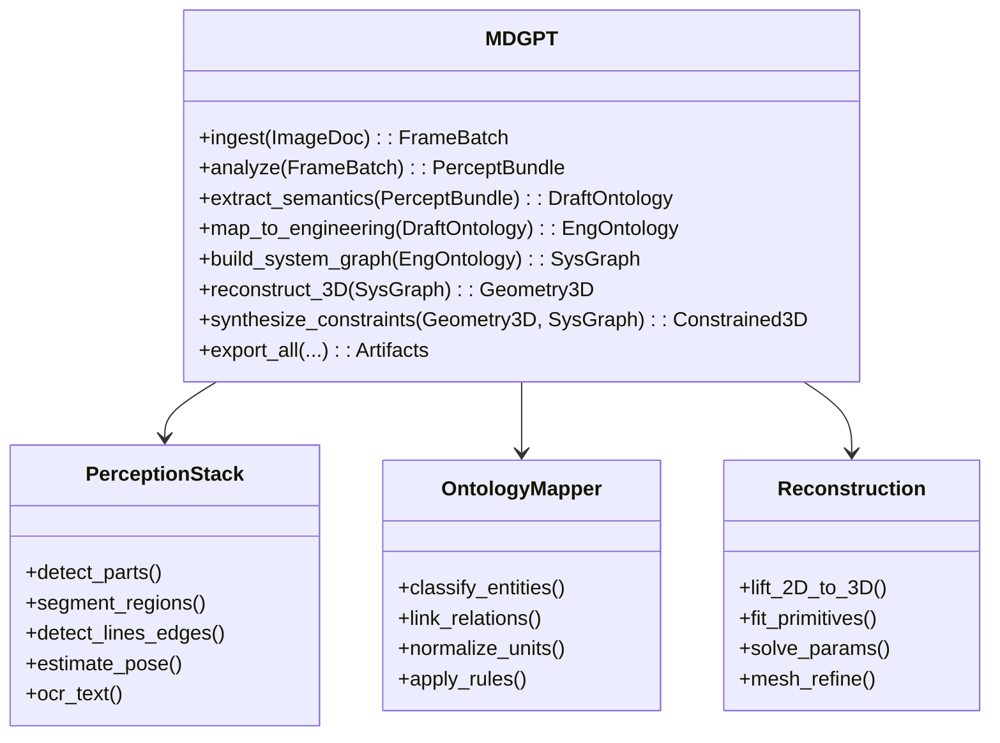

# MDGPT — Multidimensional Generative Pretrained Transformer
**From static 2D images → rich engineering ontologies → parametric 3D**

EstándarUniversal:Documento-Especificacion-ARP4754A-00.00-ModuleSpecification-0001-v1.0-AmpelTrescientosSesentaHidrogenoAlaCombinadaQuantum-GeneracionHumana-AIR-AmedeoPelliccia-8f29ac13-01-Requirements→07-Certification-Security

---

## 0) Purpose (qué es y por qué)
**MDGPT** convierte **imágenes 2D estáticas** (croquis, renders, fotos de taller, láminas técnicas) en:
1) **Ontologías de ingeniería ricas** (clases, relaciones, atributos, tolerancias, materiales, estados),
2) **Modelos 3D paramétricos** y/o mallas con **constraints**,
3) **Grafo de sistemas** (conectividad, interfaces, + metadatos UTCS).

> Meta: no "solo reconstruir 3D", sino **capturar significado** (semántica de ingeniería) para CAD/CAE, verificación y documentación automática.

---

## 1) System overview

```mermaid
flowchart LR
  A[2D Input<br/>PNG/JPG/PDF/SVG] --> B[Preprocess<br/>deskew/denoise/lines]
  B --> C[Perception Stack<br/>det/seg/pose/lines/text OCR]
  C --> D[VLM Extraction<br/>prompts → entities/relations]
  D --> E[Ontology Mapper<br/>UTCS classes + rules]
  E --> F[System Graph Builder<br/>multi-domain edges]
  F --> G[3D Reconstruction<br/>parametric + mesh]
  G --> H[Constraint Synthesis<br/>mates/tolerances/materials]
  H --> I[Exports<br/>JSON-LD / STEP* / glTF / USDZ]
  I --> J[Validation<br/>metrics + human-in-the-loop]
```



*STEP via surrogate translators or CAD scripting.

## 2) Core architecture


## 3) Data model (ontología y grafo)
### 3.1 Ontology (JSON-LD sketch)
```json
{
  "@context": {
    "ampel": "https://aqua-v/ontology/",
    "type": "@type",
    "id": "@id"
  },
  "id": "ampel:ci-CA-A-001-001-PG-0001",
  "type": "ampel:PrimaryStructureMember",
  "label": "CB Primary Grid — Frame F5",
  "material": {"type": "ampel:Material", "name": "Al-Li 2195"},
  "geometry": {
    "type": "ampel:ParametricProfile",
    "profile": "HatStringer",
    "params": {"t": 2.0, "w": 40.0, "h": 18.0, "r": 2.0, "units": "mm"}
  },
  "interfaces": [
    {"type": "ampel:BondedInterface", "to": "ampel:Stringer S14"},
    {"type": "ampel:FastenedInterface", "to": "ampel:Skin Panel CP-12"}
  ],
  "tolerances": [{"axis":"z", "value":0.2, "units":"mm"}],
  "standards": ["CS-25.305", "AC 25.571-1D"]
}
```

### 3.2 System graph (edges)
- `supports(structure_a, structure_b)`
- `fastened_to(component, component, spec=NASxxxx)`
- `grounds_to(element, LPS_bus, resistance<5mΩ)`
- `routes(service_line, through, clamp_spec=MS21919)`

## 4) Pipelines (detalle)
### 4.1 Preprocess
Deskew/denoise, binarization adaptativa, vectorización (SVG → primitives), detección de ejes/leyendas/escala.

### 4.2 Perception stack
- **Det/Seg**: parts, cutouts, stiffeners, fasteners, cable runs, annotations.
- **Line/Edge**: Hough/ML; clasificación de tipos (centrelines, hidden, section).
- **Pose**: si hay múltiples vistas, registra ortográficas.
- **OCR**: extrae callouts (material, espesor, rivet pattern).

### 4.3 VLM semantic extraction
Vision-Language model con prompts de ingeniería:
- "List structural members with role, material, thickness, and reference frames."
- "Extract interfaces and fastener specs where visible."
- Output → DraftOntology (candidatos + confianza).

### 4.4 Ontology mapping (UTCS)
- Normaliza unidades y taxonomía sin acrónimos de programa/categoría.
- Aplica reglas: e.g., si type=BondingStrap ⇒ añade relación grounds_to.
- Valida contra esquema YAML (tipos, campos obligatorios, rangos).

### 4.5 System graph build
- Conecta entidades por proximidad geométrica, callouts y reglas (e.g., stringer–skin).
- Etiqueta dominios (STRUCT, LPS, SYS-INST, MFG).

### 4.6 3D reconstruction
- **Lift 2D→3D**: infiere profundidades/espesores desde callouts y catálogos.
- Ajusta primitivas (extrusión, barrido, loft) y constraints (coplanaridad, perpendicularidad).
- Cuando el input es fotográfico: monocular depth + priors geométricos; "CAD-like mesh".

### 4.7 Constraint synthesis
- Ensambla mates (coincidente, paralelo, concentric).
- Tolerancias geométricas (GD&T mínimas) desde anotaciones/plantillas.
- Materiales, acabados, specs de sujeción, LPS (continuidad eléctrica).

### 4.8 Exports
- **Ontology**: JSON-LD / YAML.
- **Graph**: GraphML / DOT.
- **3D**: glTF/GLB, USDZ; STEP vía script CAD (Onshape/FreeCAD/Parasolid bridge).

## 5) Interfaces (API/CLI)
### 5.1 Python API
```python
from mdgpt import MDGPT

app = MDGPT(models="default")  # registry key
batch = app.ingest(["frame_A.png", "frame_B.png"])
percept = app.analyze(batch)
draft = app.extract_semantics(percept)
onto  = app.map_to_engineering(draft)
graph = app.build_system_graph(onto)
geo3d = app.reconstruct_3D(graph)
assy  = app.synthesize_constraints(geo3d, graph)

artifacts = app.export_all(
  ontology_fmt="jsonld",
  graph_fmt="graphml",
  geom_fmt=["gltf","step"]
)
```

### 5.2 CLI
```bash
mdgpt ingest --in ./input --cache ./.cache
mdgpt run --pipeline full --out ./out \
  --ontology jsonld --graph graphml --geom gltf
mdgpt validate --in ./out/ontology.jsonld --schema ./schema/utcs.yml
```

## 6) Schemas (YAML minimal)
```yaml
# schema/utcs.yml (extracto)
Entity:
  required: [id, type, label]
  properties:
    type: {enum: [PrimaryStructureMember, SystemBracket, SkinPanel, Fastener, BondingStrap, ServiceLine]}
    material: {type: object, required: [name]}
    geometry:
      type: object
      properties:
        profile: {enum: [HatStringer, ZStringer, LAngle, TBeam, Box, Plate]}
        params: {type: object}
    interfaces: {type: array}
    tolerances: {type: array}
```

## 7) Quality & validation

### Metrics
- **Ontology**: precision/recall por clase/relación.
- **Graph**: edge accuracy, connectivity consistency, rule violations ↓.
- **3D**: IoU/mChamfer vs. referencia o tolerancias paramétricas.
- **Constraint satisfiability**: ratio de solves sin conflicto.

### Human-in-the-loop
- Panel lateral: aceptar/editar entidades y relaciones.
- Resaltado visual por confianza y impacto (alto impacto = priorizar revisión).

## 8) Folder layout
```
MDGPT/
├─ README.md
├─ mdgpt/                  # package
│  ├─ __init__.py
│  ├─ perception/
│  ├─ prompts/
│  ├─ mapping/
│  ├─ reconstruction/
│  ├─ exporters/
│  └─ validators/
├─ schema/
│  └─ utcs.yml
├─ examples/
│  ├─ input/
│  └─ notebooks/
├─ scripts/
│  ├─ mdgpt_cli.py
│  └─ cad_step_bridge.py
└─ tests/
```

## 9) Minimal pseudocode (pipeline core)
```python
def run_pipeline(img_paths):
    frames = preprocess(img_paths)
    percept = run_perception(frames)             # det/seg/edges/ocr
    draft = vlm_extract(percept)                 # entities/relations (candidatos)
    onto = map_to_utcs_ontology(draft)           # normaliza + reglas
    graph = build_system_graph(onto)             # conectividad multi-dominio
    geom  = reconstruct_parametric_3d(graph)     # CAD-like
    asm   = synthesize_constraints(geom, graph)  # mates/tolerances/materials
    return export(onto, graph, asm)
```

## 10) Risks & mitigations
- **Ambigüedad 2D** → usar priors + plantillas paramétricas + pedir 2ª vista si falta.
- **Texto ruidoso (OCR)** → majority voting + diccionarios técnicos + edición humana guiada.
- **Errores topológicos** → validadores de grafo (no ciclos no permitidos, grounding completo).
- **Export STEP frágil** → bridge CAD con pruebas unitarias por "primitive type".

## 11) Roadmap (CQEA)
- **v1.1**: multi-vista con registro automático (proyecciones ortográficas).
- **v1.2**: "color by ontology" + overlay interactivo (QA UI).
- **v1.3**: puente STEP robusto (FreeCAD/Onshape API) y mates avanzados.
- **v1.4**: quantum-assisted graph matching (QAOA para subgraph isomorphism en mallas grandes).
- **v1.5**: dataset sintético fotorealista con ground truth ontológico (render paramétrico).

## 12) Compliance notes
- Clasificación UTCS-MI conforme (13 campos, sin acrónimos en Programa/Categoría).
- Referencias: ARP4754A (sistema), DO-178C (si se certifica software operativo), S1000D para documentación generada por AGEN-QAI.
- Dominio: AIR. Método de Generación: GeneracionHumana (esta especificación).

## 13) Datos de Origen (Source Data)

**Objetivo**: gestionar datos de entrada (incluyendo **hiperrealistas generados por modelos**) con trazabilidad completa y señalización inequívoca de su **origen** y **confiabilidad** para usos de diseño, entrenamiento, validación y documentación.

### 13.1 Tipos de origen (enum `origin_type`)
- `RealPhoto` — fotografía de taller/campo.
- `TechnicalDrawing` — plano vector/PDF con simbología normalizada.
- `RenderCAD` — render fotorrealista desde CAD paramétrico.
- `SyntheticParametric` — imagen sintética **con ground truth** geométrico (render desde modelo paramétrico propio).
- `SyntheticLM` — imagen **generada por modelo** (VLM/SD/flux/etc.) a partir de prompt.
- `ScanPDF` — escaneos de planos/boletines/AMM.

> Regla: **SyntheticLM** debe venir **etiquetado** con metadatos del generador (modelo, versión, prompt, semilla) y watermark/hash si existe.

### 13.2 Niveles de confianza de ingeniería (tier `trust_tier`)
- **T0** — SyntheticParametric con ground truth ontológico+geométrico.
- **T1** — RenderCAD con parámetros conocidos.
- **T2** — RealPhoto / TechnicalDrawing bien referenciados.
- **T3** — SyntheticLM (hiperrealista) **validado** por chequeos físicos/reglas.
- **T4** — ScanPDF u origen incierto (requiere curación adicional).

**Uso recomendado**:
- Entrenamiento: T0–T2 prioritarios; T3 con **pesos menores** y validación extra.
- Evidencia de certificación: **no usar** T3/T4 como evidencia directa; solo soporte ilustrativo.

### 13.3 Metadatos mínimos por ítem
- `origin_type`, `trust_tier`, `provenance` (fuente/derechos/licencia), `timestamp`.
- Si `SyntheticLM`: `{model_name, model_version, prompt, negative_prompt?, seed, sampler?, safety_filter?}`
- `watermark`/`signature`: huella o marca si disponible.
- `gt_links`: rutas a verdad terreno (ontología JSON-LD, grafo, parámetros CAD) si existen.
- `utcs_mi_header`: identificador **UTCS-MI v5.0** del artefacto de datos.
- `qa_checks`: resultados de validación (física/reglas/blur/OCR etc.).

### 13.4 Validaciones específicas para SyntheticLM
- **Coherencia física**: espesores/ángulos/ensambles plausibles; sin "imposibles mecánicos".
- **Reglas de dominio**: p. ej., continuidad LPS, patrones de fijación válidos (NAS/MS).
- **OCR semántico**: callouts legibles y consistentes.
- **Anti-"fabricación"**: banderas si detectamos herrajes imposibles o simbología inventada.
- **Trazabilidad**: almacenar prompt, semilla y huellas del modelo.

### 13.5 Ingesta y control de calidad
```bash
mdgpt dataset ingest --src ./SourceData/datasets/CB_PrimaryGrid_v1 \
  --out ./SourceData/processed/CB_PrimaryGrid_v1 --strict

mdgpt dataset validate --in ./SourceData/processed/CB_PrimaryGrid_v1 \
  --schema ./schema/utcs.yml --rules ./schema/quality_rules.yml
```

Resultados: reporte con % de hallazgos, violaciones de reglas, y recomendación de trust_tier.

---