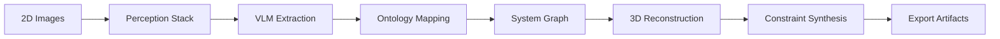

# CQEA — Classical Quantum-Extensible Applications

**Cross-domain optimization, AI/ML, and quantum-classical hybrid workflows for AMPEL360-BWB-Q**

EstándarUniversal:Documento-Especificacion-ARP4754A-00.00-ApplicationPackage-0001-v1.0-AmpelTrescientosSesentaHidrogenoAlaCombinadaQuantum-GeneracionHumana-AIR-AmedeoPelliccia-7c8d9e0f-01-Requirements→07-Certification-Security

---

## 📋 Overview

CQEA provides **classical–quantum extensible applications** that bridge traditional engineering workflows with quantum-enhanced optimization and AI/ML capabilities. This package serves as the primary application layer for simulation, optimization, and digital twin synchronization within the AMPEL360 ecosystem.

---

## 🔧 Module Index

| Module | Purpose | Status |
|--------|---------|--------|
| [MDGPT](./MDGPT) | **Multidimensional Generative Pretrained Transformer** - Transforms 2D images into rich engineering ontologies and parametric 3D models | ✅ Active |
| `QAOA_Optimizer/` | Quantum Approximate Optimization Algorithm for structural layout | 🚧 Planned |
| `DigitalTwin_Sync/` | Real-time synchronization between physical and digital twins | 🚧 Planned |
| `HybridML_Pipeline/` | Classical-quantum machine learning workflows | 🚧 Planned |

---

## 🌟 Key Features

### MDGPT (Active)
- **2D → Ontology → 3D**: Convert static images to rich engineering semantics and parametric models
- **Source Data Management**: Handle hyperrealistic LM-generated images with full provenance tracking
- **UTCS-MI v5.0 Compliance**: Full traceability and engineering standards compliance
- **Trust Tier System**: T0-T4 classification for data reliability and usage permissions

### Quantum-Classical Integration
- **Hybrid Workflows**: Seamlessly blend classical and quantum processing
- **QAOA Integration**: Quantum optimization for complex engineering problems
- **Scalable Architecture**: Classical fallbacks with quantum acceleration where available

---

## 🚀 Quick Start

### MDGPT Usage
```bash
cd MDGPT

# Ingest and process 2D images
python scripts/mdgpt_cli.py ingest --in ./examples/input --cache ./.cache

# Run full pipeline: 2D → ontology → 3D
python scripts/mdgpt_cli.py run --pipeline full --out ./output \
  --ontology jsonld --graph graphml --geom gltf

# Validate results
python scripts/mdgpt_cli.py validate --in ./output/ontology.jsonld --schema ./schema/utcs.yml
```

### Dataset Management
```bash
# Ingest dataset with metadata validation
python scripts/mdgpt_cli.py dataset ingest \
  --src ./SourceData/datasets/CB_PrimaryGrid_v1 \
  --out ./SourceData/processed/CB_PrimaryGrid_v1 \
  --strict --attach-xmp

# Validate dataset quality
python scripts/mdgpt_cli.py dataset validate \
  --in ./SourceData/processed/CB_PrimaryGrid_v1 \
  --schema ./schema/utcs.yml \
  --rules ./schema/quality_rules.yml \
  --report ./reports/dataset_qa.md
```

---

## 📑 Standards & Compliance

### Engineering Standards
- **ARP4754A**: Aircraft system development processes
- **DO-178C**: Software considerations in airborne systems
- **S1000D**: International specification for technical documentation

### Framework Integration
- **UTCS-MI v5.0**: Universal Technical Classification System
- **AQUA V. Ecosystem**: AGEN-QAI, QAUDIT, DT-TRACE integration
- **Phase Alignment**: Requirements → Design → Production → Ops → MRO

### Data Governance
- **Trust Tier System**: T0 (parametric GT) → T4 (uncertain origin)
- **Provenance Tracking**: Full metadata chain for all data sources
- **Quality Validation**: Physics-based rules and engineering constraints

---

## 🔬 Technical Architecture

### MDGPT Pipeline


### Data Flow
- **Input**: Multi-format 2D images (PNG, JPG, PDF, SVG)
- **Processing**: ML-based perception, semantic extraction, engineering mapping
- **Output**: JSON-LD ontologies, GraphML graphs, glTF/STEP geometry

---

## 🛡️ Quality & Validation

### Automated Checks
- **Physical Plausibility**: Material properties, geometric constraints
- **Engineering Rules**: LPS continuity, fastener patterns, load paths
- **Compliance Validation**: Standards adherence, documentation requirements

### Human-in-the-Loop
- **Interactive QA**: Visual validation with confidence scoring
- **Expert Review**: Domain specialist approval for critical components
- **Continuous Improvement**: Feedback loops for model refinement

---

## 🗂️ Directory Structure

```
CQEA_Classical_Quantum-Extensible_Applications/
├── README.md                 # This file
├── MDGPT/                    # Core MDGPT module
│   ├── README.md            # Detailed MDGPT documentation
│   ├── mdgpt/               # Python package
│   ├── schema/              # YAML schemas for validation
│   ├── SourceData/          # Dataset management
│   ├── examples/            # Usage examples and notebooks
│   ├── scripts/             # CLI tools and utilities
│   └── tests/               # Test suite
└── [future modules]/        # QAOA, DigitalTwin, HybridML
```

---

## 🔮 Roadmap

### Phase 1 (Current) - MDGPT Foundation
- [x] Core 2D→ontology→3D pipeline
- [x] Source data management with trust tiers
- [x] UTCS-MI v5.0 compliance implementation
- [ ] Multi-view consistency validation
- [ ] Enhanced STEP export capabilities

### Phase 2 - Quantum Integration
- [ ] QAOA optimizer for structural layouts
- [ ] Quantum-assisted graph matching
- [ ] Hybrid classical-quantum ML pipelines

### Phase 3 - Digital Twin Ecosystem
- [ ] Real-time twin synchronization
- [ ] Predictive maintenance integration
- [ ] Automated documentation generation

---

## 📞 Support & Contact

- **Technical Issues**: CQEA-support@aqua-technologies.es
- **Dataset Requests**: mdgpt-dataset@aqua-technologies.es  
- **Documentation**: [AQUA V. Knowledge Base](https://docs.aqua-v.com)

---

*Generated within the AMPEL360-H₂-BWB-Q framework — AQUA V. ecosystem.*